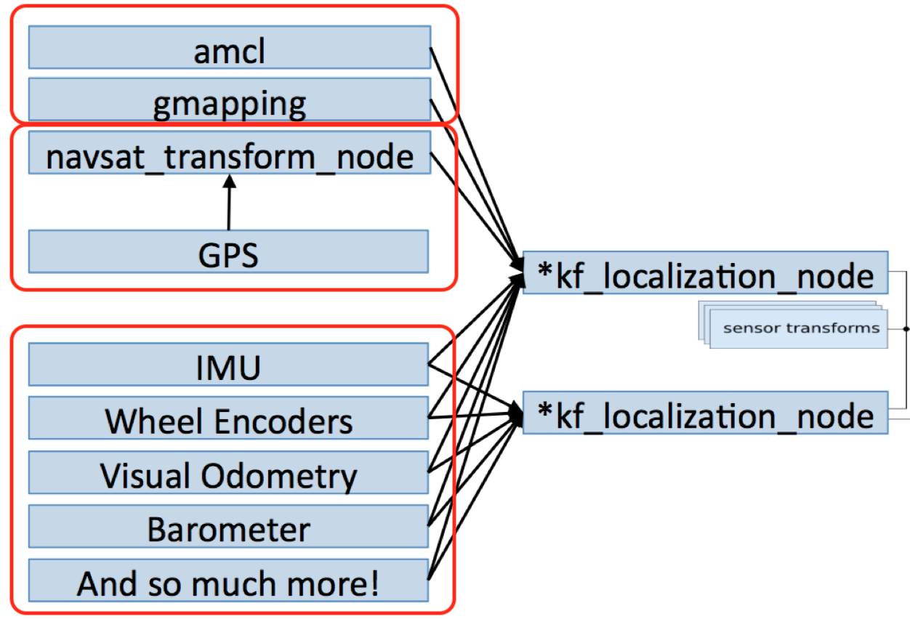
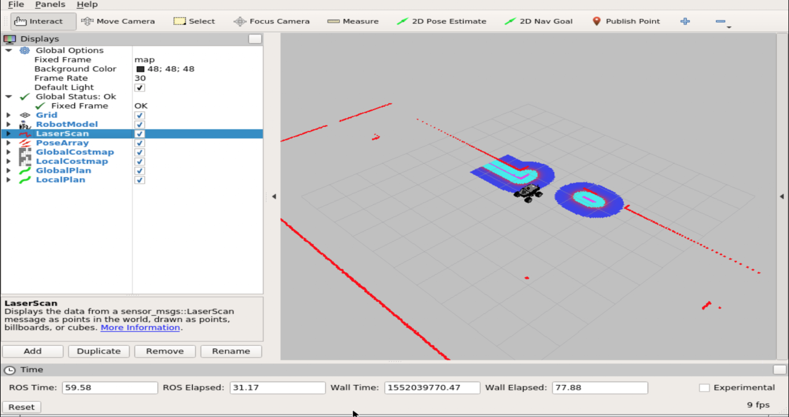

# Fuse Sensor Data to Improve Localization

## Unit 0: Introduction to the Course

### Summary

Estimated time to completion: **10 minutes**

This unit is an introduction to the **Robot Localization** Course. You'll have a quick preview of the contents you are going to cover during the course, and you will also view a practical demo.

---

### What's this course about?

One of the most important parts of mobile robotics is the ability to achieve Autonomous Navigation. That is, your robot is able to move by itself with only the help of its sensors and actuators. In order to achieve autonomous navigation, the **Localization** of the robot plays a key role. **Robot Localization** is the ability of the robot to know where it is in the environment.

In this course, we are going to review the **robot_localization** package, developed by Tom Moore. The main goal of this package is to provide accurate data about where the robot is and what it's doing, based on the input of as many sensors as you want. Let's have a look at the basic graph that shows how the **robot_localization** package works.



As you can see, we have divided this graph into 3 main block:

1. Using the **robot_localization** package alongside an external localization system, like amcl.
2. Using the **robot_localization** package alongside GPS data.
3. Using the **robot_localization** to merge different sensor inputs (IMU, Encoders, etc.).

So basically, within this course, you are going to go learn how to configure and launch the robot_localization package and its ROS nodes for all of these use cases, and using different simulated examples.

### Do you want to have a taste?

With the proper introductions made, it is time to actually start. And... as we always do in the Robot Ignite Academy, let's start with practice! In the following example, you will be using a simulated version of the robot you are going to build from scratch in this course. So... let's go!

### Demo 1.1

a) For this demo, we are going to launch a navigation system, which merges GPS data with other sensors in order to improve the robot localization.

**Execute in WebShell #1**

```
roslaunch summit_xl_demo navigation_with_gps.launch
```

After this, launch the following command in order to load the RViz configuration:

**Execute in WebShell #2**

```
rosrun rviz rviz -d `rospack find summit_xl_demo`/rviz/gps.rviz
```

Now, if you open the Graphic Tools by hitting this icon you will see something like this:



You can now use the 2D Nav Goal tool in Rviz to send a Goal (desired pose) to the Robot.

