# Unit 2: Mapping

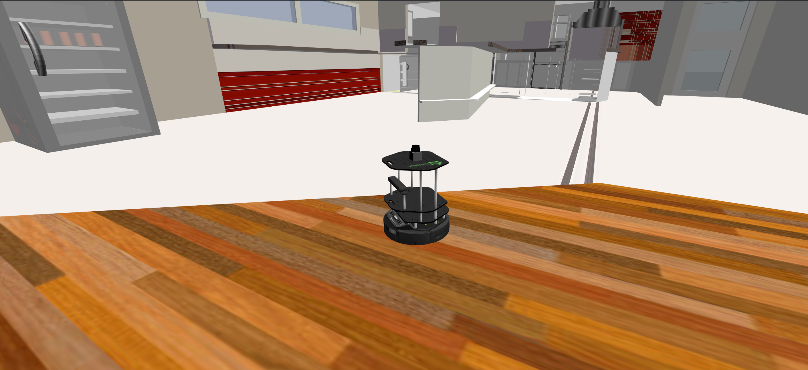

## SUMMARY

Estimated time of completion: **2 hours**

What will you learn with this unit?

- What means Mapping in ROS Navigation
- How does ROS Mapping work
- How to configure ROS to make mapping work with almost any robot
- Different ways to build a Map

---

If you completed successfully the previous Unit (Basic Concepts), you must now know at least this ONE THING. **In order to perform autonomous Navigation, the robot MUST have a map of the environment**. The robot will use this map for many things such as planning trajectories, avoiding obstacles, etc.

You can either give the robot a prebuilt map of the environment (in the rare case that you already have one with the proper format), or you can build one by yourself. This second option is the most frequent one. So in this Unit, we will basically show you **HOW to create a map from zero**.

Before starting, though, you need to be introduced properly to a very important tool in ROS Navigation. I'm talking, of course, about **RViz**. In the 1st Chapter you already used it to visualize the whole process of ROS Navigation. In this chapter, you're going to learn how to use it in order to visualize the Mapping process.

## Visualize Mapping in RViz

As you've already seen, you can launch RViz and add displays in order to watch the Mapping progress. For Mapping, you'll basically need to use 2 displays of RViz:

- **LaserScan Display**
- **Map Display**

**NOTE**: There is an optional display that you may want to add to Rviz in order to make things clearer: the **Robot Model**. This display will show you the model of the robot through RViz, allowing you to see how the robot is moving around the map that it is constructing. It is also useful to detect errors.

Follow the steps in the next exercise in order to learn how to add these displays.

### Exercise 2.1

a) Execute the following command in order to launch the **slam_gmapping** node. We need to have this node running in order to visualize the map.

**Execute in WebShell #1**

```
roslaunch turtlebot_navigation_gazebo gmapping_demo.launch
```

b) Hit the icon with a screen in the top-right corner of the IDE window in order to open the Graphic Interface.

c) Execute the following command in order to launch Rviz.

```
rosrun rviz rviz
```

d) Follow the next steps in order Add a **LaserScan** display to RViz.

#### Visualize LaserScan

1.- Click the **Add** button under Displays and choose the LaserScan display.


2.- In the Laser Scan display properties, introduce the name of the topic where the laser is publishing its data (in this case, it's **/kobuki/laser/scan**).


3.- In Global Options, change the Fixed Frame to **odom**.


4.- To see the robot in the Rviz, you can choose to also add the **RobotModel** display. This will display the current situation of the robot on the screen. You can also try to display all the reference frames of the robot by adding to Rviz the TF displays.

5.- The laser "map" that is built will disappear over time, because Rviz can only buffer a finite number of laser scans.

#### Visualize Map

1. Click the Add button and add the Map display.
2. In the Map display properties, set the topic to **/map**.

Now you will be able to properly visualize the Mapping progress through RViz.

#### Data for Exercise 2.1

Check the following Notes in order to complete the Exercise: 

**Note 1**: You can change the way you visualize these elements by modifying some properties in the left panel.
**Note 2**: For example, set the size of the Laser scan to 0.05 to make the laser ray thicker.

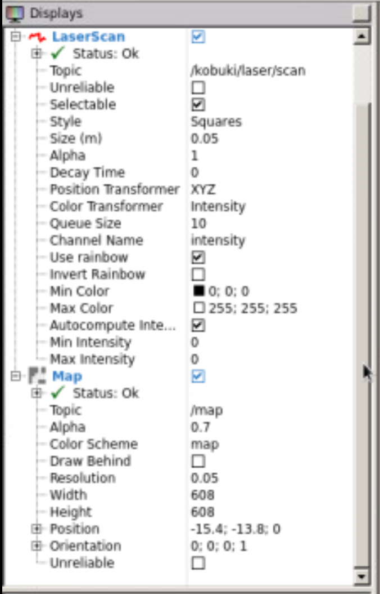

#### Expected Result for Exercise 2.1

RobotModel plus LaserScan visualization through RViz:

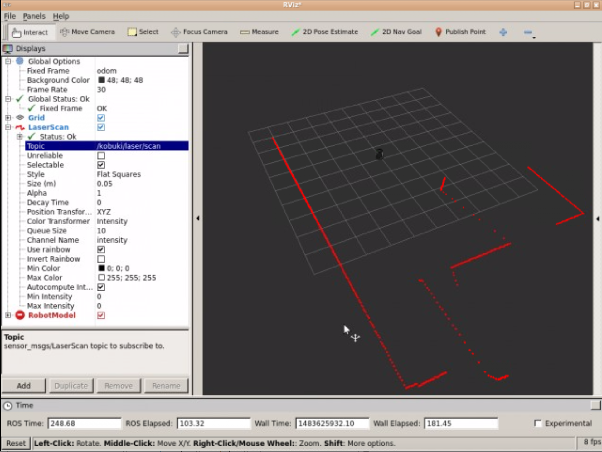

RobotModel plus Map and LaserScan visualization through RViz:


---

Now that you already know how to configure RViz in order to visualize the Mapping process, you're ready to create your own Map. 

But first, let's see one last utility that RViz has and that will be very useful for us. In the exercise above, you've added to RViz various displays in order to be able to visualize different elements in the simulation. You also modified some things in the configuration of these displays. But... if you now close RViz, and relaunch it later, all these changes you've done will be lost, so you'll have to configure it all again. That doesn't sounds good at all, right?

## Saving RViz configuration

Fortunately, RViz allows you to **save your current configuration**, so you can recover it anytime you want. In order, to do so, follow the next steps:

1. Go to the top left corner of the RViz screen, and open the *File* menu. Select the *Save Config As* option.

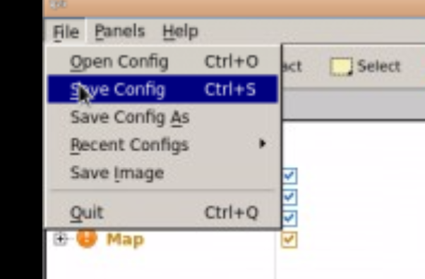

1. Write the name you want for your configuration file, and press *Save*.

Now, you'll be able to load your saved configuration anytime you want by selecting the *Open Config* option in the *File* menu.

### Exercise 2.2

**IMPORTANT: Before starting with this Exercise, make sure your Rviz is properly configurated in order to visualize the Mapping process.**

a) Execute the following command in order to start moving the robot around the environment.

**Execute in WebShell #3**

```
roslaunch turtlebot_teleop keyboard_teleop.launch
```

b) Move around the whole room until you have created a **FULL MAP** of the environment.

#### Data for Exercise 2.2

Check the following Notes in order to complete the Exercise: 

**Note 1**: Due to the way this simulation environment is built, you won't be able to enter the Kitchen. Don't worry about this issue and keep mapping the rest of the space.
**Note 2**: Remember to keep an eye at RViz so you can see if the map is being built properly or if, otherwise, you're leaving some zones without mapping.

#### Expected Result for Exercise 2.2


---

Ok so... what has just happened? In order to better understand the whole process, let's first introduce two concepts.

## SLAM

Simultaneous Localization and Mapping (SLAM). This is the name that defines the robotic problem of **building a map of an unknown environment while simultaneously keeping track of the robot's location on the map that is being built**. This is basically the problem that Mapping is solving. The next Unit (Localization) is also involved, but we'll get there later.

So, summarizing, **we need to do SLAM in order to create a Map for the robot**.

## The gmapping package

The gmapping ROS package is an implementation of a specific SLAM algorithm called *gmapping*. This means that, [somebody](http://wiki.ros.org/slam_gmapping) has implemented the gmapping algorithm for you to use inside ROS, without having to code it yourself. So if you use the ROS Navigation stack, you only need to know (and have to worry about) how to configure gmapping for your specific robot (which is precisely what you'll learn in this Chapter). 

The gmapping package contains a ROS Node called **slam_gmapping**, which allows you to create a 2D map using the laser and pose data that your mobile robot is providing while moving around an environment. This node **basically reads data from the laser and the transforms of the robot, and turns it into an occupancy grid map** (OGM).

So basically, what you've just done in the previous exercise was the following:

1. You used a previously created configuration launch file (**gmapping_demo.launch**) to launch the **gmapping** package with the Kobuki robot.
2. That launch file started a **slam_gmapping node** (from the gmapping package). Then you moved the robot around the room.
3. Then ,the slam_gmapping node **subscribed to the Laser (/kobuki/laser/scan) and the Transform Topics (/tf)** in order to get the data it needs, and it built a map.
4. The generated map is published during the whole process into the **/map** topic, which is the reason you could see the process of building the map with Rviz (because Rviz just visualizes topics).

The /map topic uses a message type of **nav_msgs/OccupancyGrid**, since it is an OGM. Occupancy is represented as an integer in the range {0, 100}. With 0 meaning completely free, 100 meaning completely occupied, and the special value of -1 for completely unknown.

Amazing, right? 

Now, you may be worrying that you only had to do a roslaunch in order to have the robot generating the map.

- What if your Kobuki does not have the laser at the center?
- What if instead of a laser, you are using a Kinect?
- What if you want to use the mapping with a different robot than Kobuki?

In order to be able to answer those questions, you still need to learn some things first.

Let's start by seeing what you can do with the Map you've just created.

### Saving the map

Another of the packages available in the ROS Navigation Stack is the **map_server package**. This package provides the **map_saver node**, which allows us to access the map data from a ROS Service, and save it into a file.

When you request the map_saver to save the current map, the map data is saved into two files: one is the YAML file, which contains the map metadata and the image name, and second is the image itself, which has the encoded data of the occupancy grid map.

#### Command to save the map

We can save the built map at anytime by using the following command:

```
rosrun map_server map_saver -f name_of_map
```

This command will get the map data from the map topic, and write it out into 2 files, **name_of_map.pgm** and **name_of_map.yaml**.

### Exercise 2.3

a) Save the map created in the previous exercise into a file.

**Execute in WebShell #4**

```
rosrun map_server map_saver -f my_map
```

b) Go to the IDE and look for the files created, **my_map.pgm** and **my_map.yaml**. Open both of them and check what they contain.

**<u>my_map.yaml</u>**

```python
image: my_map.pgm
resolution: 0.050000
origin: [-15.400000, -15.400000, 0.000000]
negate: 0
occupied_thresh: 0.65
free_thresh: 0.196
```

The data format of **my_map.pgm** is an image so it is not human readable. It can only be visualized with an image viewer.

#### Data for Exercise 2.3

Check the following Notes in order to complete the Exercise: 

**Note 1**: The -f attribute allows you to give the files a custom name. By default (if you don't use the -f attribute), the names of the file would be map.pgm and map.yaml.

**Note 2**: Remember that, in order to be able to visualize the files generated through the IDE, these files must be at the **/home/user/catkin_ws/src** directory. The files will be initially saved in the directory where you execute the command.

**Note 3**: You can download the files to your computer by right-clicking them, and selecting the 'Download' option.

#### Expected Result for Exercise 2.3

Image (PGM) File of the Map:

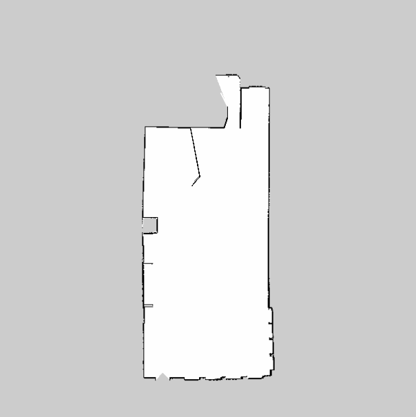

YAML File of the Map.


---

### YAML File

In order to visualize the YAML file generated in the previous exercise, you can do one of the following things:

- Open it through the IDE. In order to be able to do this, the file must be in your **catwin_ws/src** directory.
- Open it through the Web Shell. You can use, for instance, the vi editor to do so typing the command **vi my_map.yaml**.
- Download the file and visualize it in your local computer with your own text editor.


The YAML File generated will contain the 6 following fields:

- **image**: Name of the file containing the image of the generated Map.
- **resolution**: Resolution of the map (in meters/pixel).
- **origin**: Coordinates of the lower-left pixel in the map. This coordinates are given in 2D (x,y). The third value indicates the rotation. If there's no rotation, the value will be 0.
- **occupied_thresh**: Pixels which have a value greater than this value will be considered as a completely occupied zone.
- **free_thresh**: Pixels which have a value smaller than this value will be considered as a completely free zone.
- **negate**: Inverts the colours of the Map. By default, white means completely free and black means completely occupied.

### Image File (PGM)

In order to visualize the PGM file generated in the previous exercise, you can do one of the following things:

- Open it through the IDE. In order to be able to do this, the file must be in your **catwin_ws/src** directory.
- Open it through the Web Shell. You can use, for instance, the vi editor to do so typing the command **vi my_map.pgm**.
- Download the file and visualize it in your local computer with your own text editor.

What happens? Anything strange? Are you able to understand the file content? I'm sure you are not! If you try to visualize this file with a text editor, you'll get something similar to this:

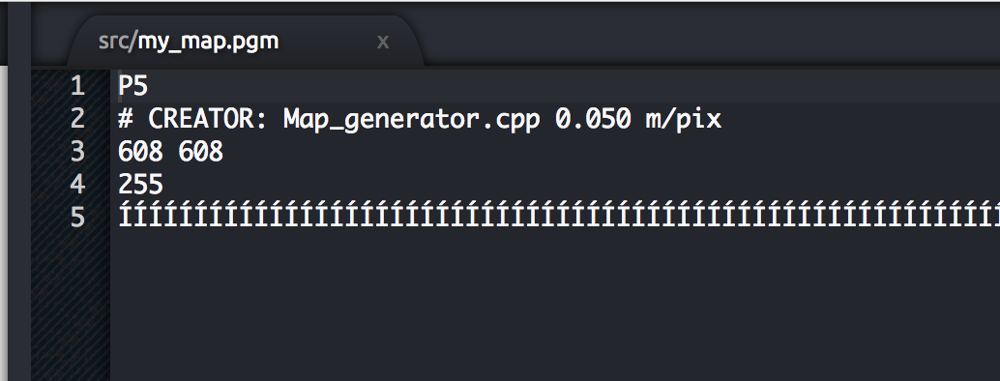

But this doesn't give us any useful information. Can you guess what's happening? This happens because this is not a text file, but a PGM (Portable Gray Map) file. A PGM is a file that represents a grayscale image. So, if you want to visualize this file properly, you should open it with an image editor. Then, you'll get something like this:

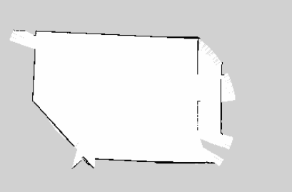

The image describes the occupancy state of each cell of the world in the color of the corresponding pixel. **Whiter pixels are free**, **blacker pixels are occupied**, and **pixels in between are unknown**. Color and grayscale images are accepted, but most maps are gray (even though they may be stored as if in color). Thresholds in the YAML file are used to divide the three categories.

When communicated via ROS messages, occupancy is represented as an integer in the range [0,100], with **0 meaning completely free and 100 meaning completely occupied, and the special value -1 for completely unknown**.

Image data is read in via SDL_Image; supported formats vary, depending on what SDL_Image provides on a specific platform. Generally speaking, most popular image formats are widely supported.

**NOTE: It may happen that your image editor doesn't support PGM format. If that is your case, you can try to convert it to a PNG file in order to visualize. Here's an online tool to do so: https://convertio.co/es/pgm-png/**

## Providing the map

Besides the map_saver node, the map_server package also provides the **map_server node**. This node reads a map file from the disk and provides the map to any other node that requests it via a ROS Service.

Many nodes request to the **map_server** the current map in which the robot is moving. This request is done, for instance, by the move_base node in order to get data from a map and use it to perform Path Planning, or by the localization node in order to figure out where in the map the robot is. You'll see examples of this usage in following chapters.

The service to call in order to get the map is:

- **static_map (nav_msgs/GetMap)**: Provides the map occupancy data through this service.

Apart from requesting the map through the service above, there are two latched topics that you can connect in order to get a ROS message with the map. The topics at which this node writes the map data are:

- **map_metadata (nav_msgs/MapMetaData):** Provides the map metadata through this topic.
- **map (nav_msgs/OccupancyGrid):** Provides the map occupancy data through this topic.

**NOTE**: When a topic is latched, it means that the last message published to that topic will be saved. That means, any node that listens to this topic in the future will get this last message, even if nobody is publishing to this topic anymore. In order to specify that a topic will be latched, you just have to set the *latch* attribute to true when creating the topic.

#### Command to launch the map server node

To launch the map_server node in order to provide information of a map given a map file, use the following command:

```
rosrun map_server map_server map_file.yaml
```

**Remember**: You must have created the map (the map_file.yaml file) previously with the gmapping node. You can't provide a map that you haven't created!

### Exercise 2.4

**IMPORTANT: Make sure to stop all the programs running in your Web Shells (by pressing Ctrl+C) before starting with this exercise.**

a) Launch the map_server node using the command tool shown above. Use the map file you've created in Exercise 2.3.

**Execute in WebShell #1**

```
rosrun map_server map_server my_map.yaml
```

b) Get information of the map by accessing the topics introduced above.

#### Data for Exercise 2.4

Check the following Notes in order to complete the Exercise: 

**Note 1**: If you launch the command from the directory where you have the map file saved, you don't have to specify the full path to the file. If you aren't in the same directory, bear in mind that you'll have to specify the full path to the file.

#### Expected Result for Exercise 2.4

Echo of the /map_metadata topic:

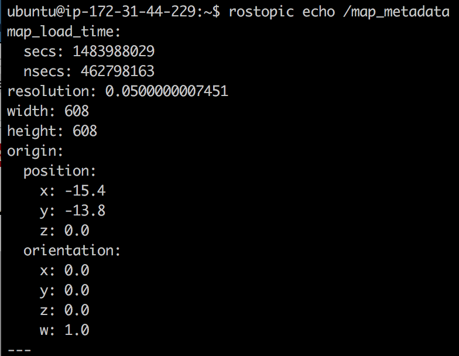

Echo of the /map topic:


---

### Exercise 2.5

Create a launch file that launches the map_server node.

a) Create a package named **provide_map**.

b) Inside this package, create a launch file that will launch the map_server node in order to provide the map you've created.

**<u>provide_map.launch</u>**

```xml
<launch>
    <node pkg="map_server" type="map_server" name="map_server" args="$(find provide_map)/map_data/my_map.yaml">
    </node>
</launch>
```

c) Execute your launch file, and check if the map is being provided by accessing the proper topics.

#### Data for Exercise 2.5

Check the following Notes in order to complete the Exercise: 

**Note 1**: In order to provide the map file, you'll have to add the path to your map as an argument of the \<node> tag.

#### Expected Result for Exercise 2.5

Same as Exercise 2.4.

---

In the previous exercise you've seen the topics at which the map_server node writes in order to provide the map data. But as we said previously, this node also allows to get this data from a service. The service it uses to provide the map data is the following:

- **static_map (nav_msgs/GetMap)**: Provides the map occupancy data through this service.

### Exercise 2.6

Using a Web Shell, perform a call to the service introduced above in order to get data from the map.

**Execute in WebShell #1**

```
rosservice call /static_map "{}"
```

#### Expected Result for Exercise 2.6

Service call to /static_map:

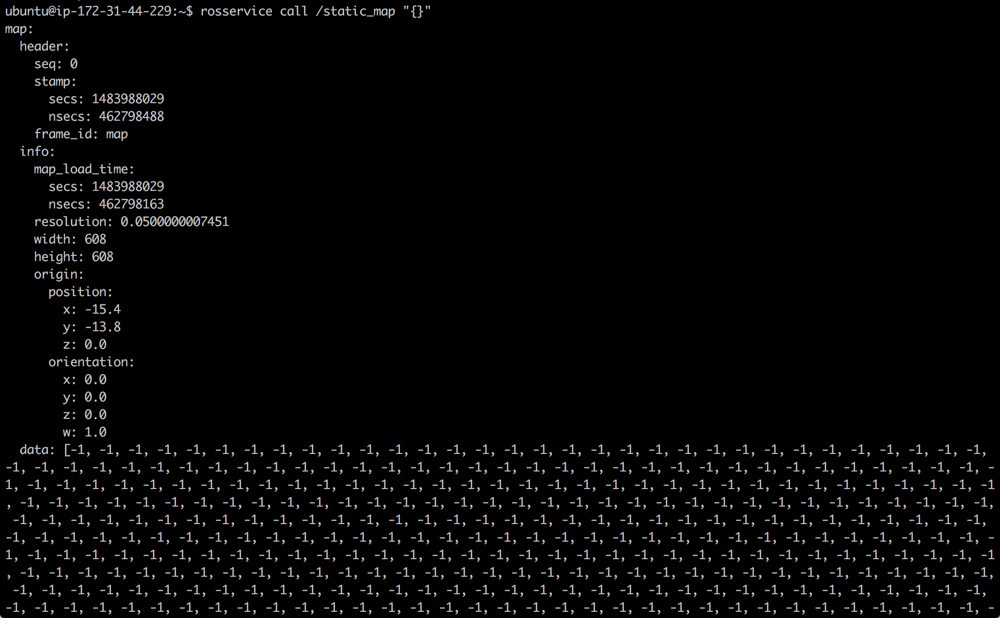

---

### Exercise 2.7

Create a Service Client that calls to this service.

a) Create a new package named **get_map_data**. Add rospy as a dependency.

b) Inside this package, create a file named **call_map_service.py**. Inside this file, write the code of your Service Client. This Service Client will call the **/static_map** service in order to get the map data, and then it will print the dimensions and resolution of the map in the screen.

**<u>call\_map\_service.py</u>**

```python
#!/usr/bin/env python
"""
/static_map service static_map_client
"""

# import sys
import rospy
from nav_msgs.srv import GetMap
# rossrv show nav_msgs/GetMap


def static_map_client():
    """
    Requests /static_map service
    """
    # rospy.loginfo("In static_map_client().")
    rospy.wait_for_service('static_map')
    # rospy.loginfo("static_map service found.")
    try:
        static_map = rospy.ServiceProxy('static_map', GetMap)
        resp = static_map()
        print "Width: %s" % resp.map.info.width
        print "Height: %s" % resp.map.info.height
        print "Resolution: %s" % resp.map.info.resolution

        return
    except rospy.ServiceException, error:
        print "Service call failed: %s" % error


if __name__ == "__main__":
    rospy.init_node('call_map_service', anonymous=True)
    # rospy.loginfo("In call_map_service.py main.")
    static_map_client()
```

<u>**call\_map\_service.py**</u> (provided solution)

```python
#! /usr/bin/env python

import rospy
from nav_msgs.srv import GetMap, GetMapRequest
import sys 

rospy.init_node('service_client') # Initialise a ROS node with the name service_client
rospy.wait_for_service('/static_map') # Wait for the service /static_map to be running
get_map_service = rospy.ServiceProxy('/static_map', GetMap) # Create the connection to the service
get_map = GetMapRequest() # Create an object of type GetMapRequest
result = get_map_service(get_map) # Call the service
print result # Print the result given by the service called
```

c) Create a launch file for your Service Client, and test that it works properly.

**<u>get\_map\_data.launch</u>**

```xml
<launch>
    <!-- Before launching this run: rosrun map_server map_server my_map.yaml -->
    <node pkg="get_map_data"
    type="call_map_service.py"
    name="call_map_service"
    output="screen">
    </node>
</launch>
```

---

### Important Remarks

Having shown how to create a map of an environment with a robot, you must understand the following:

- The map that you created is a **static map**. This means that the map will always stay as it was when you created it. So when you create a Map, it will capture the environment as it is at the exact moment that the mapping process is being performed. If for any reason, the environment changes in the future, these changes won't appear on the map, hence it won't be valid anymore (or it won't correspond to the actual environment). 
- The map that you created is a **2D Map**. This means that, the obstacles that appear on the map don't have height. So if, for instance, you try to use this map to navigate with a drone, it won't be valid. There exist packages that allow you to generate 3D mappings, but this issue won't be covered in this Course. If you're interested in this topic, you can have a look at the following link: <http://wiki.ros.org/rtabmap_ros/Tutorials/MappingAndNavigationOnTurtlebot>

---

## Hardware Requirements

Another thing you should have learnt from the previous Unit, is that **configuration** is VERY IMPORTANT in order to build a proper Map. Without a good configuration of your robot, you won't get a good Map of the environment. And without a good Map of the environment, you won't be able to Navigate properly. 

So, in order to build a proper Map, you need to fulfill these 2 requirements:

1. Provide Good Laser Data
2. Provide Good Odometry Data

The slam_gmapping node will then try to transform each incoming laser reading to the odom frame.

### Exercise 2.8

a) Make sure that your robot is publishing this data and identify the topic it is using in order to publish the data.

b) When you've identified the topics, check the structure of the messages of these topics.

#### Expected Result for Exercise 2.8

Topics list:


echo /odom:

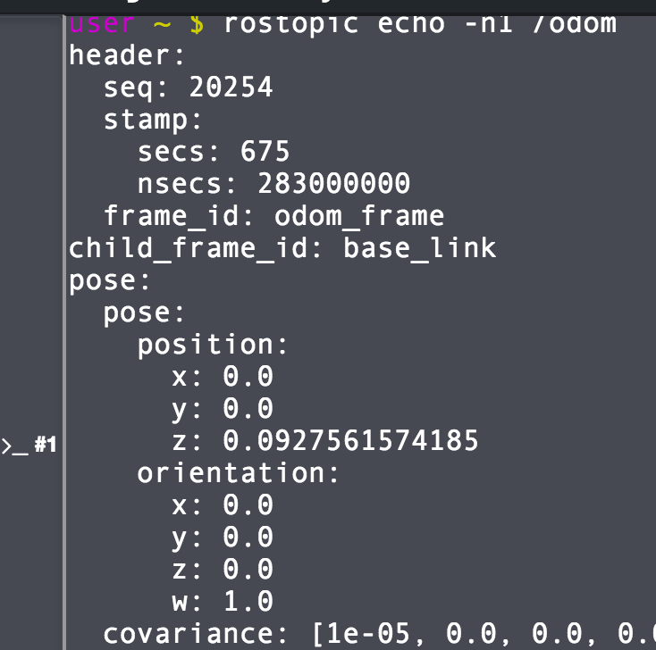

echo /kobuki/laser/scan:


---

## Transforms

In the previous exercise you had the robot transforms properly configured, so you can trust that the laser readings will be correctly transformed into the Odom frame. But will this always be like this? NO, it doesn't have to. 

In order to be able to use the laser readings, we need to set a transform between the laser and the robot base, and add it to the transform tree. Transform? Transform tree? What are you talking about? 

Ok, let's clarify all this. So we have a Kobuki Robot with a laser mounted on it, right? But, **in order to be able to use the laser data, we need to tell the robot WHERE (position and orientation) this laser is mounted in the robot**. This is what is called a **transform between frames**.

A transform specifies how data expressed in a frame can be transformed into a different frame. For instance, if you detect an obstacle with the laser at 3 cm in the front, this means that it is 3 cm from the laser, but not from the center of the robot (that is usually called the **/base_link**). To know the distance from the center of the robot, you need to **transformthe 3 cm from the /laser_frame to the /base_link** frame (which is actually what the Path Planning system needs to know, what is the distance from the center of the robot to the obstacle).

Don't you think so? If we don't provide this information to the robot, when the laser detects an object, how can the robot know where this object is? Is it in front of the robot? Is it behind? Is it to the right? There's no way the robot can know it if we don't tell the robot the **POSITION and the ORIENTATION** of the laser regarding to the center of the robot. In order to do this, we need to do the following: 

First, we'll define two frames (coordinate frames), one at the center of the laser and another one at the center of the robot. For navigation, it is important that the center of the robot is placed at the **rotational center**of the robot. We'll name the laser frame as *base_laser* and the robot frame as *base_link*.

Here you can see an scheme of how it would look like:


For instance, in the case of the Kobuki robot that you are using in this Chapter, the frames looks like this:

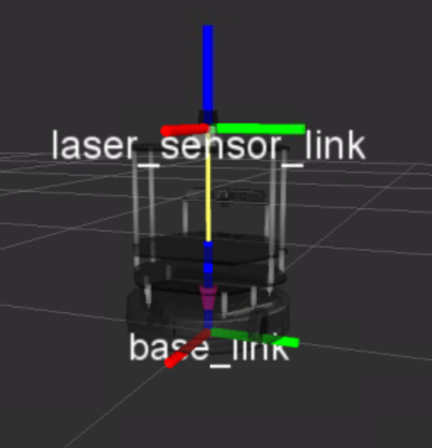

Now, we need to define a relationship (in terms of position and orientation) between the *base_laser* and the *base_link*. For instance, we know that the *base_laser frame*is at a distance of 20 cm in the *y* axis and 10 cm in the *x* axis referring the *base_link frame*. Then we'll have to provide this relationship to the robot. **This relationship between the position of the laser and the base of the robot is known in ROS as the TRANSFORM between the laser and the robot**.

For the slam_gmapping node to work properly, you will need to provide 2 transforms:

- **the frame attached to laser -> base_link**: Usually a fixed value, broadcast periodically by a robot_state_publisher, or a tf static_transform_publisher.
- **base_link -> odom**: Usually provided by the Odometry system

Since the robot needs to be able to access this information anytime, we will publish this information to a **transform tree**. The transform tree is like a database where we can find information about all the transformations between the different frames (elements) of the robot.

You can visualize the transform tree of your running system anytime by using the following command:

```
rosrun tf view_frames
```

This command will generate a pdf file containing a graph with the transform tree of your system.

### Exercise 2.9

Execute the following commands in order to visualize the transform tree of your system.

**Execute in WebShell #1**

```
roscd
cd ..
cd src
rosrun tf view_frames
```

Download this file to your computer using the IDE *Download* option, and open it. Check if the required transforms of the slam_gmapping node are there.

#### Data for Exercise 2.9

Check the following Notes in order to complete the Exercise: 

**Note 1**: You can download the files to your computer by right-clicking them on the IDE, and selecting the **Download** option.

#### Expected Result for Exercise 2.9


---

Now, let's imagine you just mounted the laser on your robot, so the transform between your laser and the base of the robot is not set. What could you do? There are basically 2 ways of publishing a transform:

- Use a **static_transform_publisher**
- Use a **transform broadcaster**

In this Course, we'll use the static_transform_publisher, since it's the fastest way. The static_transform_publisher is a ready-to-use node that allows us to directly publish a transform by simply using the command line. The structure of the command is the next one:

```
static_transform_publisher x y z yaw pitch roll frame_id child_frame_id period_in_ms
```

Where:

- **x, y, z** are the offsets in meters
- **yaw, pitch, roll** are the rotation in radians
- **period_in_ms** specifies how often to send the transform

You can also create a launch file that launches the command above, specifying the different values in the following way:

```xml
<launch>
    <node pkg="tf" type="static_transform_publisher" name="name_of_node" 
          args="x y z yaw pitch roll frame_id child_frame_id period_in_ms">
    </node>
</launch>
```

### Exercise 2.10

Create a package and a launch file in order to launch a static_transform_publisher node. This node should publish the transform between the Kinect camera mounted on the robot and the base link of the robot.

Generate again the frames graph you got in the previous exercise and check if the new transform is being published.

<u>**static\_transform\_publisher.launch**</u>

```xml
<launch>
    <node pkg="tf" type="static_transform_publisher" name="broadcaster"
          args="0 0 1 0 0 0 base_link kinect_link 10">
    </node>
</launch>
```

#### Expected Result for Exercise 2.10


---

### Important Remark

Having shown how to create a transform broadcaster, let me tell you a secret. This is not something that you'll usually have to do. Yeah, I'm really sorry. 

In the previous Chapter (Basic Concepts), you learned that the description of the robot model is made in the URDF files, right? Well, the **publication of the transforms is also handled by the URDF files**. At least, this is the common use. There exist, though, some cases where you do have to publish a transform separately from the URDF files. For instance:

- If you temporarily add a sensor to the robot. That is, you add a sensor that will be used during a few days, and then it will be removed again. In a case like this, instead of changing the URDF files of the robot (which will probably be more cumbersome), you'll just create a transform broadcaster to add the transform of this new sensor. 
- You have a sensor that is external from your robot (and static). For instance, check the following scenario:


You have a robotic arm and, separated from it, you also have a Kinect camera, which provides information about the table to the robotic arm. In a case like this, you won't specify the transforms of the Kinect camera in the URDF files of the robot, since it's not a part of the robot. You'll also use a separated transform broadcaster.

---

## Creating a launch file for the slam_gmapping node

At this point, I think you're prepared to create the launch file in order to start the **slam_gmapping** node. The main task to create this launch file, as you may imagine, is to correctly set the parameters for the slam_gmapping node. This node is highly configurable and has lots of parameters you can change in order to improve the mapping performance. This parameters will be read from the ROS Parameter Server, and can be set either in the launch file itself or in a separated parameter files (YAML file). If you don't set some parameters, it will just take the default values. You can have a look at the complete list of parameters available for the slam_gmapping node here: <http://wiki.ros.org/gmapping> 

Let's now check some of the most important ones:

### General Parameters

- **base_frame (default: "base_link")**: Indicates the name of the frame attached to the mobile base.
- **map_frame (default: "map")**: Indicates the name of the frame attached to the map.
- **odom_frame (default: "odom")**: Indicates the name of the frame attached to the odometry system.
- **map_update_interval (default: 5.0)**: Sets the time (in seconds) to wait until update the map.

### Exercise 2.11

**IMPORTANT: Before starting with this Exercise, make sure you've stopped the previously launched slam_gmapping node by pressing Ctrl + C on the console where you executed the command.**

a) In the *turtlebot_navigation_gazebo* package, search for the launch file named **gmapping_demo.launch**. You will see that what this file actually does is to call another launch file named **gmapping.launch.xml**, which is in the *turtlebot_navigation* package.

b) Create a new package named **my_mapping_launcher**. Inside this package create a directory named launch, and inside this directory create a file named **my_gmapping_launch.launch**. Inside this file, copy the contents of the **gmapping.launch.xml** file.

<u>**gmapping.launch.xml**</u>

```xml
<launch>
  <arg name="scan_topic"  default="kobuki/laser/scan" />
  <arg name="base_frame"  default="base_footprint"/>
  <arg name="odom_frame"  default="odom"/>

  <node pkg="gmapping" type="slam_gmapping" name="slam_gmapping" output="screen">
    <param name="base_frame" value="$(arg base_frame)"/>
    <param name="odom_frame" value="$(arg odom_frame)"/>
    <param name="map_update_interval" value="5.0"/>
    <param name="maxUrange" value="6.0"/>
    <param name="maxRange" value="8.0"/>
    <param name="sigma" value="0.05"/>
    <param name="kernelSize" value="1"/>
    <param name="lstep" value="0.05"/>
    <param name="astep" value="0.05"/>
    <param name="iterations" value="5"/>
    <param name="lsigma" value="0.075"/>
    <param name="ogain" value="3.0"/>
    <param name="lskip" value="0"/>
    <param name="minimumScore" value="200"/>
    <param name="srr" value="0.01"/>
    <param name="srt" value="0.02"/>
    <param name="str" value="0.01"/>
    <param name="stt" value="0.02"/>
    <param name="linearUpdate" value="0.5"/>
    <param name="angularUpdate" value="0.436"/>
    <param name="temporalUpdate" value="-1.0"/>
    <param name="resampleThreshold" value="0.5"/>
    <param name="particles" value="80"/>
  <!--
    <param name="xmin" value="-50.0"/>
    <param name="ymin" value="-50.0"/>
    <param name="xmax" value="50.0"/>
    <param name="ymax" value="50.0"/>
  make the starting size small for the benefit of the Android client's memory...
  -->
    <param name="xmin" value="-1.0"/>
    <param name="ymin" value="-1.0"/>
    <param name="xmax" value="1.0"/>
    <param name="ymax" value="1.0"/>

    <param name="delta" value="0.05"/>
    <param name="llsamplerange" value="0.01"/>
    <param name="llsamplestep" value="0.01"/>
    <param name="lasamplerange" value="0.005"/>
    <param name="lasamplestep" value="0.005"/>
    <remap from="scan" to="$(arg scan_topic)"/>
  </node>
</launch>
```

c) Modify the launch file you've just created, and set the **map_update_interval** parameter to 15.

d) Launch the gmapping node using the new launch file created, and launch Rviz with your previously saved configuration.

e) Move the robot around and calculate the time that takes to update the map now.

#### Data for Exercise 2.11

Check the following Notes in order to complete the Exercise: 

**Note 1**: Keep in mind that Rviz may have some delay, so the times may not be exact.

#### Expected Result for Exercise 2.11

The map now updates every 15 seconds.

---

### Laser Parameters

- **maxRange (float)**: Sets the maximum range of the laser. Set this value to something slightly higher than the real sensor's maximum range.
- **maxUrange (default: 80.0)**: Sets the maximum usable range of the laser. The laser beams will be cropped to this value.
- **minimumScore (default: 0.0)**: Sets the minimum score to consider a laser reading good.

### Exercise 2.12

**IMPORTANT: Before starting with this Exercise, make sure you've stopped the previously launched slam_gmapping node by pressing Ctrl + C on the console where you executed the command.**

a) Modify again this file, and set now the **maxUrange** parameter to 2.

b) Launch again the node and check what happens now with the mapping area of the robot.

#### Expected Result for Exercise 2.12


---

### Initial map dimensions and resolutions

- **xmin (default: -100.0)**: Initial map size
- **ymin (default: -100.0)**: Initial map size
- **xmax (default: 100.0)**: Initial map size
- **ymax (default: 100.0)**: Initial map size
- **delta (default: 0.05)**: Sets the resolution of the map

### Exercise 2.13

IMPORTANT: Before starting with this Exercise, make sure you've stopped the previously launched slam_gmapping node by pressing Ctrl + C on the console where you executed the command.**

a) Modify again this file, and set now the **xmin, ymin, xmax and ymax** parameters to 100 and -100, respectively.

b) Launch again the node and check how the initial map looks now.

#### Expected Result for Exercise 2.13


### Other Parameters

- **linearUpdate (default: 1.0)**: Sets the linear distance that the robot has to move in order to process a laser reading.
- **angularUpdate (default: 0.5)**: Sets the angular distance that the robot has to move in order to process a laser reading.
- **temporalUpdate (default: -1.0)**: Sets the time (in seconds) to wait between laser readings. If this value is set to -1.0, then this function is turned off.
- **particles (default: 30)**: Number of particles in the filter

Now you've already seen (and played with) some of the parameters that take place in the mapping process, it's time to create your own parameters file.

But first, let me explain you one thing. In the **gmapping_demo.launch** file, the parameters where loaded in the launch file itself, as you've seen. So you changed the parameters directly in the launch file. But this is not the only way you have to load parameters. In fact, parameters are usually loaded from an external file. This file that contains the parameters is usually aa **YAML file**. 

So, you can also write all the parameters in a YAML file, and then load this file (and the parameters) in the launch file just by adding the following line inside the **\<node>** tag:

```xml
<rosparam file="$(find my_mapping_launcher)/params/gmapping_params.yaml" command="load" />
```

This will have the exact same result as if the parameters are loaded directly through the launch file. And as you will see, it is a much more clean way to do it.

### Exercise 2.15

**IMPORTANT: Before starting with this Exercise, make sure you've stopped the previously launched slam_gmapping node by pressing Ctrl + C on the console where you executed the command.**

a) Create a new directory named **params**inside the package created in Exercise 2.11.

b) Create a YAML file named **gmapping_params.yaml**, and write in all the paremeters you want to set.

<u>**gmapping_params.yaml**</u>

```python
base_frame: base_footprint
odom_frame: odom
map_update_interval: 15.0
maxUrange: 2.0
maxRange: 8.0
sigma: 0.05
kernelSize: 1
lstep: 0.05
astep: 0.05
iterations: 5
lsigma: 0.075
ogain: 3.0
lskip: 0
minimumScore: 200
srr: 0.01
srt: 0.02
str: 0.01
stt: 0.02
linearUpdate: 0.5
angularUpdate: 0.436
temporalUpdate: -1.0
resampleThreshold: 0.5
particles: 80

xmin: -100.0
ymin: -100.0
xmax: 100.0
ymax: 100.0

delta: 0.05
llsamplerange: 0.01
llsamplestep: 0.01
lasamplerange: 0.005
lasamplestep: 0.005
```

c) Remove all the parameters that are being loaded in the launch file, and load instead the YAML file you've just created.

<u>**my\_gmapping\_launch.launch**</u>

```xml
<launch>
  <arg name="scan_topic"  default="kobuki/laser/scan" />

  <node pkg="gmapping" type="slam_gmapping" name="slam_gmapping" output="screen">
    <rosparam file="$(find my_mapping_launcher)/params/gmapping_params.yaml" command="load" />
    <remap from="scan" to="$(arg scan_topic)"/>
  </node>
</launch>
```

d) Launch again the node and check that everything works fine.

#### Data for Exercise 2.15

Check the following Notes in order to complete the Exercise: 

**Note 1**: Remember that in order to set a parameter in the YAML file, you have to use this structure:

**name_of_paramter: value_of_parameter**

---

# Extra content (optional)

## Manually modify the map (for convenience)

Sometimes, the map that you create will contain stuff that you do not want to be there. For example:

1. There could be people detected by the mapping process that has been included in the map. You don't want them on the map as black dots!
2. There could be zones where you do not want the robot to move (for instance, avoid the robot going close to down stairs area to prevent it from falling down).

For all these cases, you can take the map generated and modify it manually, just by using an image editor. You can include forbidden areas, or delete people and other stuff included in the map.

### Exercise 2.16

a) Download the map file (PGM file) generated in Exercise 2.3 to your local computer

b) Open the map with your favourite image editor.

c) Edit the file in order to prevent the robot to move close to the door.

#### Expected Result for Exercise 2.16


---

## Build a Map Using Logged Data

Until now we've seen how to build a map by moving the robot in real-time. But this is not the only way of creating a map, of course! As you already know, the process of building a map is based on reading the data that is being published in the laser and the transform topics. That's why we were moving the robot around, to publish the data that the robot was getting in real-time while moving. But if we just need some data being published on those topics... doesn't it come to your mind another obvious way of creating a map? That's right! You could just use a bag file in order to publish data on those topics, and therefore build a map. 

In order to build a map using logged data, you will have to follow these 2 steps (which are divided into sub-steps):

### 1. Create the bag file

In order to create a proper bag file for Mapping, you'll need to follow the next steps:

a) First of all, launch your keyboard teleop to start moving the robot:

```
roslaunch pkg_name keyboard_teleop_launch_file.launch
```

b) Make sure that the robot is publishing its laser data and the tfs.

```
rostopic list
```

c) Start recording scans and transforms (note that the scan topic may vary from robot to robot):

[esto no puede funcionar porque no estas grabando la odometria]

```
rosbag record -O mylaserdata /laser_topic /tf_topic
```

This will start writing a file in the current directory called *mylaserdata.bag*.

d) Drive the robot around. General advice:

- Try to limit fast rotations, as they are hardest on the scan-matcher. It helps to lower the speed.
- Visualize what the robot "sees" with its laser; if the laser can't see it, it won't be in the map.
- Loop closure is the hardest part; when closing a loop, be sure to drive another 5-10 meters to get plenty of overlap between the start and end of the loop.

f) Kill the rosbag instance, and note the name of the file that was created.

### Exercise 2.17

Create your own bag file by following the steps shown above.

#### Data for Exercise 2.17

Check the following Notes in order to complete the Exercise: 

**Note 1**: In order to be able to see the bag file in the IDE, you have to run the *rosbag record*command from the catkin_ws/src directory.
**Note 2**: You can check if a bag file has been created properly by using the next command: *rosbag info name_of_bag_file.bag*

#### Expected Result for Exercise 2.17

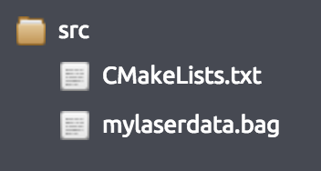

---

### 2. Build the Map

Once we have the bag file, we're ready to build the map! In order to do see, you'll need to follow the next steps:

a) Start the slam_gmapping node, which will take in laser scans (in this case, on the /kobuki/laser/scan topic) and produce a map:

```
rosrun gmapping slam_gmapping scan:=kobuki/laser/scan
```

b) Play the bag file to provide data to the slam_gmapping node:

```
rosbag play name_of_bag_file_created_in_step_1
```

Wait for rosbag to finish and exit.

c) Save the created map using the map_saver node as shown in previous sections:

```
rosrun map_server map_saver -f map_name
```

Now you will have 2 files (map_name.pgm and map_name.yaml) that should look the same as the ones you created in Exercise 1.3.

### Exercise 2.18

Create your own map from the bag file you've created in the previous exercise by following the steps shown above.

#### Data for Exercise 2.18

Check the following Notes in order to complete the Exercise: 

**Note 1**: Remember that the files will be saved to the directory from which you've executed the command.

#### Expected Result for Exercise 2.18

Image File:


YAML File:


---

## Summary

The very first thing you need in order to navigate is a Map of the environment. You can't navigate if you don't have a Map. Furthermore, this Map does have to be built properly, so it accurately represents the environment you want to navigate.

In order to create a Map of the environment, ROS provides the slam_gmapping node (of the gmapping package), which is an implementation of the SLAM (Simulatenous Localization and Mapping) algorithm. Basically, this node takes as input the laser and odometry readings of the robot (in order to get data from the environment), and creates a 2D Map.

This Map is an occupancy represenation of the environment, so it provides information about the occupancy of each pixel in the Map. When the Map is completely built, you can save it into a file.

Also bear in mind that you only need the slam_gmapping node (the Mapper), when you are creating a map. Once the map has been created and saved, this node is not necessary anymore, hence it must be killed. At that point, you should launch the map_server node, which is the node that will provide the map that you just created to other nodes.