# Chapter 4: Path Planning Part 1

## Summary

Estimated time to completion: **3 hours**

What will you learn with this unit?

- Visualize Path Planning in Rviz
- Basic concepts of the move_base node
- What is the Global Planner?
- What is the Global Costmap?

We're arriving at the end of the course, guys! For now, we've seen how to create a map of an environment, and how to localize the robot in it. So, at this point (and assuming everything went well), we have all that we need in order to perform Navigation. That is, we're now ready to plan trajectories in order to move the robot from pose A to pose B.

In this chapter, you'll learn how the Path Planning process works in ROS, and all of the elements that take place in it. But first, as we've been doing in previous chapters, let's have a look at our digital best friend, RViz.

## Visualize Path Planning in Rviz

As you've already seen in previous chapters, you can also launch RViz and add displays in order to watch the Path Planning process of the robot. For this chapter, you'll basically need to use 3 elements of RViz:

- Map Display (Costmaps)
- Path Displays (Plans)
- 2D Tools

### Exercise 4.1

a) Execute the next command in order to launch the move_base node.

**Execute in WebShell #1:**

```
roslaunch husky_navigation move_base_demo.launch
```

b) Open the Graphic Interface and execute the following command in order to start RViz.

**Execute in WebShell #2:**

```
rosrun rviz rviz
```

c) Properly congifure RViz in order to visualize the necessary parts.

#### Visualize Costmaps

- Click the Add button under Displays and chose the Map element.
- Set the topic to **/move_base/global_costmap/costmap**in order to visualize the global costmap
- Change the topic to **/move_base/local_costmap/costmap**in order to visualize the local costmap.
- You can have 2 Map displays, one for each costmap.

> You can add more than one Map display at a time in Rviz to visualize the global costmap and local costmap at the same time.

> The local_costmap displays the free and occupied space around the robot based on the current laser sensor readings.

#### Visualize Plans

- Click the Add button under Displays and chose the Path element.
- Set the topic to **/move_base/NavfnROS/plan** in order to visualize the global plan.
- Change the topic to **/move_base/DWAPlannerROS/local_plan** in order to visualize the local plan.
- You can also have 2 Path displays, one for each plan.

> There is another possible topic to subscribe to called /move_base/DWAPlannerROS/global_plan. This global_plan path is always displayed in Rviz while the trajectory is being executed whereas the topic /move_base/NavfnROS/plan is only displayed initially after a new "2D Nav Goal" is commanded and then it disappears. This happens because /move_base/NavfnROS/plan is only published once after a new goal is commanded, whereas both /move_base/DWAPlannerROS/local_plan and /move_base/DWAPlannerROS/local_plan are published at a rate of around 5 Hz while the robot is trying to reach the goal. You can check the publishing frequency this by running the command: `rostopic hz /move_base/DWAPlannerROS/local_plan`.

d) Use the 2D Pose Estimate tool in order to provide an initial pose for the robot. 

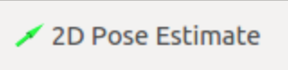

e) Use the 2D Nav Goal tool in order to send a goal pose to the robot. Make sure to select an unoccupied (dark grey) or unexpected (light grey) location. 

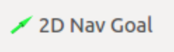

#### Data for Exercise 4.1

Check the following notes in order to complete the exercise:

**Note 1**: Bear in mind that if you don't set a 2D Nav Goal, the planning process won't start. This means that until you do, you won't be able to visualize any plan in RViz.

**Note 2**: In order for the 2D tools to work, the Fixed Frame at Rviz must be set to map.

#### Expected Result for Exercise 4.1

Global Costmap:

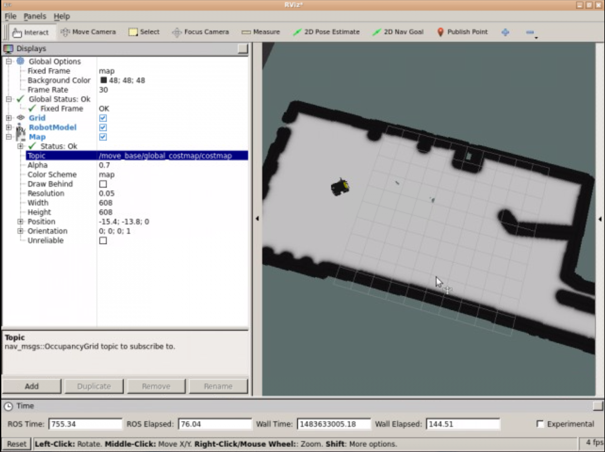

Local Costmap:

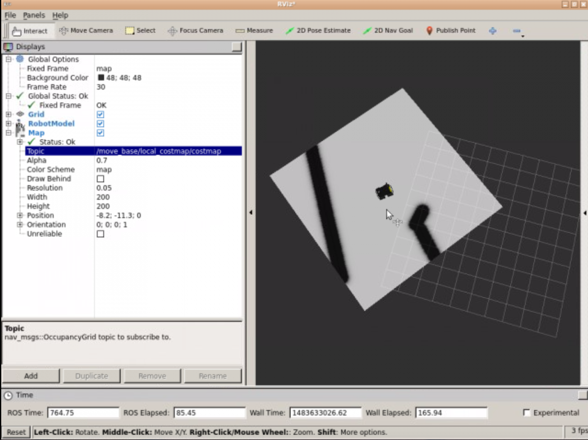

Global Plan:

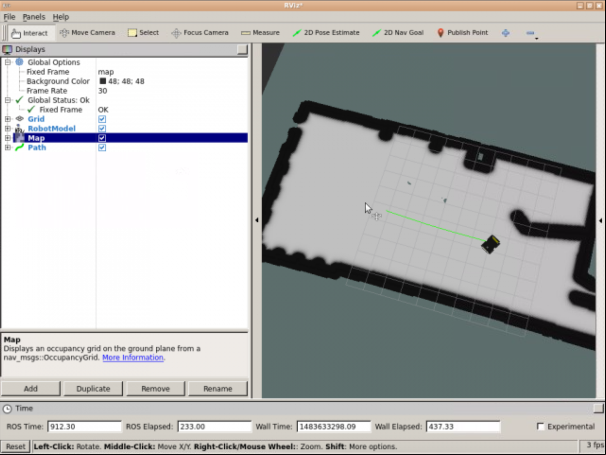

Local Plan (in red) and Global Plan (in green):

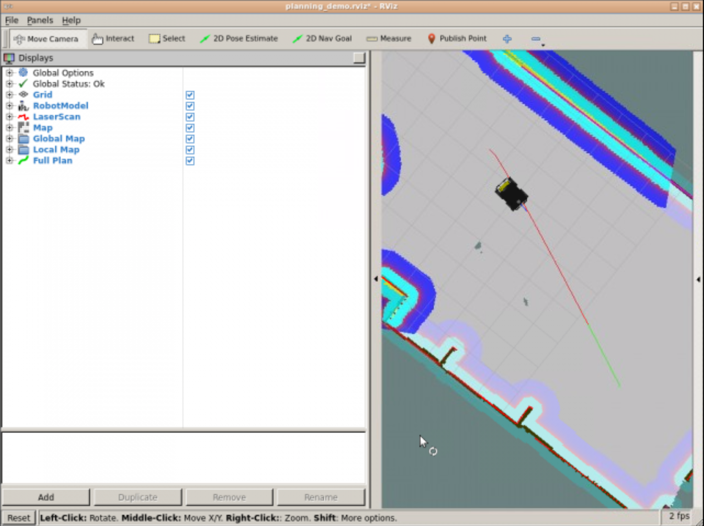

**REMEMBER**: Remember to save your RViz configuration in order to be able to load it again whenever you want. If you don't remember how to do it, check the Mapping Chapter.

That's awesome, right? But what has just happened? What was that 2D Nav Goal tool I used in order to move the robot? And what's a Costmap? How does ROS calculate the trajectories?

Keep calm!! By the end of this chapter, you'll be able to answer all of those questions. But let's go step by step, so that you can completely understand how the whole process works.

## The move_base package

The move_base package contains the **move_base node**. Doesn't that sound familiar? Well, it should, since you were introduced to it in the Basic Concepts chapter! The move_base node is one of the major elements in the ROS Navigation Stack, since it links all of the elements that take place in the Navigation process. Let's say it's like the Architect in Matrix, or the Force in Star Wars. Without this node, the ROS Navigation Stack wouldn't make any sense!

Ok! We understand that the move_base node is very important, but... what is it exactly? What does it do? Great question!

The **main function of the move_base node is to move the robot from its current position to a goal position**. Basically, this node is an implementation of a *SimpleActionServer*, which takes a goal pose with message type *geometry_msgs/PoseStamped*. Therefore, we can send position goals to this node by using a *SimpleActionClient*.

This Action Server provides the topic **move_base/goal**, which is the input of the Navigation Stack. This topic is then used to provide the goal pose.

### Exercise 4.2

a) In a WebShell, visualize the *move_base/goal* topic.

b) As you did in the previous exercise, send a goal to the robot by using the 2D Nav Goal tool in RViz.

c) Check what happens in the topic that you are listening to.

#### Expected Result for Exercise 4.2

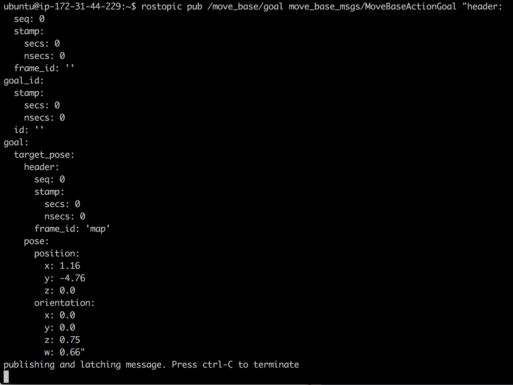

---

So, each time you set a Pose Goal using the 2D Nav Goal tool from RViz, what is really happening is that a new message is being published into the move_base/goal topic.

Anyway, this is not the only topic that the move_base Action Server provides. As every action server, it provides the following 5 topics:

- **move_base/goal (move_base_msgs/MoveBaseActionGoal)**
- **move_base/cancel (actionlib_msgs/GoalID)**
- **move_base/feedback (move_base_msgs/MoveBaseActionFeedback)**
- **move_base/status (actionlib_msgs/GoalStatusArray)**
- **move_base/result (move_base_msgs/MoveBaseActionResult)**

### Exercise 4.3

Without using Rviz, send a pose goal to the move_base node.

a) Use the command line tool in order to send this goal to the Action Server of the move_base node.

b) Visualize through the webshells all of the topics involved in the action, and check their output while the action is taking place, and when it's done.

Check the topic info by running `rostopic info /move_base/goal`:

```
Type: move_base_msgs/MoveBaseActionGoal

Publishers:
 * /move_base (http://rosds_computer:39662/)

Subscribers:
 * /move_base (http://rosds_computer:39662/)
```

Check the message definition by running `rosmsg show move_base_msgs/MoveBaseActionGoal`:

```
std_msgs/Header header
  uint32 seq
  time stamp
  string frame_id
actionlib_msgs/GoalID goal_id
  time stamp
  string id
move_base_msgs/MoveBaseGoal goal
  geometry_msgs/PoseStamped target_pose
    std_msgs/Header header
      uint32 seq
      time stamp
      string frame_id
    geometry_msgs/Pose pose
      geometry_msgs/Point position
        float64 x
        float64 y
        float64 z
      geometry_msgs/Quaternion orientation
        float64 x
        float64 y
        float64 z
        float64 w
```

Now publish a goal to the /move_base/goal topic:

```
$ rostopic pub /move_base/goal move_base_msgs/MoveBaseActionGoal "header:
  seq: 1
  stamp:
    secs: 699
    nsecs: 333000000
  frame_id: ''
goal_id:
  stamp:
    secs: 0
    nsecs:         0
  id: ''
goal:
  target_pose:
    header:
      seq: 1
      stamp:
        secs: 699
        nsecs: 333000000
      frame_id: "map"
    pose:
      position:
        x: -0.425518214703
        y: -0.552486002445
        z: 0.0
      orientation:
        x: 0.0
        y: 0.0
        z: -0.18096932038
        w: 0.983488741716"
```

#### Data for Exercise 4.3

Check the following notes in order to complete the exercise:

**Note 1**: Remember that the SimpleAcionServer subscribes to the /move_base_node/goal topic in order to read the pose goal.

**Note 2**: In order to see an example of a valid message for the /move_base/goal topic, you can listen to the topic while you send a pose goal via the 2D Nav Goal tool of RViz.

**Note 3**: Keep in mind that in order to be able to send goals to the Action Server, the move_base node must be launched.

#### Expected Result for Exercise 4.3

Sending goal:


Echo feedback:

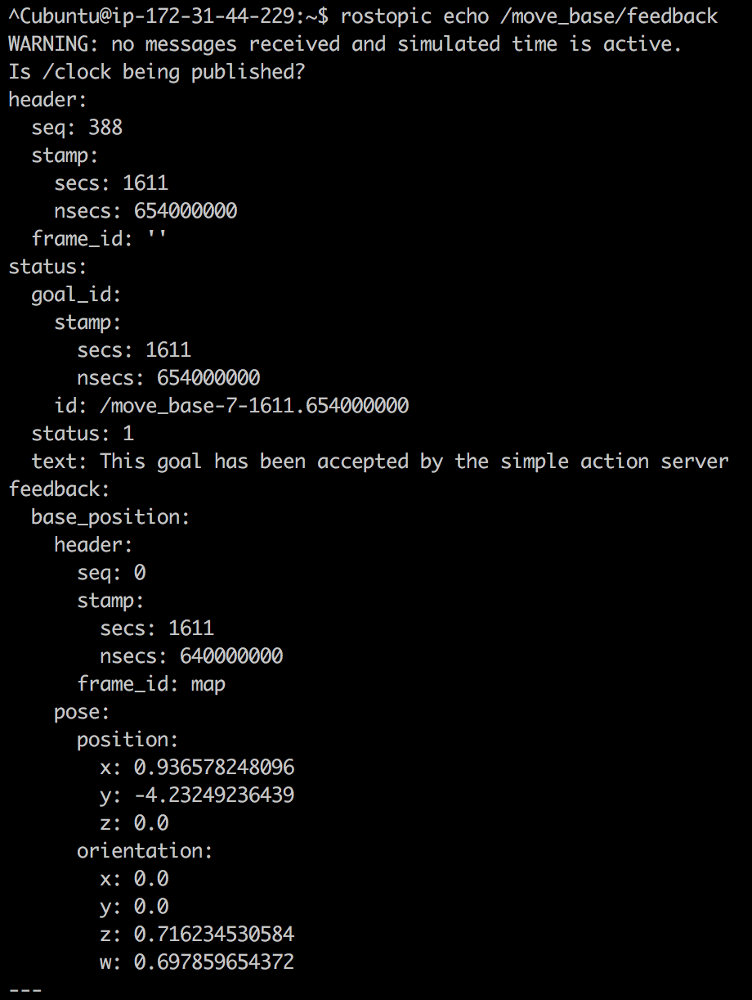

Echo status accepted:

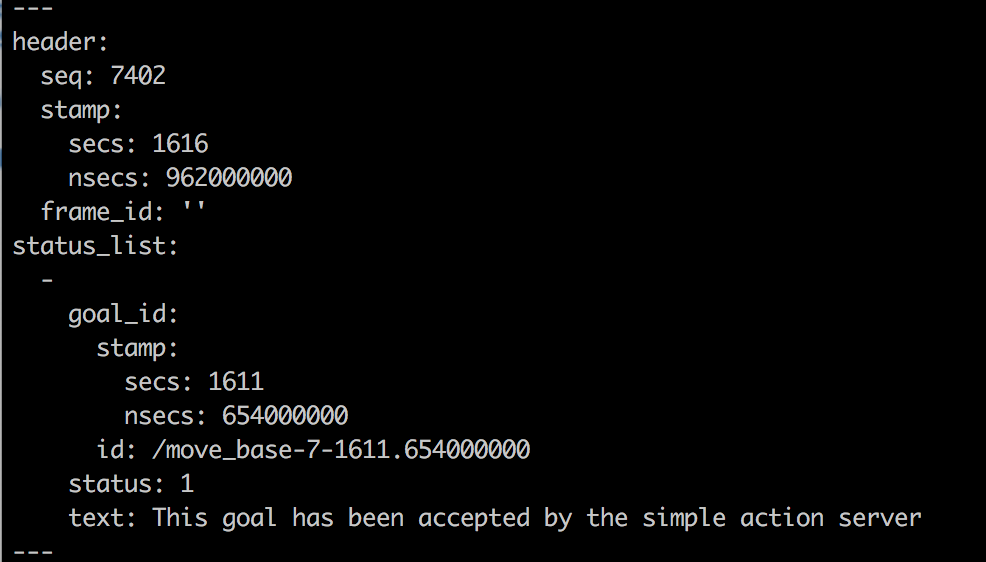

Echo status reached:

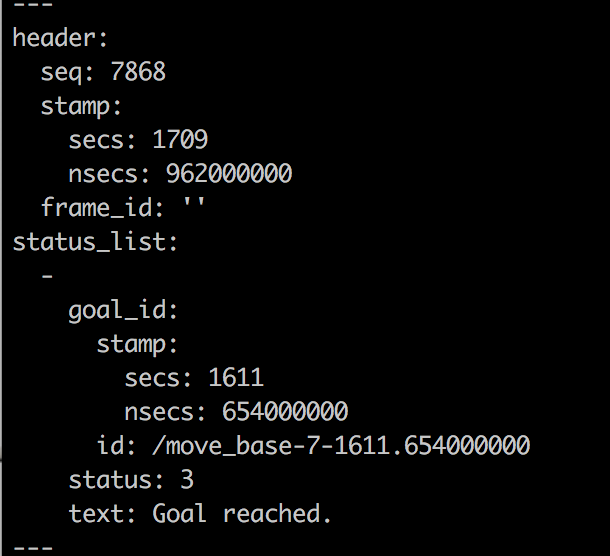

Echo result:

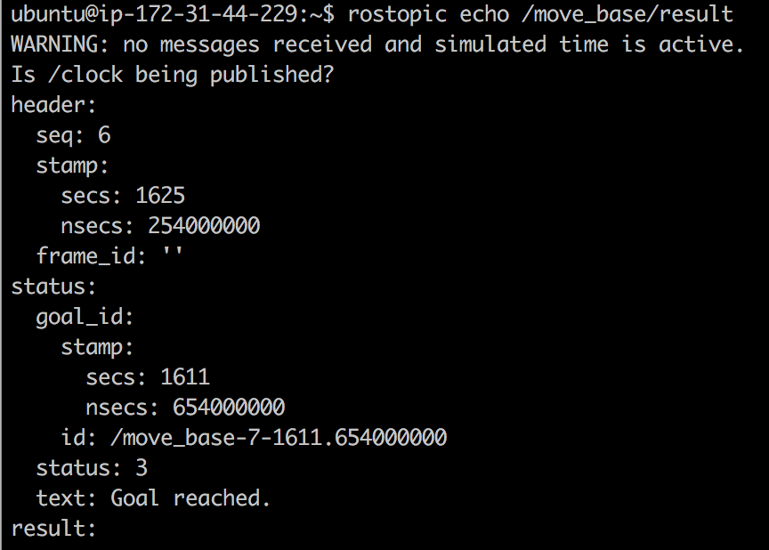

### Exercise 4.4

a) Create a new package named **send_goals**. Add rospy as a dependency.

```
$ cd ~/catkin_ws/src
$ catkin_create_pkg send_goals rospy
```

b) Inside this package, create a file named **send_goal_client.py**. Write into this file the code for an Action Client in order to send messages to the Action Server of the move_base node.

c) Using this Action Client, move the robot to three different Poses of the Map. When the robot has reached the 3 poses, start over again creating a loop, so that the robot will keep going to these 3 poses over and over.

<u>**send\_goal\_client.py**</u>

```python
#! /usr/bin/env python
"""
This is a client for sending a goal to a MoveBase ActionServer called "move_base"
"""

import time
import rospy
import actionlib

# Import action messages
from move_base_msgs.msg import MoveBaseAction, MoveBaseGoal, MoveBaseResult, MoveBaseFeedback

# definition of the feedback callback. This will be called when feedback
# is received from the action server
# it just prints a message indicating a new message has been received


def feedback_callback(feedback):

    print('[Feedback] Going to Goal Pose...')


# initializes the action client node
rospy.init_node('move_base_action_client')

# create the connection to the action server
client = actionlib.SimpleActionClient('/move_base', MoveBaseAction)
# waits until the action server is up and running
client.wait_for_server()
# rospy.loginfo("Action server ready.")

# creates a goal to send to the action server
goal = MoveBaseGoal()
goal.target_pose.header.frame_id = 'map'

waypoints = [[0.0, 0.0, 0.0, 0.0, 0.0, 1.0, 0.0007963],
             [-2.0, -2.0, 0.0, 0.0, 0.0, 0.9092974, -0.4161468],
             [2.0, -2.0, 0.0, 0.0, 0.0, 0.0, 1.0]]

loop_waypoints = False

i = 0  # select first waypoint index

while True:
    goal.target_pose.pose.position.x = waypoints[i][0]
    goal.target_pose.pose.position.y = waypoints[i][1]
    goal.target_pose.pose.position.z = waypoints[i][2]
    goal.target_pose.pose.orientation.x = waypoints[i][3]
    goal.target_pose.pose.orientation.y = waypoints[i][4]
    goal.target_pose.pose.orientation.z = waypoints[i][5]
    goal.target_pose.pose.orientation.w = waypoints[i][6]
    client.send_goal(goal, feedback_cb=feedback_callback)
    client.wait_for_result()
    print('[Result] State: %d' % (client.get_state()))
    if client.get_state() == 0 or not loop_waypoints:  # PENDING
        client.cancel_goal()
        break
    i += 1
    i %= 3

# goal.target_pose.pose.position.x = waypoints[i][0]
# goal.target_pose.pose.position.y = waypoints[i][1]
# goal.target_pose.pose.position.z = waypoints[i][2]
# goal.target_pose.pose.orientation.x = waypoints[i][3]
# goal.target_pose.pose.orientation.y = waypoints[i][4]
# goal.target_pose.pose.orientation.z = waypoints[i][5]
# goal.target_pose.pose.orientation.w = waypoints[i][6]

# sends the goal to the action server, specifying which feedback function
# to call when feedback received
# client.send_goal(goal, feedback_cb=feedback_callback)

# Uncomment these lines to test goal preemption:
# time.sleep(3.0)
# client.cancel_goal()  # would cancel the goal 3 seconds after starting

# wait until the result is obtained
# you can do other stuff here instead of waiting
# and check for status from time to time
# status = client.get_state()
# check the client API link below for more info

# client.wait_for_result()

# print('[Result] State: %d' % (client.get_state()))

```

If `loop_waypoints` is set to `False`, then only one goal message is sent to the action server. The first goal waypoint sent to the action server corresponds to the initial value of index `i`. The bottom half of the script that is commented out was provided by the course. I used their code as a template and made modifications to get the robot to loop through multiple waypoints indefinitely.

#### Explanation

* To find all of the seven message definitions associated with the MoveBase ActionServer, run `roscd move_base_msgs/msg` :

```
MoveBaseActionFeedback.msg  MoveBaseAction.msg        MoveBaseFeedback.msg  MoveBaseResult.msg
MoveBaseActionGoal.msg      MoveBaseActionResult.msg  MoveBaseGoal.msg
```

* An action server really only defines 3 different types of messages: Goal, Feedback, and Result. However,  MoveBaseAction.msg contains instances (?) of MoveBaseActionGoal.msg, MoveBaseActionFeedback.msg, and MoveBaseActionResult.msg:

```
$ cat MoveBaseAction.msg
# ====== DO NOT MODIFY! AUTOGENERATED FROM AN ACTION DEFINITION ======

MoveBaseActionGoal action_goal
MoveBaseActionResult action_result
MoveBaseActionFeedback action_feedback
```

Furthermore MoveBaseActionGoal.msg contains an instance of the MoveBaseGoal.msg:

```
$ cat MoveBaseActionGoal.msg
# ====== DO NOT MODIFY! AUTOGENERATED FROM AN ACTION DEFINITION ======

Header header
actionlib_msgs/GoalID goal_id
MoveBaseGoal goal
```

As you can see, MoveBaseActionGoal.msg contains the Goal message MoveBaseGoal.msg along with metadata about the Goal like the header information and goal ID. The MoveBaseGoal.msg just contains a definition of the goal message:

```
$ cat MoveBaseGoal.msg
# ====== DO NOT MODIFY! AUTOGENERATED FROM AN ACTION DEFINITION ======
geometry_msgs/PoseStamped target_pose
```

The same hierarchy also applies to MoveBaseActionFeedback.msg and MoveBaseActionResult.msg. So if you want to write an action client, you have to define a goal message which contains a target_pose message of type geometry_msgs/PoseStamped. Information about this message type can be found by:

```
$ rosmsg info geometry_msgs/PoseStamped
std_msgs/Header header
  uint32 seq
  time stamp
  string frame_id
geometry_msgs/Pose pose
  geometry_msgs/Point position
    float64 x
    float64 y
    float64 z
  geometry_msgs/Quaternion orientation
    float64 x
    float64 y
    float64 z
    float64 w
```

The goal message includes a pose message that contains the desired position and orientation. These fields in the goal message should be defined in the action client before sending the goal message to the action server. After the action client has sent the goal to the action server, the action client can request **feedback** from the action server to get a status update. In this case, the feedback message contains a geometry_msgs/PoseStamped message:

 ```
$ cat MoveBaseFeedback.msg
# ====== DO NOT MODIFY! AUTOGENERATED FROM AN ACTION DEFINITION ======
geometry_msgs/PoseStamped base_position
 ```

As the action server is executing the action,  it can send feedback to the action client with the current pose information. After the action is completed, the action client can get a **result** from the action server in the form of a result message. In this case, the result message is empty:

```
$ cat MoveBaseResult.msg
# ====== DO NOT MODIFY! AUTOGENERATED FROM AN ACTION DEFINITION ======
```

After receiving the result message, we can check the status of the goal by calling the `get_state()` method:

```
client.get_state()
```

This returns an actionlib_msgs/GoalStatus message which can take on one of 10 possible states:

```
$ rosmsg show actionlib_msgs/GoalStatus
uint8 PENDING=0
uint8 ACTIVE=1
uint8 PREEMPTED=2
uint8 SUCCEEDED=3
uint8 ABORTED=4
uint8 REJECTED=5
uint8 PREEMPTING=6
uint8 RECALLING=7
uint8 RECALLED=8
uint8 LOST=9
actionlib_msgs/GoalID goal_id
  time stamp
  string id
uint8 status
string text
```

In Exercise 4.4, we received a status of 3 which means the goal succeeded.

#### Expected result for Exercise 4.4

The robot moves infinitely to the 3 poses given.

---

So, at this point, you've checked that you can send pose goals to the move_base node by sending messages to the /move_base/goal topic of its Action Server.

When this node **receives a goal pose**, it links to components such as the *global planner, local planner, recovery behaviors, and costmaps*, and **generates an output, which is a velocity command** with the message type *geometry_msgs/Twist*, and sends it to the **/cmd_vel** topic in order to move the robot.

The move_base node, just as you saw with the slam_gmapping and the amcl nodes in previous chapters, also has parameters that you can modify. For instance, one of the parameters that you can modify is the frequency at which the move_base node sends these velocity commands to the base controller. Let's check it with a quick exercise.

### Exercise 4.5

a) Create a new package named **my_move_base_launcher**. Inside this package, create 2 directories, one named **launch** and the other one named **params**. Inside the *launch* directory, create 2 new files named **my_move_base_launch_1.launch** and **my_move_base_launch_2.launch**. Inside the *params* directory, create a new file named **my_move_base_params.yaml**.

b) Have a look at the **move_base_demo.launch** and **move_base.launch** files of the *husky_navigation* package. Also, have a look at the **planner.yaml** file of the same package.

<u>**move\_base\_demo.launch**</u>

```xml
<launch>

  <!-- Run the map server -->
  <arg name="map_file" default="$(find husky_navigation)/maps/my_map.yaml"/>
  <node name="map_server" pkg="map_server" type="map_server" args="$(arg map_file)" />

  <!--- Run AMCL -->
  <include file="$(find husky_navigation)/launch/amcl.launch" />

  <!--- Run Move Base -->
  <include file="$(find husky_navigation)/launch/move_base.launch" />

</launch>
```

**move_base.launch** contains:

```xml
<launch>

  <arg name="no_static_map" default="false"/>

  <arg name="base_global_planner" default="navfn/NavfnROS"/>
  <arg name="base_local_planner" default="dwa_local_planner/DWAPlannerROS"/>
  <!-- <arg name="base_local_planner" default="base_local_planner/TrajectoryPlannerROS"/> -->

  <node pkg="move_base" type="move_base" respawn="false" name="move_base" output="screen">

    <param name="base_global_planner" value="$(arg base_global_planner)"/>
    <param name="base_local_planner" value="$(arg base_local_planner)"/>
    <rosparam file="$(find husky_navigation)/config/planner.yaml" command="load"/>

    <!-- observation sources located in costmap_common.yaml -->
    <rosparam file="$(find husky_navigation)/config/costmap_common.yaml" command="load" ns="global_costmap" />
    <rosparam file="$(find husky_navigation)/config/costmap_common.yaml" command="load" ns="local_costmap"/>

    <!-- local costmap, needs size -->
    <rosparam file="$(find husky_navigation)/config/costmap_local.yaml" command="load" ns="local_costmap" />
    <param name="local_costmap/width" value="10.0"/>
    <param name="local_costmap/height" value="10.0"/>

    <!-- static global costmap, static map provides size -->
    <rosparam file="$(find husky_navigation)/config/costmap_global_static.yaml" command="load" ns="global_costmap" unless="$(arg no_static_map)"/>

    <!-- global costmap with laser, for odom_navigation_demo -->
    <rosparam file="$(find husky_navigation)/config/costmap_global_laser.yaml" command="load" ns="global_costmap" if="$(arg no_static_map)"/>
    <param name="global_costmap/width" value="100.0" if="$(arg no_static_map)"/>
    <param name="global_costmap/height" value="100.0" if="$(arg no_static_map)"/>
  </node>

</launch>
```

**planner.yaml** contains:

```
controller_frequency: 5.0
recovery_behaviour_enabled: true

NavfnROS:
  allow_unknown: true # Specifies whether or not to allow navfn to create plans that traverse unknown space.
  default_tolerance: 0.1 # A tolerance on the goal point for the planner.

TrajectoryPlannerROS:
  # Robot Configuration Parameters
  acc_lim_x: 2.5
  acc_lim_theta:  3.2

  max_vel_x: 1.0
  min_vel_x: 0.0

  max_vel_theta: 1.0
  min_vel_theta: -1.0
  min_in_place_vel_theta: 0.2

  holonomic_robot: false
  escape_vel: -0.1

  # Goal Tolerance Parameters
  yaw_goal_tolerance: 0.1
  xy_goal_tolerance: 0.2
  latch_xy_goal_tolerance: false

  # Forward Simulation Parameters
  sim_time: 2.0
  sim_granularity: 0.02
  angular_sim_granularity: 0.02
  vx_samples: 6
  vtheta_samples: 20
  controller_frequency: 20.0

  # Trajectory scoring parameters
  meter_scoring: true # Whether the gdist_scale and pdist_scale parameters should assume that goal_distance and path_distance are expressed in units of meters or cells. Cells are assumed by default (false).
  occdist_scale:  0.1 #The weighting for how much the controller should attempt to avoid obstacles. default 0.01
  pdist_scale: 0.75  #     The weighting for how much the controller should stay close to the path it was given . default 0.6
  gdist_scale: 1.0 #     The weighting for how much the controller should attempt to reach its local goal,also controls speed  default 0.8

  heading_lookahead: 0.325  #How far to look ahead in meters when scoring different in-place-rotation trajectories
  heading_scoring: false  #Whether to score based on the robot's heading to the path or its distance from the path. default false
  heading_scoring_timestep: 0.8   #How far to look ahead in time in seconds along the simulated trajectorywhen using heading scoring (double, default: 0.8)
  dwa: true #Whether to use the Dynamic Window Approach (DWA)_ or whether to use Trajectory Rollout
  simple_attractor: false
  publish_cost_grid_pc: true

  # Oscillation Prevention Parameters
  oscillation_reset_dist: 0.25 #How far the robot must travel in meters before oscillation flags are reset(double, default: 0.05)
  escape_reset_dist: 0.1
  escape_reset_theta: 0.1

DWAPlannerROS:
  # Robot configuration parameters
  acc_lim_x: 2.5
  acc_lim_y: 0
  acc_lim_th: 3.2

  max_vel_x: 0.5
  min_vel_x: 0.0
  max_vel_y: 0
  min_vel_y: 0

  max_trans_vel: 0.5
  min_trans_vel: 0.1
  max_rot_vel: 1.0
  min_rot_vel: 0.2

  # Goal Tolerance Parameters
  yaw_goal_tolerance: 0.1
  xy_goal_tolerance: 0.2
  latch_xy_goal_tolerance: false

  # # Forward Simulation Parameters
  # sim_time: 2.0
  # sim_granularity: 0.02
  # vx_samples: 6
  # vy_samples: 0
  # vtheta_samples: 20
  # penalize_negative_x: true

  # # Trajectory scoring parameters
  # path_distance_bias: 32.0 # The weighting for how much the controller should stay close to the path it was given
  # goal_distance_bias: 24.0 # The weighting for how much the controller should attempt to reach its localgoal, also controls speed
  # occdist_scale: 0.01 # The weighting for how much the controller should attempt to avoid obstacles
  # forward_point_distance: 0.325 # The distance from the center point of the robot to place an additionalscoring point, in meters
  # stop_time_buffer: 0.2  # The amount of time that the robot must stThe absolute value of the veolicty at which to start scaling the robot's footprint, in m/sop before a collision in order for a trajectory to beconsidered valid in seconds
  # scaling_speed: 0.25 # The absolute value of the veolicty at which to start scaling the robot's footprint, in m/s
  # max_scaling_factor: 0.2 # The maximum factor to scale the robot's footprint by

  # # Oscillation Prevention Parameters
  # oscillation_reset_dist: 0.25 #How far the robot must travel in meters before oscillation flags are reset (double, default: 0.05)
```

c) Copy the contents of these files to the files that you created in the first step.

d) Modify the *my_move_base_launch_1.launch* file so that it loads your second launch file.

Note that **my_move_base_launch_1.launch** already launches **move_base.launch**, so I commented this line out:

```xml
<include file="$(find husky_navigation)/launch/move_base.launch" />
```

and replaced it with this line:

```xml
<include file="$(find my_move_base_launcher)/launch/my_move_base_launch_2.launch" />
```

e) Modify the *my_move_base_launch_2.launch* file so that it loads your move_base parameters file.

Note that **my_move_base_launch_2.launch** already loads the original **planner.yaml** file, so I commented this line out:

```xml
<rosparam file="$(find husky_navigation)/config/planner.yaml" command="load"/>
```

and replaced it with this line:

```xml
<rosparam file="$(find my_move_base_launcher)/params/my_move_base_params.yaml" command="load"/>
```

f) Modify the *my_move_base_params.yaml* file, and change the **controller_frequency** parameter.

g) Launch the *my_move_base_launch_1.launch* file, and check what happens now.

The controller frequency is set to: controller_frequency: 5.0. At 5.0 Hz, the robot moves smoothly and continuously. The maximum /cmd_vel linear speed is 0.5 m/s.  When I decrease the frequency to 1.0 Hz, the robot does not move smoothly nor continuously. It moves for a fraction of a second, then pauses, then continues moving again in a repeated cycle until it reaches the goal. **I do not understand why lowering the frequency would cause this type of behavior.** The maximum /cmd_vel linear speed here is also 0.5 m/s.

When I increase the controller frequency to the default 20.0 Hz, the robot moves smoothly and continuously but much slower than at 5 Hz. I checked the /cmd_vel topic and the max speed was 0.5 m/s at 5 Hz but dropped to 0.166 m/s at 20 Hz. **I do not understand why increasing the frequency would cause the maximum commanded velocity to drop.**

### Exercise 4.6

a) Open Rviz and add a Display in order to be able to visualize the Global Plan.

Under **Displays** > **Map**, select the **Topic** as **/move_base/global_costmap/costmap**.

The global planner will generate a plan to reach the desired goal while avoiding obstacles based on the global costmap. To see the global cost map in Rviz, under **Displays** > **Map**, select the **Topic** as **/move_base/global_costmap/costmap**.

To visualize the Global Plan in Rviz, you need add **Path** to the **Displays** window by selecting **Add** > **Path**. Then under **Displays** > **Path**, select the **Topic** as **/move_base/NavfnROS/plan**.

b) Subscribe to the topic where the Global Planner publishes its planned path, and have a look at it.

See part (a) from above.

c) Using the 2D Nav Goal tool, send a new goal to the move_base node.

### Expected Result for Exercise 4.6

Global Plan in RViz:


Global Plan topic:

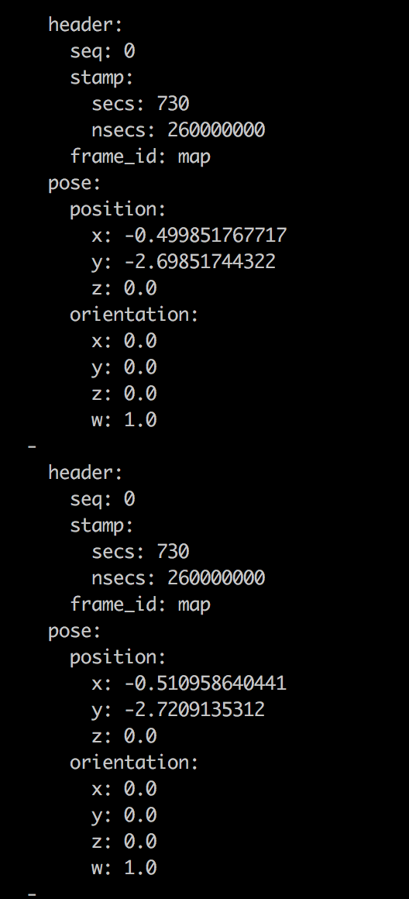

Note that the Global Plan topic screenshot above was generated by listening to the **/move_base/NavfnROS/plan** topic which publishes a plan in the **map** frame. Another topic that sounds similar is the **/move_base/DWAPlannerROS/global_plan** topic, but this publishes a plan in the **odom** frame. **I think these plans could be the same but expressed in different coordinate frames but I would need to verify this.** My guess is that the global planner is generates a global plan in the map frame and then this plan is transformed to be in the odom frame for the local planner.

---

You've probably noticed that when you send a goal in order to visualize the path plan made by the global planner, the robot automatically starts executing this plan. This happens because by sending this goal pose, you're starting the whole navigation process.

In some cases, you might be interested in just visualizing the global plan, but not in executing that plan. For this case, the move_base node provides a service named **/make_plan**. This service allows you to calculate a global plan without causing the robot to execute the path. Let's check how it works with the next exercise.

### Exercise 4.7

Create a Service Client that will call one of the services introduced above in order to get the plan to a given pose, without causing the robot to move.

a) Create a new package named **make_plan**. Add rospy as a dependency.

b) Inside this package, create a file named **make_plan_caller.py**. Write the code for your Service Client into this file.

#### Data for Exercise 4.7

Check the following notes in order to complete the exercise:

**Note 1**: The type of message used by the /make_plan service is nav_msgs/GetPlan.

**Note 2**: When filing this message in order to call the service, you don't have to fill all of the fields of the message. Check the following message example:

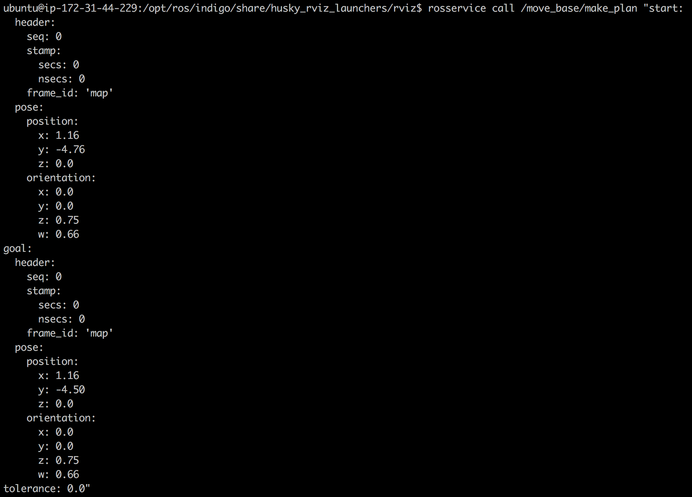

#### Explanation

First check information about the **/move_base/make_plan** service:

```
$ rosservice info /move_base/make_plan
Node: /move_base
URI: rosrpc://rosds_computer:54715
Type: nav_msgs/GetPlan
Args: start goal tolerance
```

Then show the structure of the **/nav_msgs/GetPlan** service message type:

```
$ rossrv show nav_msgs/GetPlan
geometry_msgs/PoseStamped start
  std_msgs/Header header
    uint32 seq
    time stamp
    string frame_id
  geometry_msgs/Pose pose
    geometry_msgs/Point position
      float64 x
      float64 y
      float64 z
    geometry_msgs/Quaternion orientation
      float64 x
      float64 y
      float64 z
      float64 w
geometry_msgs/PoseStamped goal
  std_msgs/Header header
    uint32 seq
    time stamp
    string frame_id
  geometry_msgs/Pose pose
    geometry_msgs/Point position
      float64 x
      float64 y
      float64 z
    geometry_msgs/Quaternion orientation
      float64 x
      float64 y
      float64 z
      float64 w
float32 tolerance
---
nav_msgs/Path plan
  std_msgs/Header header
    uint32 seq
    time stamp
    string frame_id
  geometry_msgs/PoseStamped[] poses
    std_msgs/Header header
      uint32 seq
      time stamp
      string frame_id
    geometry_msgs/Pose pose
      geometry_msgs/Point position
        float64 x
        float64 y
        float64 z
      geometry_msgs/Quaternion orientation
        float64 x
        float64 y
        float64 z
        float64 w
```

The first part of the service message is the **request** followed by the **response**. The request consists of a start pose and goal pose. The response consists of an array of a sequence of poses that comprise the planned trajectory.

The **make_plan_caller.py** service client contains:

```python
#!/usr/bin/env python
"""
This is a service client that calls the /move_base/make_plan service.
"""

import rospy
from nav_msgs.srv import GetPlan, GetPlanRequest

# Initialize node for service client
rospy.init_node('make_plan_service_client', anonymous=True)

# Wait for service server to respond
rospy.wait_for_service('/move_base/make_plan')

make_plan = rospy.ServiceProxy('/move_base/make_plan', GetPlan)
req = GetPlanRequest()
req.start.header.frame_id = 'map'
req.start.pose.position.x = 0.0
req.start.pose.position.y = 0.0
req.start.pose.position.z = 0.0
req.start.pose.orientation.x = 0.0
req.start.pose.orientation.y = 0.0
req.start.pose.orientation.z = 0.0
req.start.pose.orientation.w = 1.0
req.goal.header.frame_id = 'map'
req.goal.pose.position.x = 1.0
req.goal.pose.position.y = 1.0
req.goal.pose.position.z = 0.0
req.goal.pose.orientation.x = 0.0
req.goal.pose.orientation.y = 0.0
req.goal.pose.orientation.z = 0.0
req.goal.pose.orientation.w = 1.0
req.tolerance = 0.1
resp = make_plan(req)

print resp

```

Note that you must specify the **frame** of the start pose and goal pose as "map" before sending the request message or you will get an error. To run the service client, open a terminal and run `rosrun make_plan make_plan_caller.py`.

#### Expected Result for Exercise 4.7

Returned Plan:

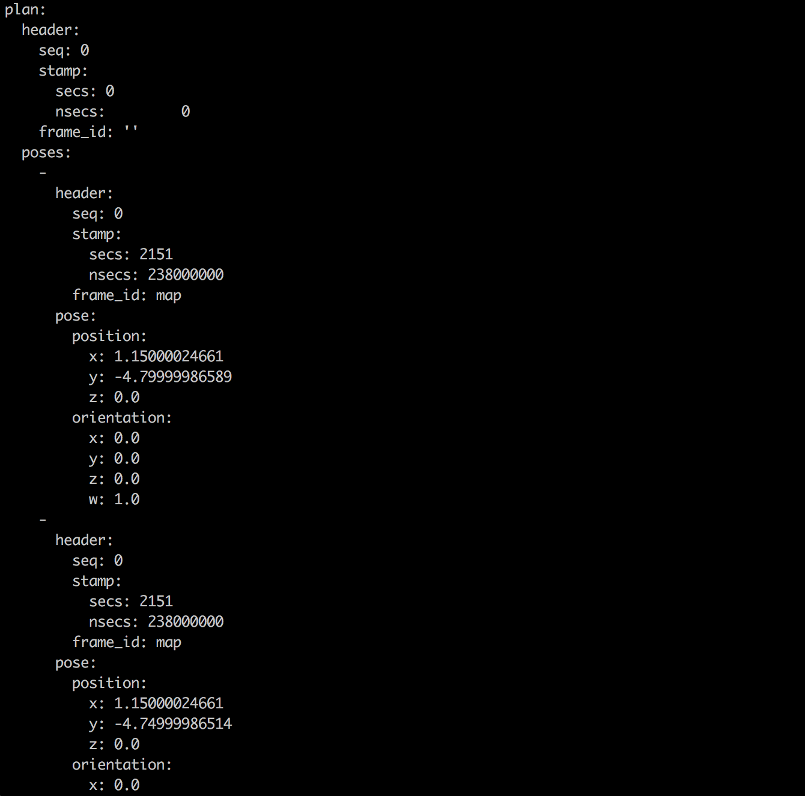

---

So, you now know that the first step of this navigation process is to calculate a safe plan so that your robot can arrive to the user-specified goal pose. But... how is this path calculated?

There exist different global planners. Depending on your setup (the robot you use, the environment it navigates, etc.), you would use one or another. Let's have a look at the most important ones.

## Navfn

The Navfn planner is probably the most commonly used global planner for ROS Navigation. It uses Dijkstra's algorithm in order to calculate the shortest path between the initial pose and the goal pose. Below, you can see an animation of how this algorithm works.


## Carrot Planner

The carrot planner takes the goal pose and checks if this goal is in an obstacle. Then, if it is in an obstacle, it walks back along the vector between the goal and the robot until a goal point that is not in an obstacle is found. It, then, passes this goal point on as a plan to a local planner or controller. Therefore, this planner does not do any global path planning. It is helpful if you require your robot to move close to the given goal, even if the goal is unreachable. In complicated indoor environments, this planner is not very practical. 

This algorithm can be useful if, for instance, you want your robot to move as close as possible to an obstacle (a table, for instance).

## Global Planner

The global planner is a more flexible replacement for the navfn planner. It allows you to change the algorithm used by navfn (Dijkstra's algorithm) to calculate paths for other algorithms. These options include support for A∗, toggling quadratic approximation, and toggling grid path.

### Change the Global Planner

The global planner used by the move_base node it's usually specified in the move_base parameters file. In order to do this, you will add one of the following lines to the parameters file:

```python
base_global_planner: "navfn/NavfnROS" # Sets the Navfn Planner

base_global_planner: "carrot_planner/CarrotPlanner" # Sets the Carrot Planner

base_global_planner: "global_planner/GlobalPlanner" # Sets the Global Planner
```

**NOTE:** It can also, though, be specified in the launch file, like it is our case.

### Exercise 4.8

a) Open Rviz and add a display in order to be able to visualize the global plan.

b) Send a goal using the 2D Nav Goal tool. This goal must be "inside" an obstacle. Check what happens.

I got this error when choosing navfn/NavfnROS as the global planner:

```
[ WARN] [1556317165.381964265, 292.837000000]: Map update loop missed its desired rate of 4.0000Hz... the loop actually took 2.2820 seconds
[ WARN] [1556317165.731875003, 292.983000000]: Clearing costmap to unstuck robot (1.840000m).
[ WARN] [1556317176.228963192, 298.037000000]: Map update loop missed its desired rate of 4.0000Hz... the loop actually took 2.2000 seconds
[ WARN] [1556317176.505130591, 298.184000000]: Rotate recovery behavior started.
[ WARN] [1556317190.725861392, 304.258000000]: Map update loop missed its desired rate of 4.0000Hz... the loop actually took 1.2210 seconds
[ WARN] [1556317191.384051691, 304.526000000]: Map update loop missed its desired rate of 4.0000Hz... the loop actually took 0.2680 seconds
[ WARN] [1556317198.462509384, 307.882000000]: Map update loop missed its desired rate of 4.0000Hz... the loop actually took 3.3740 seconds
[ERROR] [1556317198.803701155, 308.036000000]: Aborting because a valid plan could not be found. Even after executing all recovery behaviors
```


c) Modify the **my_move_base_launch_2.launch** file so that it now uses the carrot planner.

There are two possible ways to set the value of the base_global_planner parameter in the launch file:

1. In the launch file (not inside any tags), define an argument called "base_global_planner" and set its value to be "carrot_planner/CarrotPlanner":

```xml
<arg name="base_global_planner" default="carrot_planner/CarrotPlanner"/>
```

When launching the move_base package, set the value of the "base_global_planner" with the argument defined above inside of the \<node> tag:

```xml
<param name="base_global_planner" value="$(arg base_global_planner)"/>
```

2. Set the value of "base_global_planner" in the params.yaml file:

```python
base_global_planner: "carrot_planner/CarrotPlanner" # Sets the Carrot Planner
```

Then load the params.yaml file inside of the \<node> tag when you launch the move_base package:

```xml
<rosparam file="$(find my_move_base_launcher)/params/my_move_base_params.yaml" command="load"/>
```

> When setting the value of the base_global_planner, make sure to only define it using only one of the methods above and commenting out the other one to avoid naming conflicts.

d) Repeat step b, and check what happens now.

The carrot_planner/CarrotPlanner planned a path to the boundary of the obstacle as expected.

#### Data for Exercise 4.8

Check the following notes in order to complete the exercise:

**Note 1**: To make sure you've properly changed the global planner, you can use the following command:

**rosparam get /move_base/base_global_planner**.

#### Expected Result for Exercise 4.8

Sending goal:

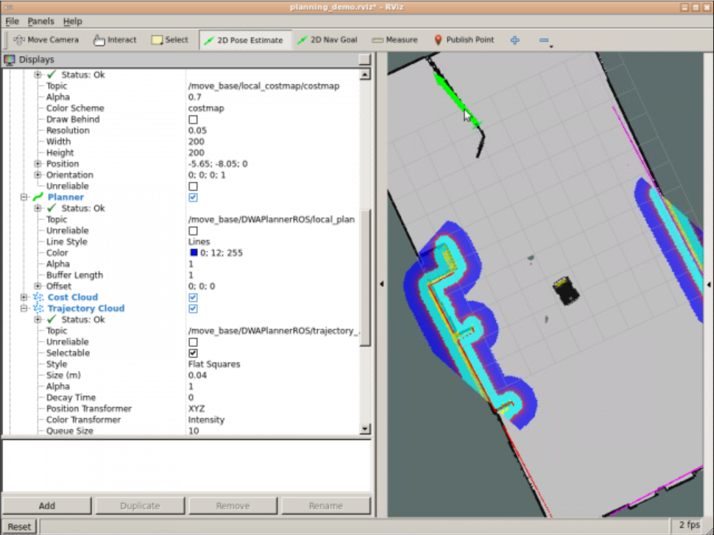

Navfn:

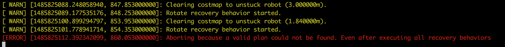

Sending goal at obstacle:


Carrot Planner:

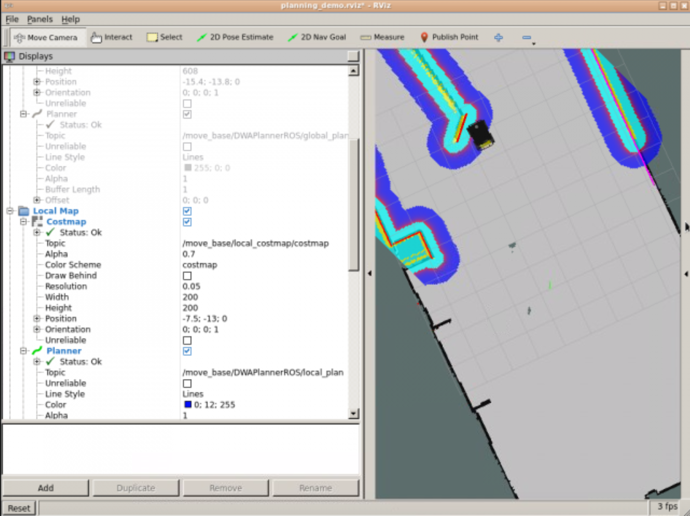

---

The global planner also has its own parameters in order to customize its behaviour. The parameters for the global planner are also located in a YAML file. Depending on which global planner you use, the parameters to set will be different. In this course, we will have a look at the parameters for the navfn planner because it's the one that is most commonly used. If you are interested in seeing the parameters you can set for the other planners, you can have a look at them here:

carrot planner: <http://wiki.ros.org/carrot_planner>

global planner: <http://wiki.ros.org/global_planner>

To use the GlobalPlanner, set the value of base_global_planner in the parameters YAML file as:

```python
base_global_planner: "global_planner/GlobalPlanner"
```

The parameters of GlobalPlanner can be set in the YAML file for example by:

```python
GlobalPlanner:
  use_dijkstra: false
```

## Navfn Parameters

- **/allow_unknown (default: true)**: Specifies whether or not to allow navfn to create plans that traverse unknown space. NOTE: if you are using a layered costmap_2d costmap with a voxel or obstacle layer, you must also set the track_unknown_space param for that layer to be true, or it will convert all of your unknown space to free space (which navfn will then happily go right through).
- **/planner_window_x (default: 0.0)**: Specifies the x size of an optional window to restrict the planner to. This can be useful for restricting NavFn to work in a small window of a large costmap.
- **/planner_window_y (default: 0.0)**: Specifies the y size of an optional window to restrict the planner to. This can be useful for restricting NavFn to work in a small window of a large costmap.
- **/default_tolerance (default: 0.0)**: A tolerance on the goal point for the planner. NavFn will attempt to create a plan that is as close to the specified goal as possible, but no farther away than the default_tolerance.

- **cost_factor**
- **neutral_cost**
- **lethal_cost**

Here you can see an example of a global planner parameters file:

```python
NavfnROS:
  visualize_potential: false    
  allow_unknown: false          
                                
  planner_window_x: 0.0         
  planner_window_y: 0.0         

  default_tolerance: 0.0
```

### Exercise 4.9

Change the **use_dijkstra** parameter to false, and repeat Exercise 4.8. Check if something changes now. 

Setting **use_dijkstra** to false means that the **\*A** algorithm is used as the global planner. From inspection, it is difficult to tell the difference between the two algorithms. The wiki page http://wiki.ros.org/global_planner shows some comparisons between the two algorithms.

---

So... summarizing:

Until now, you've seen that a global planner exists that is in charge of calculating a safe path in order to move the robot from an initial position to a goal position. You've also seen that there are different types of global planners, and that you can choose the global planner that you want to use. Finally, you've also seen that each planner has its own parameters, which modify the way the planner behaves.

But now, let me ask you a question. When you plan a trajectory, this trajectory has to be planned according to a map, right? A path without a map makes no sense. Ok, so... can you guess what map the global planner uses in order to calculate its path?

You may be tempted to think that the map that is being used is the map that you created in the Mapping Chapter (Chapter 2) of this course... but, let me tell you, that's not entirely true.

There exists another type of map: **the costmap**. Does it sound familiar? It should since you were introduced to it back in the first exercise of this chapter.

A costmap is a map that represents places that are safe for the robot to be in a grid of cells. Usually, the values in the costmap are binary, representing either free space or places where the robot would be in collision.

Each cell in a costmap has an integer value in the range {0,255}. There are some special values frequently used in this range, which work as follows:

- **255 (NO_INFORMATION)**: Reserved for cells where not enough information is known.
- **254 (LETHAL_OBSTACLE**: Indicates that a collision-causing obstacle was sensed in this cell
- **253 (INSCRIBED_INFLATED_OBSTACLE)**: Indicates no obstacle, but moving the center of the robot to this location will result in a collision
- **0 (FREE_SPACE)**: Cells where there are no obstacles and, therefore, moving the center of the robot to this position will not result in a collision

There exist 2 types of costmaps: **global costmap** and **local costmap**. The main difference between them is, basically, the way they are built:

- The **global costmap** is created from a static map.
- The **local costmap** is created from the robot's sensor readings.

For now, we'll focus on the global costmap since it is the one used by the global planner. So, **the global planner uses the global costmap in order to calculate the path to follow**.

Let's do an exercise so that you can have a better idea of how a global costmap looks.

### Exercise 4.10

Launch Rviz and add the necessary display in order to visualize the global costmap. 

#### Data for Exercise 4.10

Check the following notes in order to complete the exercise:

**Note 1**: You can change the colours used for the global costmap at the Color Scheme parameter in the RViz configuration:

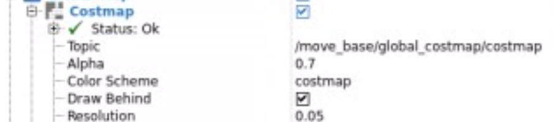

#### Expected Result for Exercise 4.10

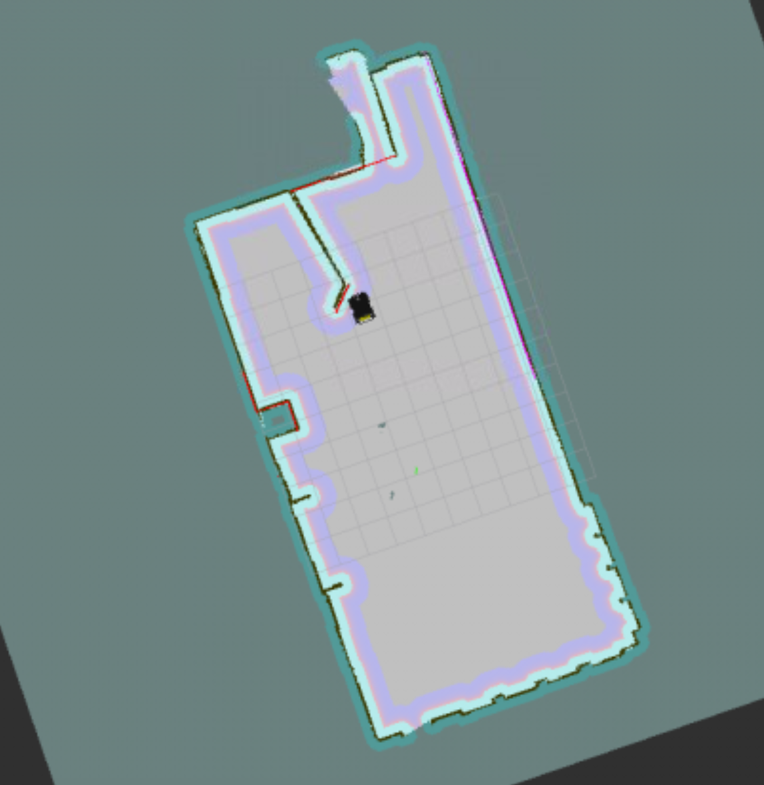

## Global Costmap

The global costmap is created from a user-generated static map (as the one we created in the Mapping Chapter). In this case, the costmap is initialized to match the width, height, and obstacle information provided by the static map. This configuration is normally used in conjunction with a localization system, such as amcl. This is the method you'll use to initialize a **global costmap**.

The global costmap also has its own parameters, which are defined in a YAML file. Next, you can see an example of a global costmap parameters file.

```python
global_frame: map
static_map: true
rolling_window: false

plugins:
  - {name: static,                  type: "costmap_2d::StaticLayer"}
  - {name: inflation,               type: "costmap_2d::InflationLayer"}
  - {name: obstacles,               type: "costmap_2d::VoxelLayer"}
```

Costmap parameters are defined in 3 different files:

- A YAML file that sets the parameters for the global costmap (which is the one you've seen above). Let's name this file *global_costmap_params.yaml*.
- A YAML file that sets the parameters for the local costmap. Let's name this file *local_costmap_params.yaml*.
- A YAML file that sets the parameters for both the global and local costmaps. Let's name this file *common_costmap_params.yaml*.

Fow now, we'll focus on the global costmap parameters since it's the costmap that is used by the global planner.

### Global Costmap Parameters

The parameters you need to know are the following:

- **global_frame (default: "/map")**: The global frame for the costmap to operate in.
- **static_map (default: true)**: Whether or not to use a static map to initialize the costmap.
- **rolling_window (default: false)**: Whether or not to use a rolling window version of the costmap. If the static_map parameter is set to true, this parameter must be set to false.
- **plugins**: Sequence of plugin specifications, one per layer. Each specification is a dictionary with a **name** and **type** fields. The name is used to define the parameter namespace for the plugin. This name will then be defined in the **common_costmap_parameters.yaml** file, which you will see in the the next Unit. The type field actually defines the plugin (source code) that is going to be used.

So, by setting the static_map parameter to true, and the rolling_window parameters to false, we will initialize the costmap by getting the data from a static map. This is the way you want to initialize a global costmap.

### Exercise 4.11

a) Add a file named **my_global_costmap_params.yaml** to the *params* directory of the package you created in Exercise 4.5.

b) Copy the contents of the **costmap_global_static.yaml** file of the *husky_navigation* package into this file.

c) Modify the **my_move_base_launch_2.launch** file you created in Exercise 4.5 so that it loads the global costmap parameters files you just created.

Find this line and comment it out:

```xml
<rosparam file="$(find husky_navigation)/config/costmap_global_static.yaml" command="load" ns="global_costmap" unless="$(arg no_static_map)"/>
```

Add this line:

```xml
<rosparam file="$(find my_move_base_launcher)/params/my_global_costmap_params.yaml" command="load" ns="global_costmap" unless="$(arg no_static_map)"/>
```

d) Change the **rolling_window** parameter to true and launch the move_base node again.

e) Check what changes you see in the visualization of the global costmap.

This is what my_global_costmap_params.yaml contains:

```python
global_frame: map
static_map: false
rolling_window: true
track_unknown_space: track_unknown_space

plugins:
  - {name: static,                  type: "costmap_2d::StaticLayer"}
  - {name: obstacles_laser,         type: "costmap_2d::VoxelLayer"}
  - {name: inflation,               type: "costmap_2d::InflationLayer"}
```

When rolling_window is set to true, make sure that static_map is set to false.

#### Expected Result for Exercise 4.11

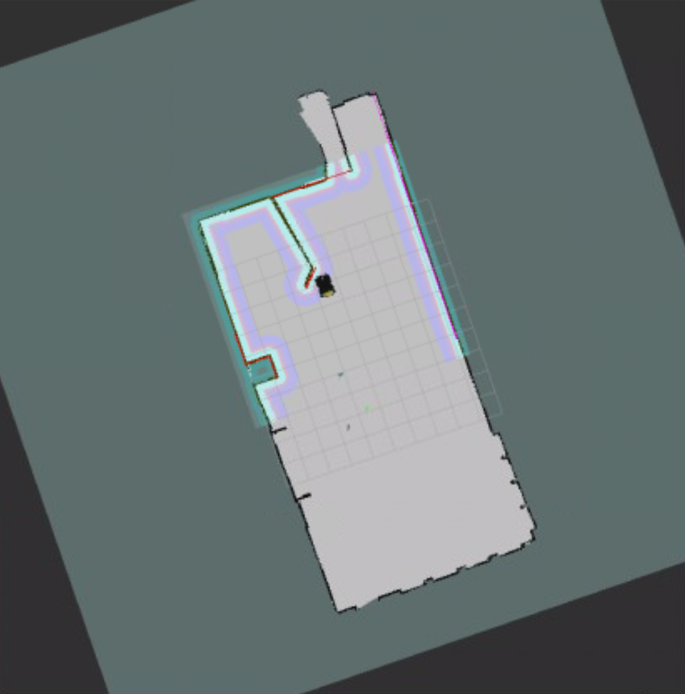

---

The last parameter you need to know how to set is the plugins area. In the plugins area, we will add layers to the costmap configuration. Ok, but... what are layers?

In order to simplify (and clarify) the configuration of costmaps, ROS uses layers. Layers are like "blocks" of parameters that are related. For instance, the **static map, the sensed obstacles, and the inflation are separated into different layers**. These layers are defined in the **common_costmap_parameters.yaml**file, and then added to the **local_costmap_params.yaml** and **global_costmap_params.yaml** files.

To add a layer to a configuration file of a costmap, you will specify it in the plugins area. Have a look at the following line:

```python
plugins: 
    - {name: static_map,       type: "costmap_2d::StaticLayer"}
```

Here, you're adding to your costmap configuration a layer named **static_map**, which will use the **costmap_2d::StaticLayer** plugin. You can add as many layers as you want:

```python
plugins: 
    - {name: static_map,       type: "costmap_2d::StaticLayer"}
    - {name: obstacles,        type: "costmap_2d::VoxelLayer"}
    - {name: inflation,        type: "costmap_2d::InflationLayer"}
```

For instance, you can see an example on the local costmap parameters file shown above. In the case of the global costmap, you will usually use these 2 layers:

- **costmap_2d::StaticLayer**: Used to initialize the costmap from a static map.
- **costmap_2d::InflationLayer**: Used to inflate obstacles.

You may have noticed that the layers are just being added to the parameters file. That's true. Both in the global and local costmap parameters file, the layers are just added. The specific parameters of these layers are defined in the **common costmap parameters** file. We will have a look at this file later on in the chapter.

