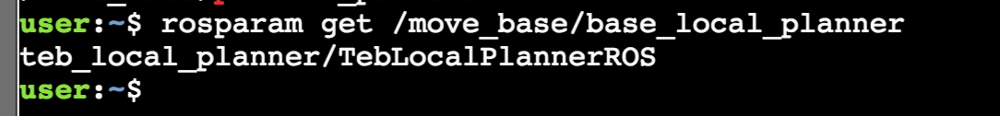
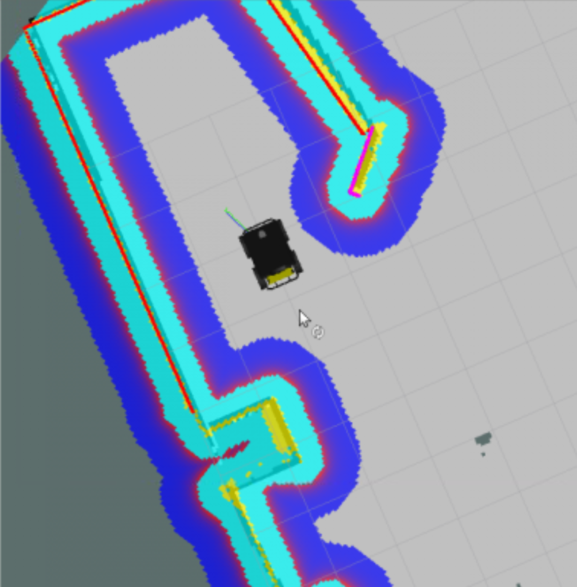
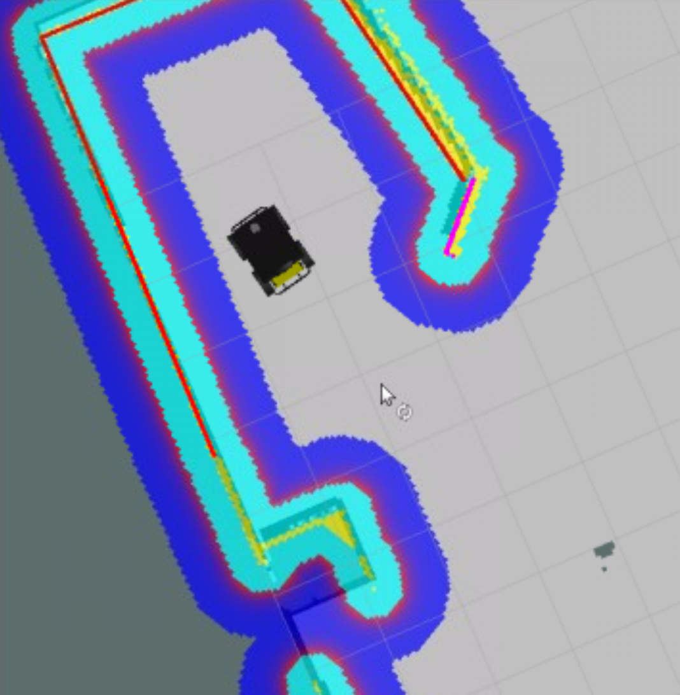
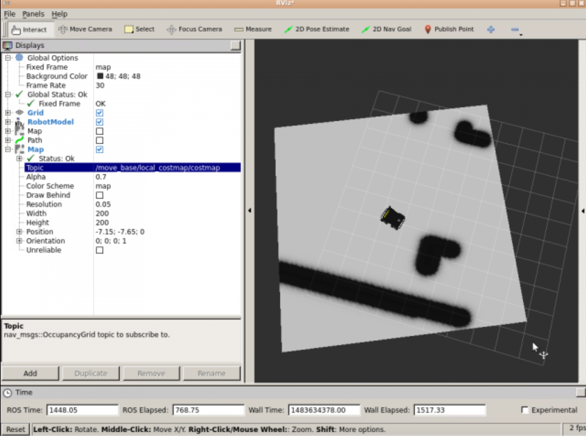
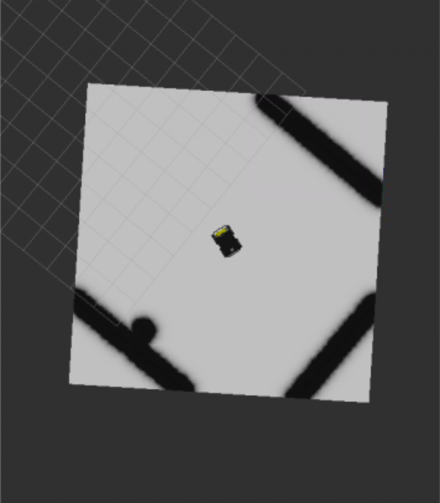
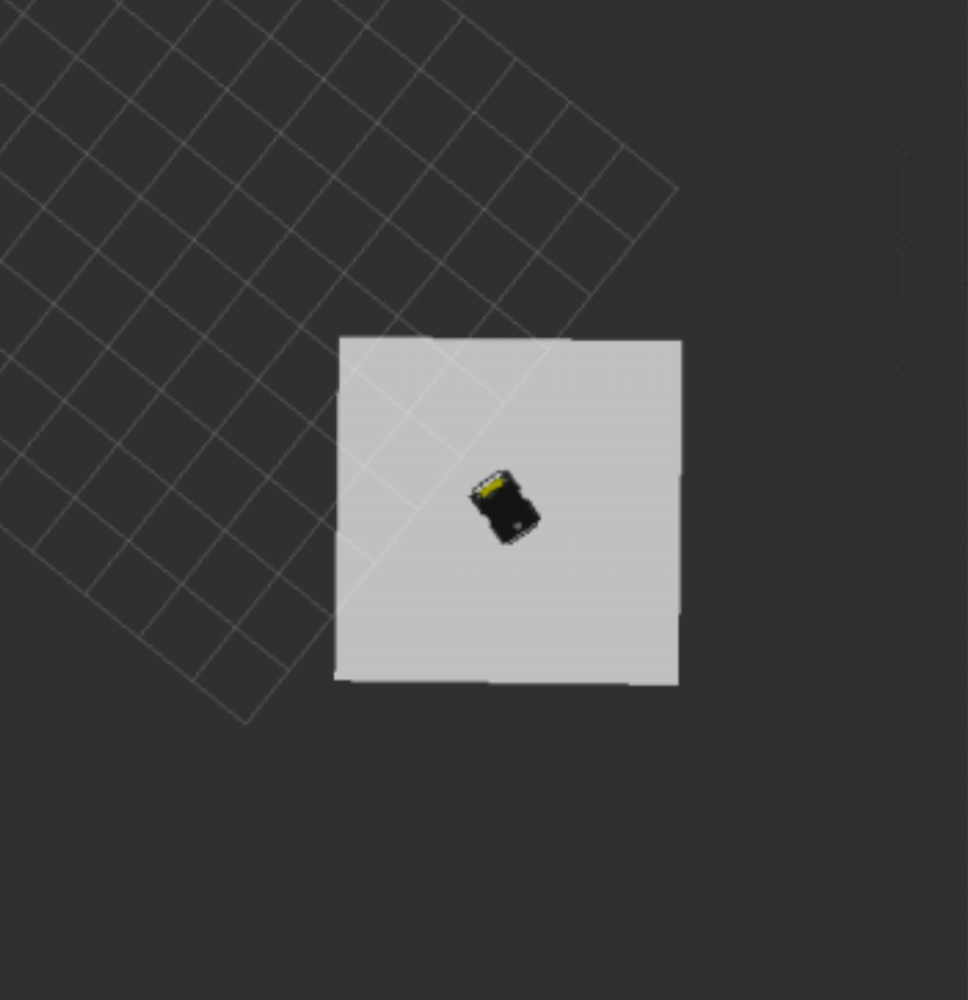
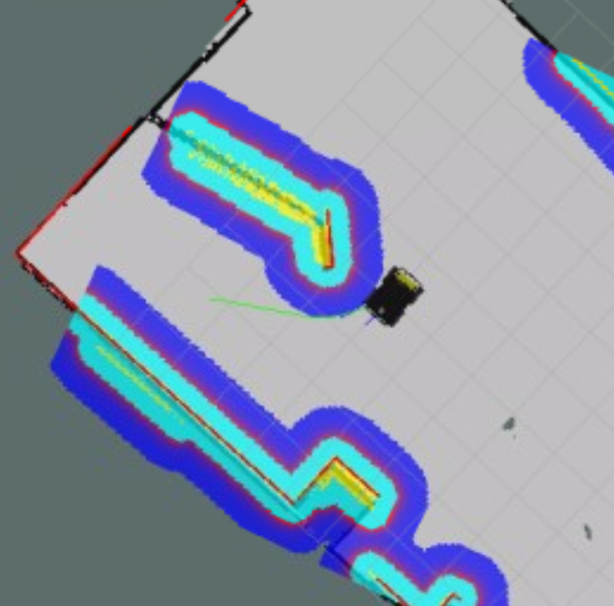
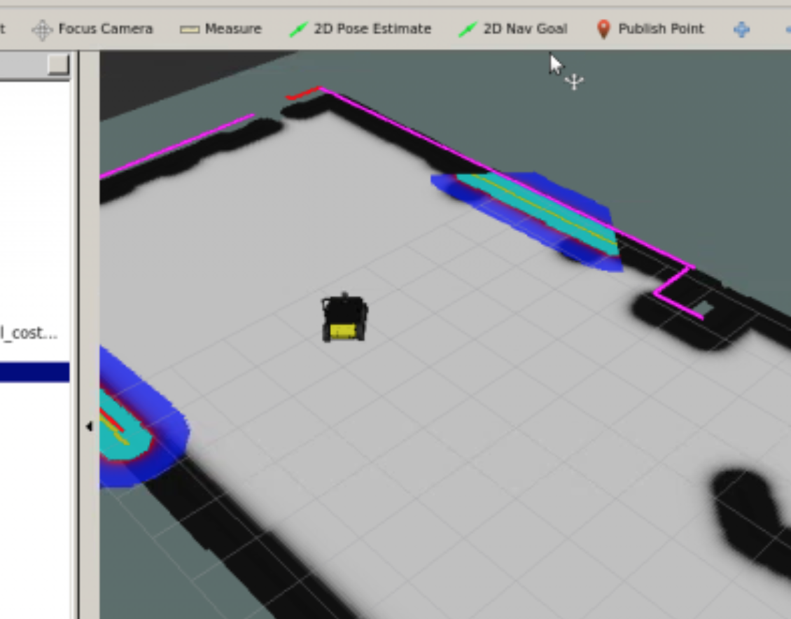
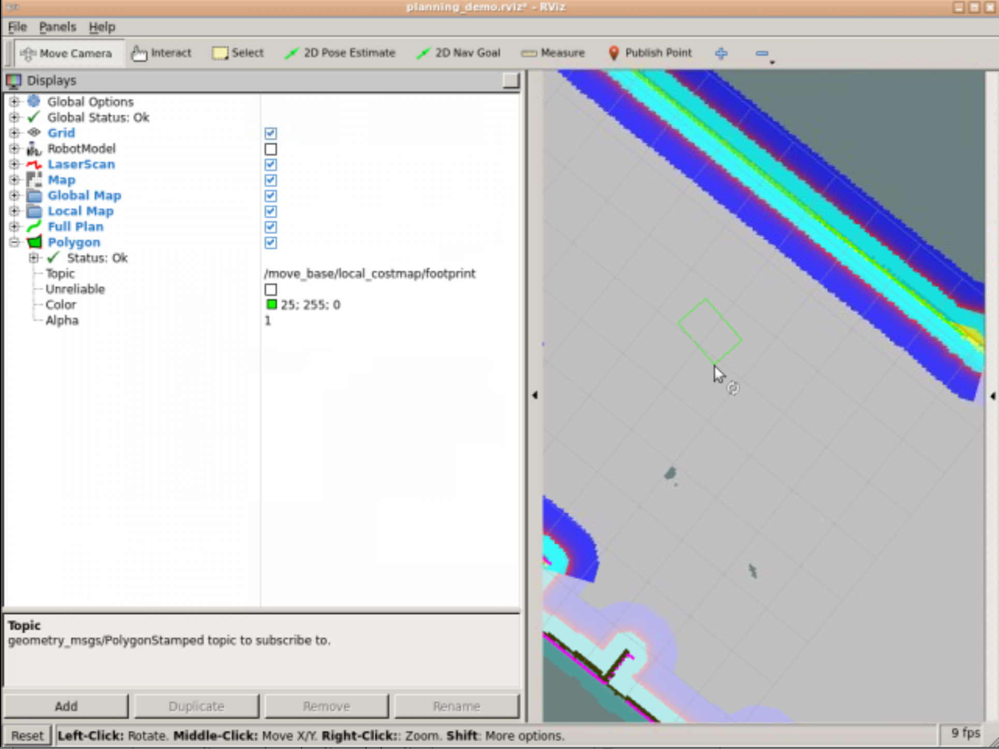

# Unit 5: Path Planning Part 2 (Obstacle Avoidance)

## Summary

Estimated time to completion: **3 hours**

What will you learn with this unit?

- How does Obstacle Avoidance work
- What is the Local Planner?
- What is the Local Costmap?
- Path Planning Recap
- How to use the Dynamic Reconfigure and other Rviz tools

------

Until this point, you've seen how ROS plans a trajectory in order to move a robot from a starting position to a goal position. In this chapter, you will learn how ROS executes this trajectory, and avoids obstacles while doing so. You will also learn other important concepts regarding Path Planning, which we missed in the previous chapter. Finally, we will do a summary so that you can better understand the whole process. 

Are you up to the challenge? Let's get started then!

### The Local Planner

Once the global planner has calculated the path to follow, this path is sent to the local planner. The local planner, then, will execute each segment of the global plan (let's imagine the local plan as a smaller part of the global plan). So, **given a plan to follow (provided by the global planner) and a map, the local planner will provide velocity commands in order to move the robot**.

Unlike the global planner, the **local planner monitors the odometry and the laser data**, and chooses a collision-free local plan (let's imagine the local plan as a smaller part of the global plan) for the robot. So, the local planner **can recompute the robot's path on the fly** in order to keep the robot from striking objects, yet still allowing it to reach its destination.

Once the local plan is calculated, it is published into a topic named **/local_plan**. The local planner also publishes the portion of the global plan that it is attemting to follow into the topic **/global_plan**. Let's do an exercise so that you can see this better.

## Exercise 5.1

a) Open Rviz and add Displays in order to be able to visualize the **/global_plan** and the **/local_plan** topics of the local planner.

b) Send a Goal Pose to the robot and visualize both topics.

**/global_plan** topic:

```
$ rostopic info /move_base/DWAPlannerROS/global_plan
Type: nav_msgs/Path
```

```
$ rosmsg show nav_msgs/Path
std_msgs/Header header
  uint32 seq
  time stamp
  string frame_id
geometry_msgs/PoseStamped[] poses
  std_msgs/Header header
    uint32 seq
    time stamp
    string frame_id
  geometry_msgs/Pose pose
    geometry_msgs/Point position
      float64 x
      float64 y
      float64 z
    geometry_msgs/Quaternion orientation
      float64 x
      float64 y
      float64 z
      float64 w
```

**/local_plan** topic:

```
$ rostopic info /move_base/DWAPlannerROS/local_plan
Type: nav_msgs/Path
```

Both global and local plans are message types containing a sequence of waypoints for the robot to follow. The global plan is basically the shortest obstacle-free path from the current position to the goal based on the global static map. The local plan is path that the robot is actually commanded to follow and it accounts for obstacles not in the static map and the robot's kinematic constraints. For example, the local planner may generate a plan that gives the robot a smooth and continuous path to follow based on its kinematic constraints. It is interesting to note that the **/move_base/NavfnROS/plan** topic also has the message type **nav_msgs/Path**. In practice, /global_plan and NavfnROS/plan usually look the same. Sometimes, /global_plan looks like a shorter version (a subset?) of NavfnROS/plan when the goal is far enough away from the current position.

What is the real difference between **/global_plan** and **/NavfnROS/plan**?

### Expected Result for Exercise 5.1


------


As for the global planner, different types of local planners also exist. Depending on your setup (the robot you use, the environment it navigates, etc.) and the type of performance you want, you will use one or another. Let's have a look at the most important ones.

### base_local_planner

The base local planner provides implementations of the *Trajectory Rollout* and the *Dynamic Window Approach (DWA)* algorithms in order to calculate and execute a global plan for the robot.

Summarizing, the basic idea of how this algorithms works is as follows:

- Discretely sample from the robot's control space
- For each sampled velocity, perform forward simulations from the robot's current state to predict what would happen if the sampled velocity was applied.
- Evaluate each trajectory resulting from the forward simulation.
- Discard illegal trajectories.
- Pick the highest-scoring trajectory and send the associated velocities to the mobile base.
- Rinse and Repeat.

DWA differs from Trajectory Rollout in how the robot's space is sampled. Trajectory Rollout samples are from the set of achievable velocities over the entire forward simulation period given the acceleration limits of the robot, while DWA samples are from the set of achievable velocities for just one simulation step given the acceleration limits of the robot.

DWA is a more efficient algorithm because it samples a smaller space, but may be outperformed by Trajectory Rollout for robots with low acceleration limits because DWA does not forward simulate constant accelerations. In practice, DWA and Trajectory Rollout perform similarly, so **it's recommended to use DWA because of its efficiency gains**.

The DWA algorithm of the base local planner has been improved in a new local planner separated from this one. That's the DWA local planner we'll see next.

### dwa_local_planner

The DWA local planner provides an implementation of the *Dynamic Window Approach* algorithm. It is basically a re-write of the base local planner's DWA (Dynamic Window Approach) option, but the code is a lot cleaner and easier to understand, particularly in the way that the trajectories are simulated. 

So, for applications that use the DWA approach for local planning, the dwa_local_planner is probably the best choice. This is the **most commonly used option**.

### eband_local_planner

The eband local planner implements the *Elastic Band* method in order to calculate the local plan to follow.

### teb_local_planner

The teb local planner implements the *Timed Elastic Band* method in order to calculate the local plan to follow.

### Change the local_planner

As for the global planner, you can also select which local planner you want to use. This is also done in the move_base node parameters file, by adding one of the following lines:

```python
base_local_planner: "base_local_planner/TrajectoryPlannerROS" # Sets the Trajectory Rollout algorithm from base local                                                                 planner

base_local_planner: "dwa_local_planner/DWAPlannerROS" # Sets the dwa local planner

base_local_planner: "eband_local_planner/EBandPlannerROS" # Sets the eband local planner

base_local_planner: "teb_local_planner/TebLocalPlannerROS" # Sets the teb local planner
```

## Exercise 5.2

Change the local planner in the **my_move_base_launch_2.launch** file to use the teb_local_planner and check how it performs.

> Make sure the value of base_local_planner is only set in one place: either in the parameters YAML file or in the launch file.

The timed elastic band local planner takes a lot longer to calculate compared to the dynamic window approach. For example, I got the error shown below:

```
[ WARN] [1556475398.684018112, 1798.669000000]: Control loop missed its desired rate of 5.0000Hz... theloop actually took 0.2130 seconds
```

I think this means it took longer to calculate a new local plan than the controller frequency of 5.0 Hz. If this happens, I need to check the maximum computation time for the local planner and make sure that I set the controller frequency slower than this.

### Expected Result for Exercise 5.2



------

**NOTE:** Make sure to switch back to the DWAPlanner after you finish with this Exercise.

As you would expect, the local planner also has its own parameters. These parameters will be different depending on the local planner you use. In this course, we'll be focusing on the DWA local planner parameters, since it's the most common choice. Anyways, if you want to check the specific parameters for the other local planners, you can have a look at them here:

base_local_planner: <http://wiki.ros.org/base_local_planner>

eband_local_planner: <http://wiki.ros.org/eband_local_planner>

teb_local_planner: <http://wiki.ros.org/teb_local_planner>

### dwa local planner Parameters

The parameters for the local planner are set in another YAML file. The most important parameters for the DWA local planner are the following:

#### Robot Configuration Parameters

- **/acc_lim_x (default: 2.5)**: The x acceleration limit of the robot in meters/sec^2
- **/acc_lim_th (default: 3.2)**: The rotational acceleration limit of the robot in radians/sec^2
- **/max_trans_vel (default: 0.55)**: The absolute value of the maximum translational velocity for the robot in m/s
- **/min_trans_vel (default: 0.1)**: The absolute value of the minimum translational velocity for the robot in m/s
- **/max_vel_x (default: 0.55)**: The maximum x velocity for the robot in m/s.
- **/min_vel_x (default: 0.0)**: The minimum x velocity for the robot in m/s, negative for backwards motion.
- **/max_rot_vel (default: 1.0)**: The absolute value of the maximum rotational velocity for the robot in rad/s
- **/min_rot_vel (default: 0.4)**: The absolute value of the minimum rotational velocity for the robot in rad/s

#### Goal Tolerance Parameters

- **/yaw_goal_tolerance (double, default: 0.05)**: The tolerance, in radians, for the controller in yaw/rotation when achieving its goal
- **/xy_goal_tolerance (double, default: 0.10)**: The tolerance, in meters, for the controller in the x and y distance when achieving a goal
- **/latch_xy_goal_tolerance (bool, default: false)**: If goal tolerance is latched, if the robot ever reaches the goal xy location, it will simply rotate in place, even if it ends up outside the goal tolerance while it is doing so.


## Exercise 5.3

a) Open the **my_move_base_params.yaml** file you created in the previous Chapter to edit it.

b) Modify the **xy_goal_tolerance** parameter of the DWAPlanner and set it to a higher value.

c) Check if you notice any differences in the performance.

The robot stops short of the goal by the distance that I set for xy_goal_tolerance.

```
$ rosparam get /move_base/DWAPlannerROS/xy_goal_tolerance
1.0
```

### Expected Result for Exercise 5.3

High XY tolerance:



Low XY tolerance:



------

As you've seen in the exercise, the higher you set the goal tolerances in your parameters file, the less accurate the robot will be in order to set a goal as reached.

### Forward Simulation Parameters

- **/sim_time (default: 1.7)**: The amount of time to forward-simulate trajectories in seconds
- **/sim_granularity (default: 0.025)**: The step size, in meters, to take between points on a given trajectory
- **/vx_samples (default: 3)**: The number of samples to use when exploring the x velocity space
- **/vy_samples (default: 10)**: The number of samples to use when exploring the y velocity space
- **/vtheta_samples (default: 20)**: The number of samples to use when exploring the theta velocity space


## Exercise 5.4

a) Modify the **sim_time** parameter in the local planner parameters file and set it to 4.0.

b) Check if you notice any differences in the performance or visualization of the local planner.

I did not observe a noticeable difference between the default 1.7 second sim_time and 4.0 second sim_time.

### Expected Result for Exercise 5.4

Regular sim_time:

 

High sim_time:


------

#### Trajectory Scoring Parameters

- **/path_distance_bias (default: 32.0)**: The weighting for how much the controller should stay close to the path it was given
- **/goal_distance_bias (default: 24.0)**: The weighting for how much the controller should attempt to reach its local goal; also controls speed
- **/occdist_scale (default: 0.01)**: The weighting for how much the controller should attempt to avoid obstacles

Here you have an example of the dwa_local_planner_params.yaml:

```python
DWAPlannerROS:

# Robot Configuration Parameters - Kobuki
  max_vel_x: 0.5  # 0.55
  min_vel_x: 0.0

  max_vel_y: 0.0  # diff drive robot
  min_vel_y: 0.0  # diff drive robot

  max_trans_vel: 0.5 # choose slightly less than the base's capability
  min_trans_vel: 0.1  # this is the min trans velocity when there is negligible rotational velocity
  trans_stopped_vel: 0.1

  # Warning!
  #   do not set min_trans_vel to 0.0 otherwise dwa will always think translational velocities
  #   are non-negligible and small in place rotational velocities will be created.

  max_rot_vel: 5.0  # choose slightly less than the base's capability
  min_rot_vel: 0.4  # this is the min angular velocity when there is negligible translational velocity
  rot_stopped_vel: 0.4

  acc_lim_x: 1.0 # maximum is theoretically 2.0, but we
  acc_lim_theta: 2.0
  acc_lim_y: 0.0      # diff drive robot

# Goal Tolerance Parameters
  yaw_goal_tolerance: 0.3  # 0.05
  xy_goal_tolerance: 0.15  # 0.10
  # latch_xy_goal_tolerance: false

# Forward Simulation Parameters
  sim_time: 1.0       # 1.7
  vx_samples: 6       # 3
  vy_samples: 1       # diff drive robot, there is only one sample
  vtheta_samples: 20  # 20

# Trajectory Scoring Parameters
  path_distance_bias: 64.0      # 32.0   - weighting for how much it should stick to the global path plan
  goal_distance_bias: 24.0      # 24.0   - wighting for how much it should attempt to reach its goal
  occdist_scale: 0.5            # 0.01   - weighting for how much the controller should avoid obstacles
  forward_point_distance: 0.325 # 0.325  - how far along to place an additional scoring point
    stop_time_buffer: 0.2         # 0.2    - amount of time a robot must stop in before colliding for a valid traj.
  scaling_speed: 0.25           # 0.25   - absolute velocity at which to start scaling the robot's footprint
  max_scaling_factor: 0.2       # 0.2    - how much to scale the robot's footprint when at speed.

# Oscillation Prevention Parameters
  oscillation_reset_dist: 0.05  # 0.05   - how far to travel before resetting oscillation flags

# Debugging
  publish_traj_pc : true
  publish_cost_grid_pc: true
  global_frame_id: odom


# Differential-drive robot configuration - necessary?
#  holonomic_robot: false
```

## Exercise 5.5

Change the **path_distance_bias** parameter in the local planner parameters file.

Check if you notice any differences in the performance.

The robot's local trajectory follows the global plan much closer with path_distance_bias = 64.0 compared to 10.0 as expected. If the robot has to navigate in a small space, increasing path_distance_bias would reduce the chance of colliding with obstacles.

------

In the global planner section, we already introduced you to costmaps, focusing on the global costmap. So, now it's time to talk a little bit about the local costmap.

### Local Costmap

The first thing you need to know is that the **local planner uses the local costmap in order to calculate local plans**.

Unlike the global costmap, the local costmap is created directly from the robot's sensor readings. Given a width and a height for the costmap (which are defined by the user), it keeps the robot in the center of the costmap as it moves throughout the environment, dropping obstacle information from the map as the robot moves.

Let's do an exercise so that you can get a better idea of how the local costmap looks, and how to differentiate a local costmap from a global costmap.

## Exercise 5.6

a) Open Rviz and add the proper displays in order to visualize the global and the local costmaps.

b) Execute the following command in order to spawn an obstacle in the room.

Check if you already have the **object.urdf** file in your workspace. If you don't have it yet, you'll need to execute the following command in order to move it to your workspace.

Execute in WebShell #2:

```
cp /home/simulations/public_sim_ws/src/all/turtlebot/turtlebot_navigation_gazebo/urdf/object.urdf /home/user/catkin_ws/src
```

Now, spawn the object.

Execute in WebShell #2:

```
rosrun gazebo_ros spawn_model -file /home/user/catkin_ws/src/object.urdf -urdf -x 0 -y 0 -z 1 -model my_object
```

c) Launch the keyboard Teleop and move close to the spawned object.

Execute in WebShell #3:

```
roslaunch husky_launch keyboard_teleop.launch
```

d) Check the differences between the global and local Costmaps.

### Expected Result for Exercise 5.6

Husky facing the spawned obstacle:


Global Costmap (Obstacle doesn't appear):


Local Costmap (Obstacle does appear):



------

So, as you've seen in the previous exercise, the **local costmap does detect new objects that appear in the simulation, while the global costmap doesn't**.

This happens, as you may have already deduced, because the global costmap is created from a static map file. This means that the costmap won't change, even if the environment does. The local costmap, instead, is created from the robot's sensor readings, so it will always keep updating with new readings from the sensors.

Since the global costmap and the local costmap don't have the same behavior, the parameters file must also be different. Let's have a look at the most important parameters that we need to set for the local costmap.

### Local Costmap Parameters

The parameters you need to know are the following:

- **global_frame**: The global frame for the costmap to operate in. In the local costmap, this parameter has to be set to "/odom".
- **static_map** : Whether or not to use a static map to initialize the costmap. In the local costmap, this parameter has to be set to "false."
- **rolling_window**: Whether or not to use a rolling window version of the costmap. If the static_map parameter is set to true, this parameter must be set to false. In the local costmap, this parameter has to be set to "true."
- **width**: The width of the costmap.
- **heigth**: The height of the costmap.
- **update_frequency**: The frequency in Hz for the map to be updated.
- **plugins**: Sequence of plugin specifications, one per layer. Each specification is a dictionary with a name and type fields. The name is used to define the parameter namespace for the plugin.

So, by setting the **static_map** paramter to false, and the **rolling_window** parameter to true, we are indicating that we don't want the costmap to be initialized from a static map (as we did with the global costmap), but to be built from the robot's sensor readings. 
Also, since we won't have any static map, the **global_frame** parameter needs to be set to **odom**. 
Finally, we also need to set a **width** and a **height** for the costmap, because in this case, it can't get these values from a static map.

Let's do a simple exercise so that you can modify some of these parameters.

## Exercise 5.7

a) Add a file named **my_local_costmap_params.yaml** to the *params* directory of the package you created in Exercise 4.5.

b) Copy the contents of the **costmap_local.yaml** file of the *husky_navigation* package into this file.

**costmap_local.yaml** contains:

```python
global_frame: odom
rolling_window: true

plugins:
  - {name: obstacles_laser,           type: "costmap_2d::ObstacleLayer"}
  - {name: inflation,                 type: "costmap_2d::InflationLayer"}
```

c) Modify the **my_move_base_launch_2.launch** file you created in exercise 4.5 so that it loads the local costmap parameters file you just created.

d) Launch Rviz and visualize the local costmap again. Visualize both the map and costmap modes.

e) Modify the **width** and **height** parameters and put them to 5. Visualize the costmap again.

**NOTE:** Keep in mind that, for your case, the **width** and **heigth** parameters are being loaded directly from the launch file. So, you will have to remove from the launch file and add them to the parameters file.

### Expected Result for Exercise 5.7

10x10 costmap (map view):



10x10 costmap (costmap view):


5x5 costmap (map view):



5x5 costmap (costmap view):


------

As you've seen in the previous exercise, it's very important to set a correct width and height for your costmap. Depending on the environment you want to navigate, you will have set one value or another in order to properly visualize the obstacles.

Just as we saw for the global costmap, layers can also be added to the local costmap. In the case of the local costmap, you will usually add these 2 layers:

- **costmap_2d::ObstacleLayer**: Used for obstacle avoidance.
- **costmap_2d::InflationLayer**: Used to inflate obstacles.

So, you will end up with something like this:

```python
plugins:
    - {name: obstacle_layer,      type: "costmap_2d::ObstacleLayer"}
    - {name: inflation_layer,     type: "costmap_2d::InflationLayer"}
```

**VERY IMPORTANT:** Note that the **obstacle layer** uses different plugins for the **local costmap** and the **global costmap**. For the local costmap, it uses the **costmap_2d::ObstacleLayer**, and for the global costmap it uses the **costmap_2d::VoxelLayer**. This is very important because it is a common error in Navigation to use the wrong plugin for the obstacle layers.

As you've already seen through the exercises, the local costmap keeps updating itself . These update cycles are made at a rate specified by the **update_frequency**parameter. Each cycle works as follows:

- Sensor data comes in.
- Marking and clearing operations are performed.
- The appropriate cost values are assigned to each cell.
- Obstacle inflation is performed on each cell with an obstacle. This consists of propagating cost values outwards from each occupied cell out to a specified inflation radius.

## Exercise 5.8

a) In the local costmap parameters file, change the **update_frequency** parameter of the map to be slower.

b) Repeat Exercise 5.6 again, and see what happens now.

I changed the update frequency to 1.0 Hz by adding this line to the my_local_costmap_params.yaml file:

```
update_frequency: 1.0
```

The update frequency of the local costmap can be verified by:

```
$ rosparam get /move_base/local_costmap/update_frequency
1.0
```

After reducing the update frequency from the default 5.0 Hz to 1.0 Hz, the local costmap does not update as frequently as expected.

### Expected Result for Exercise 5.8

The object in the costmap is spawned with a little delay.

------

Now, you may be wondering... what are the marking and clearing operations you mentioned above?

As you already know, the costmap automatically subscribes to the sensor topics and updates itself according to the data it receives from them. Each sensor is used to either **mark** (insert obstacle information into the costmap), **clear** (remove obstacle information from the costmap), or both.

A **marking** operation is just an index into an array to change the cost of a cell.
A **clearing** operation, however, consists of raytracing through a grid from the origin of the sensor outwards for each observation reported.

The marking and clearing operations can be defined in the **obstacle layer**.

At this point, we can almost say that you already know how to configure both global and local costmaps. But if you remember, there's still a paramters file we haven't talked about. That's the **common costmap parameters file**. These parameters will affect both the global and the local costmap.

Basically, the parameters you'll have to set in this file are the following:

- **footprint**: Footprint is the contour of the mobile base. In ROS, it is represented by a two-dimensional array of the form [x0, y0], [x1, y1], [x2, y2], ...]. This footprint will be used to compute the radius of inscribed circles and circumscribed circles, which are used to inflate obstacles in a way that fits this robot. Usually, for safety, we want to have the footprint be slightly larger than the robot’s real contour. 
- **robot_radius**: In case the robot is circular, we will specify this parameter instead of the footprint. 
- **layers parameters**: Here we will define the parameters for each layer.

Each layer has its own parameters.

### Obstacle Layer

The obstacle layer is in charge of the **marking and clearing operations**.

As you already know, the costmap automatically subscribes to the sensor topics and updates itself according to the data it receives from them. Each sensor is used to either mark (insert obstacle information into the costmap), clear (remove obstacle information from the costmap), or both.

A marking operation is just an index into an array to change the cost of a cell.
A clearing operation, however, consists of raytracing through a grid from the origin of the sensor outwards for each observation reported.

The marking and clearing operations can be defined in the obstacle layer.

- **max_obstacle_height (default: 2.0)**: The maximum height of any obstacle to be inserted into the costmap, in meters. This parameter should be set to be slightly higher than the height of your robot.
- **obstacle range (default: 2.5)**: The default maximum distance from the robot at which an obstacle will be inserted into the cost map, in meters. This can be overridden on a per-sensor basis.
- **raytrace_range (default: 3.0)**: The default range in meters at which to raytrace out obstacles from the map using sensor data. This can be overridden on a per-sensor basis.
- **observation_sources (default: "")**: A list of observation source names separated by spaces. This defines each of the *source_name* namespaces defined below.

Each source_name in observation_sources defines a namespace in which parameters can be set:

- **/source_name/topic (default: source_name)**: The topic on which sensor data comes in for this source. Defaults to the name of the source.
- **/source_name/data_type (default: "PointCloud")**: The data type associated with the topic, right now only "PointCloud," "PointCloud2," and "LaserScan" are supported.
- **/source_name/clearing (default: false)**: Whether or not this observation should be used to clear out freespace.
- **/source_name/marking (default: true)**: Whether or not this observation should be used to mark obstacles.
- **/source_name/inf_is_valid (default: false)**: Allows for Inf values in "LaserScan" observation messages. The Inf values are converted to the laser's maximum range.

**VERY IMPORTANT:** A very important thing to keep in mind is that the **obstacle layer** uses different plugins for the **local costmap** and the **global costmap**. For the local costmap, it uses the **costmap_2d::ObstacleLayer**, and for the global costmap it uses the **costmap_2d::VoxelLayer**. This is very important because it is a common error in Navigation to use the wrong plugin for the obstacle layers.

## Exercise 5.9

a) Add a file named **my_common_costmap_params.yaml** to the *params* directory of the package you created in Exercise 4.5.

Make sure to edit the launch file **my_move_base_launch_2.launch**. Comment out the following two lines:

```xml
<rosparam file="$(find husky_navigation)/config/costmap_common.yaml" command="load" ns="global_costmap" />
    <rosparam file="$(find husky_navigation)/config/costmap_common.yaml" command="load" ns="local_costmap"/>
```

Add the following two lines:

```xml
<rosparam file="$(find my_move_base_launcher)/params/my_common_costmap_params.yaml" command="load" ns="global_costmap" />
    <rosparam file="$(find my_move_base_launcher)/params/my_common_costmap_params.yaml" command="load" ns="local_costmap"/>
```

b) Copy the contents of the **costmap_common.yaml** file of the *husky_navigation* package into this new file.

**costmap_common.yaml** contains:

```
footprint: [[-0.5, -0.33], [-0.5, 0.33], [0.5, 0.33], [0.5, -0.33]]
footprint_padding: 0.01

robot_base_frame: base_link
update_frequency: 4.0
publish_frequency: 3.0
transform_tolerance: 0.5

resolution: 0.05

obstacle_range: 5.5
raytrace_range: 6.0

#layer definitions
static:
    map_topic: /map
    subscribe_to_updates: true

obstacles_laser:
    observation_sources: laser
    laser: {data_type: LaserScan, clearing: true, marking: true, topic: scan, inf_is_valid: true}

inflation:
    inflation_radius: 1.0
```

c) Now, modify the **obstacle_range** parameter and set it to 1.

d) Move the robot close to an obstacle and see what happens.

### Expected Result for Exercise 5.9


------

#### Inflation Layer

The inflation layer is in charge of performing inflation in each cell with an obstacle.

- **inflation_radius (default: 0.55)**: The radius in meters to which the map inflates obstacle cost values.
- **cost_scaling_factor (default: 10.0)**: A scaling factor to apply to cost values during inflation.

## Exercise 5.10

a) Now, modify the **inflation_radius** parameter of the costmap to be slower.

b) Move close to an object and check the difference.

### Expected Result for Exercise 5.10

Low inflation:


High inflation:



------

#### Static Layer

The static layer is in charge of providing the static map to the costmaps that require it (global costmap).

- **map_topic (string, default: "map")**: The topic that the costmap subscribes to for the static map.

## Recovery Behaviors

It could happen that while trying to perform a trajectory, the robot gets stuck for some reason. Fortunately, if this happens, the ROS Navigation Stack provides methods that can help your robot to get unstuck and continue navigating. These are the **recovery behaviors**.

The ROS Navigation Stack provides 2 recovery behaviors: **clear costmap** and **rotate recovery**.

In order to enable the recovery behaviors, we need to set the following parameter in the move_base parameters file:

- **recovery_behavior_enabled (default: true)**: Enables or disables the recovery behaviors.

### Rotate Recovery

Bascially, the rotate recovery behavior is a simple recovery behavior that attempts to clear out space by rotating the robot 360 degrees. This way, the robot may be able to find an obstacle-free path to continue navigating.

It has some parameters that you can customize in order to change or improve its behavior:

### Rotate Recovery Parameters

- **/sim_granularity (double, default: 0.017)**: The distance, in radians, between checks for obstacles when checking if an in-place rotation is safe. Defaults to 1 degree.
- **/frequency (double, default: 20.0)**: The frequency, in HZ, at which to send velocity commands to the mobile base.

### Other Parameters

IMPORTANT: These parameters are already set when using the base_local_planner local planner; they only need to be set explicitly for the recovery behavior if a different local planner is used.**

- **/yaw_goal_tolerance (double, default: 0.05)**: The tolerance, in radians, for the controller in yaw/rotation when achieving its goal
- **/acc_lim_th (double, default: 3.2)**: The rotational acceleration limit of the robot, in radians/sec^2
- **/max_rotational_vel (double, default: 1.0)**: The maximum rotational velocity allowed for the base, in radians/sec
- **/min_in_place_rotational_vel (double, default: 0.4)**: The minimum rotational velocity allowed for the base while performing in-place rotations, in radians/sec

These parameters are set in the move_base parameters file.

## Exercise 5.11

Force the robot to move to an obstacle and check if the Rotate Recovery behavior launches. 

------

### Clear Costmap

The clear costmap recovery is a simple recovery behavior that clears out space by clearing obstacles outside of a specified region from the robot's map. Basically, the local costmap reverts to the same state as the global costmap.

The move_base node also provides a service in order to clear out obstacles from a costmap. This service is called **/move_base/clear_costmaps**.

Bear in mind that by clearing obstacles from a costmap, you will make these obstacles invisible to the robot. So, be careful when calling this service since it could cause the robot to start hitting obstacles.

## Exercise 5.12

a) If there's not one yet, add an object to the scene that doesn't appear in the global costmap. For instance, the object in [Exercise 5.6](https://i-020023c2451ceb591.robotigniteacademy.com/jupyter/notebooks/Path_Planning_2.ipynb#ex-5-6).

Recall that to add the obstacle:

```
rosrun gazebo_ros spawn_model -file /home/user/catkin_ws/src/object.urdf -urdf -x 0 -y 0 -z 1 -model my_object
```

b) Move the robot so that it detects this new obstacle in the local costmap.

Use teleop:

```
roslaunch husky_launch keyboard_teleop.launch
```

c) Turn the robot so that it doesn't see anymore the obstacle (the laser beams don't detect it).

d) Perform a call to the **/clear_costmaps** service through the WebShell, and check what happens.

```
rosservice call /move_base/clear_costmaps "{}"
```

### Expected Result for Exercise 5.12

Object detected by the laser and placed into the local Ccostmap:


Husky turns and laser doesn't detect the object anymore, but it still appears in the local costmap.


After calling the **/move_base/clear_costmaps** service, the object is cleared from the local costmap:



------

## Oscillation Supression

Oscillation occurs when, in any of the x, y, or theta dimensions, positive and negative values are chosen consecutively.

To prevent oscillations, when the robot moves in any direction, the opposite direction is marked invalid for the next cycle, until the robot has moved beyond a certain distance from the position where the flag was set.

In order to manage this issue, 2 parameters exist that you can set in the move_base parameters file.

- **oscillation_timeout (double, default: 0.0)**: How long, in seconds, to allow for oscillation before executing recovery behaviors. A value of 0.0 corresponds to an infinite timeout.
- **oscillation_distance (double, default: 0.5)**: How far, in meters, the robot must move to not be considered oscillating. Moving this far resets the timer counting up to the ~oscillation_timeout

## Recap

Congratulations! At this point, you've already seen almost all of the important parts that this chapter covers. And since this is the last chapter of the course, this means that you are very close to knowing how to deal with ROS Navigation in its entirety!

Anyways, you may be overwhelmed with all of the information that you've received about Path Planning. That's why I think this is a good moment to do a summary of all that you've seen in this chapter up until now. Let's begin!

### The move_base node

The move_base node is, basically, the node that coordinates all of the Path Planning System. It takes a goal pose as input, and outputs the necessary velocity commands in order to move the robot from an initial pose to the specified goal pose. In order to achieve this, the move_base node manages a whole internal process where it take place for different parts:

- global planner
- local planner
- costmaps
- recovery behaviors

### The global planner

When a new goal is received by the move_base node, it is immediately sent to the global planner. The global planner, then, will calculate a safe path for the robot to use to arrive to the specified goal. The global planner uses the global costmap data in order to calculate this path.

There are different types of global planners. Depending on your setup, you will use one or another.

### The local planner

Once the global planner has calculated a path for the robot, this is sent to the local planner. The local planner, then, will execute this path, breaking it into smaller (local) parts. So, given a plan to follow and a map, the local planner will provide velocity commands in order to move the robot. The local planner operates over a local costmap.

There are different types of local planners. Depending on the kind of performance you require, you will use one or another.

### Costmaps

Costmaps are, basically, maps that represent which points of the map are safe for the robot to be in, and which ones are not. There are 2 types of costmaps:

- global costmap
- local costmap

Basically, the difference between them is that the global costmap is built using the data from a previously built static map, while the local costmap is built from the robot's sensor readings.

### Recovery Behaviors

The recovery behaviors provide methods for the robot in case it gets stuck. The Navigation Stack provides 2 different recovery behaviors:

- rotate recovery
- clear costmap

### Configuration

Since there are lots of different nodes working together, the number of parameters available to configure the different nodes is also very high. I think it would be a great idea if we summarize the different parameter files that we will need to set for Path Planning. The parameter files you'll need are the following:

- **move_base_params.yaml**
- **global_planner_params.yaml**
- **local_planner_params.yamls**
- **common_costmap_params.yaml**
- **global_costmap_params.yaml**
- **local_costmap_params.yaml**

Besides the parameter files shown above, we will also need to have a launch file in order to launch the whole system and load the different parameters.

### Overall

Summarizing, this is how the whole path planning method goes:

After getting the current position of the robot, we can send a goal position to the **move_base** node. This node will then send this goal position to a **global planner** which will plan a path from the current robot position to the goal position. This plan is in respect to the **global costmap**, which is feeding from the **map server**.

The **global planner** will then send this path to the **local planner**, which executes each segment of the global plan. The **local planner** gets the odometry and the laser data values and finds a collision-free local plan for the robot. The **local planner** is associated with the **local costmap**, which can monitor the obstacle(s) around the robot. The **local planner** generates the velocity commands and sends them to the base controller. The robot base controller will then convert these commands into real robot movement.

If the robot is stuck somewhere, the recovery behavior nodes, such as the **clear costmap recovery** or **rotate recovery**, will be called.

Now everything makes more sense, right?

## Dynamic Reconfigure

Until now, we've seen how to change parameters by modifying them in the parameters files. But, guess what... this is not the only way that you can change parameters! You can also change dynamic parameters by using the rqt_reconfigure tool. Follow the next steps:

## Exercise 5.14

a) Run the next command in order to open the rqt_reconfigure tool.

```
rosrun rqt_reconfigure rqt_reconfigure
```

- Open the move_base group.
- Select the DWAPlannerROS node.
- Play a little bit with the following 3 parameters:
  - **path_distance_bias**
  - **goal_distance_bias**
  - **occdist_scale**
- The above parameters are the ones involved in calculating the cost function, which is used to score each trajectory. More in detail, they define the following:
  - **path_distance_bias**: The weighting for how much the controller should stay close to the path it was given.
  - **goal_distance_bias**: The weighting for how much the controller should attempt to reach its local goal, also controls speed.
  - **occdist_scale**: The weighting for how much the controller should attempt to avoid obstacles.
- Open Rviz and visualize how the global and local plans change depending on the values set.

### Expected Result for Exercise 5.14


## Other Useful Visualizations in Rviz

Until now, we've seen some ways of visualizing different parts of the move_base node process through Rviz. But, there are a couple more that may be interesting to know:

### Robot Footprint

It shows the footprint of the robot.



### Current Goal

To show the goal pose that the navigation stack is attempting to achieve, add a Pose Display and set its topic to /move_base_simple/goal. You will now be able to see the goal pose as a red arrow. It can be used to learn the final position of the robot.


## Exercise 5.15

Open Rviz and try to visualize the elements described above. 

### Expected Result for Exercise 5.15

Images similar to those shown above in RViz.

------

## CONCLUSIONS


Summarizing, the ROS Path Planning system is basically managed by the move_base node.