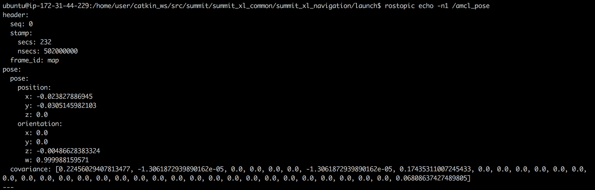

# Course Project


## Summary

Estimated time to completion: **1'5 hours**

What will you learn with this unit?

- Practice everything you've learned through the course
- Put together everything that you learned into a big project
- Create a launch file that launches each part of the Navigation Stack

------

## Navigate the Summit Robot!

In this project, you will have to make a [Summit robot](http://www.robotnik.eu/mobile-robots/summit-xl/) navigate around a room autonomously.

For this goal, you will have to apply all of the things that you are learning along the course. It's really important that you complete it because all of the structures that you create for this project will be asked about in our **official exam**. 

**Note: Our offical exam is only available, at present, for on-site or virtual classes.**

Basically, in this project, you will have to:

- Apply all of the theory given in the course
- Follow the steps provided below without looking at the provided solutions (unless you get really stuck)
- Make as many tests as required in the simulation environment until it works

To finish this project successfully, we provide the 5 steps you should follow with clear instructions, and even solutions, below.

Also, remember to:

- Create your packages and code in the simulation environment as you have been doing throughout the course.
- Use the consoles to gather information about the status of the simulated robot.
- Use the IDE to create your files and execute them through the consoles, observing the results on the simulation screen. You can use other consoles to watch calls to topics, services, or action servers.
- Everything that you create in this unit will be automatically saved in your space. You can come back to this unit at any time and continue with your work from the point where you left off.
- Every time you need to reset the position of the robot, just press the restart button in the simulation window.
- Use the debugging tools to try to find what is not working and why (for instance, the Rviz tool is very useful for this purpose).

## What does Summit provide for programming?

### Sensors

- **Laser sensor**: Summit has a [Hokuyo Laser,](https://en.wikipedia.org/wiki/Inertial_measurement_unit) which provides information about the objects that it detects in its range. The value of the sensor is provided through the topic */hokuyo_base/scan*
- **Odometry**: The odometry of the robot can be accessed through the */odom* topic

### Actuators

- **Speed**: You can send speed commands to move the robot through the topic */summit_xl_control/cmd_vel*.

## Steps you should cover

These are the steps that you should follow throughout the duration of the project. These steps will assure you that you have practiced and created all of the structures asked about in the final exam of this course. If you perform all of the steps mentioned here, you will find the exam passable.

- [Step 1: Generate a Map of the environment (Dedicate 2 hours)](https://i-020023c2451ceb591.robotigniteacademy.com/jupyter/notebooks/Course_Project_Nav.ipynb#step1)
- [Step 2: Make the Robot Localize itself in the Map that you've created (Dedicate 2 hours)](https://i-020023c2451ceb591.robotigniteacademy.com/jupyter/notebooks/Course_Project_Nav.ipynb#step2)
- [Step 3: Set Up a Path Planning System (Dedicate 3 hours)](https://i-020023c2451ceb591.robotigniteacademy.com/jupyter/notebooks/Course_Project_Nav.ipynb#step3)
- [Step 4: Create a ROS program that interacts with the Navigation Stack (Dedicate 3 hours)](https://i-020023c2451ceb591.robotigniteacademy.com/jupyter/notebooks/Course_Project_Nav.ipynb#stepExtra)

**NOTE 1**: We do provide the solution for each step. Do not watch unless you are really stuck.

### Step 1: Generate a Map of the Environment

As you've learned in the first 2 chapters of the course, the first thing you need in order to navigate autonomously with a robot is a map of the environment. Where else would this project start? 

Therefore, the first step would not be anything other than creating a map of the environment that we want to navigate. In order to achieve this, we've divided this first step into 7 sub-steps:

- Make sure that the Summit robot is publishing it's transform data correctly.
- Create a package called **my_summit_mapping** that will contain all of the files related to mapping.
- Create a **launch file** that will launch the slam_gmapping node and add the necessary parameters in order to properly configure the slam_gmapping node.
- Launch the slam_gmapping node and create a map of the simulated environment.
- Save the map that you've just created.
- Create a script that automatically saves maps.
- Create a **launch file** that will provide the created map to other nodes.

So, let's start doing them!

**1. Generate the necessary files in order to visualize the frames tree.**

To generate a pdf of the frames tree:

```
rosrun tf view_frames
```

Then download the pdf onto your local drive.

You should get a file like this one:


Create the package, adding **rospy** as the only dependency.

```
$ cd ~/catkin_ws/src
$ catkin_create_pkg my_summit_mapping rospy
```

**3. Create the launch file for the gmapping node.**

In the mapping section (Chapter 2) of this course, you've seen how to create a launch file for the slam_gmapping node. You've also seen some of the most important parameters to set. So, in this step, you'll have to create a launch file for the slam_gmapping node and add the parameters that you think you need to set.

Here you can see a full list of parameters that you can set to configure the slam_gmapping node: <http://docs.ros.org/hydro/api/gmapping/html/>

Here you have an example launch file for the gmapping node:

```xml
<launch>
    <node pkg="gmapping" type="slam_gmapping" name="slam_gmapping" output="screen">
      <!-- simulation remap from="scan" to="/hokuyo_laser_topic"/ -->
      <!-- real -->
      <!-- remap from="scan" to="/scan_filtered"/ -->
      <remap from="scan" to ="/hokuyo_base/scan"/>
      <!-- param name="map_udpate_interval" value="5.0"/ -->
      <param name="base_frame" value="base_footprint"/>
      <param name="odom_frame" value="odom"/>
      <param name="map_udpate_interval" value="5.0"/>
      <param name="maxUrange" value="2.0"/>
      <param name="sigma" value="0.05"/>
      <param name="kernelSize" value="1"/>
      <param name="lstep" value="0.05"/>
      <param name="astep" value="0.05"/>
      <param name="iterations" value="5"/>
      <param name="lsigma" value="0.075"/>
      <param name="ogain" value="3.0"/>
      <param name="lskip" value="0"/>
      <param name="srr" value="0.1"/>
      <param name="srt" value="0.2"/>
      <param name="str" value="0.1"/>
      <param name="stt" value="0.2"/>
      <param name="linearUpdate" value="0.2"/>
      <param name="angularUpdate" value="0.1"/>
      <param name="temporalUpdate" value="3.0"/>
      <param name="resampleThreshold" value="0.5"/>
      <param name="particles" value="100"/>
      <param name="xmin" value="-50.0"/>
      <param name="ymin" value="-50.0"/>
      <param name="xmax" value="50.0"/>
      <param name="ymax" value="50.0"/>
      <param name="delta" value="0.05"/>
      <param name="llsamplerange" value="0.01"/>
      <param name="llsamplestep" value="0.01"/>
      <param name="lasamplerange" value="0.005"/>
      <param name="lasamplestep" value="0.005"/>
    </node>
</launch>
```

**4. Launch the node using the launch file that you've just created, and create a map of the environment.**

In order to move the robot around the environment, you can use the keyboard teleop. To launch the keyboard teleop, just execute the following command:

```
roslaunch summit_xl_gazebo keyboard_teleop.launch
```

Also, remember to launch Rviz and add the proper displays in order to visualize the map you are generating. You should get something like this in RViz:


Now, start moving the robot around the room to create the map.

What's happening? Are you having difficulty generating a proper map? Is there anything strange in the mapping process? Do you know what could be the reason behind it?

What's happening here is the following: 

- Your maxUrange parameter in the launch file of the slam_gmapping node is set to 2. This parameter sets the maximum range of the laser scanner that is used for map building. Since this is a small value, the robot can't get enough data to know where it is, so it may get lost. This will cause some strange issues during the mapping process, such as the robot readjusting its position incorrectly. 
- In order to solve it, you should set the maxUrange parameter to some higher value, for instance, 7. This way, the robot will be able to get more data from the environemnt, so that it won't get lost. Now, you'll be able to finalize the mapping process correctly.

Once you modify this parameter and relaunch the slam_gmapping node, you should get something like this in RViz:


Now, you will be able to map the environment much more easily.

**5. Save the map.**

```
$ cd catkin_ws/src/my_summit_mapping/maps/
$ rosrun map_server map_saver -f fetch_map
```

Create a directory in your package named **maps**, and save the map files there. Your map image file should look something similar to this:


**6. Create a launch file that launches the map_server node.**

As you've also seen in the course, the map you've just created will be used by other nodes (this means, it'll be used in further steps) in order to perform navigation. 

Therefore, you'll need to create a launch file in order to provide the map. As you know, this is done through the map_server node.

Finally, launch this file and check that it's really providing the map.

**Solution:**

In the mapping section of this course, I created a package called **get_map_data** to provide the map through the map_server node. I wrote a service client called **call_map_service.py** to request the map from the **/static_map** service. Then wrote a launch file called **get_map_data.launch** to launch the service client. The contents of call_map_service.py and get_map_data.launch are given below.

<u>**call\_map\_service.py**</u>

```python
#!/usr/bin/env python
"""
/static_map service static_map_client
"""

# import sys
import rospy
from nav_msgs.srv import GetMap
# rossrv show nav_msgs/GetMap


def static_map_client():
    """
    Requests /static_map service
    """
    # rospy.loginfo("In static_map_client().")
    rospy.wait_for_service('static_map')
    # rospy.loginfo("static_map service found.")
    try:
        static_map = rospy.ServiceProxy('static_map', GetMap)
        resp = static_map()
        print "Width: %s" % resp.map.info.width
        print "Height: %s" % resp.map.info.height
        print "Resolution: %s" % resp.map.info.resolution

        return
    except rospy.ServiceException, error:
        print "Service call failed: %s" % error


if __name__ == "__main__":
    rospy.init_node('call_map_service', anonymous=True)
    # rospy.loginfo("In call_map_service.py main.")
    static_map_client()
```

<u>**get\_map\_data.launch**</u>

```xml
<launch>
    <!-- Before launching this run: rosrun map_server map_server my_map.yaml -->
    <node pkg="get_map_data"
    type="call_map_service.py"
    name="call_map_service"
    output="screen">
    </node>
</launch>
```

First run the map_server node before launching the service client:

```
$ cd ~/catkin_ws/src/my_summit_mapping/maps
$ rosrun map_server map_server fetch_map.yaml
```

Now launch the service client:

```
roslaunch get_map_data get_map_data.launch
```

### Step 2: Make the Robot Localize itself in the Map

This step has 4 actions for you to do:

- Create a package called **my_summit_localization** that will contain all of the files related to localization.
- Create a **launch file** that will launch the amcl node and add the necessary parameters in order to properly configure the amcl node.
- Launch the node and check that the robot properly localizes itself in the environment.
- Create a table with three different spots.
- Create a ROS Service to save the different spots into a file.

**1. Create a package called my_summit_localization.**

Create the package adding **rospy** as the only dependency.

```
$ cd ~/catkin_ws/src
$ catkin_create_pkg my_summit_localization rospy
```

**2. Create the launch file for the amcl node.**

In the localization section (Chapter 3) of this course, you saw how to create a launch file for the amcl node. You've also seen some of the most important parameters to set. So, in this step, you'll have to create a launch file for the amcl node and add the parameters you think you need to set.

Here you can see a full list of parameters that you can set to configure the amcl node: <http://wiki.ros.org/amcl>

Remember that before setting the amcl node parameters, you'll need to load the map created in Step 1. For that, you'll just need to include the launch you've created in Step 1 in the amcl node launch file in order to provide the map to other nodes.

The contents of the launch and parameters file are given below. One of the key steps is to make sure the amcl node is receiving the correct name for the **odom** and **scan** topics.

<u>**my\_summit\_localization.launch**</u>

```xml
<launch>

  <!-- Run the map server -->
  <arg name="map_file" default="$(find my_summit_mapping)/maps/fetch_map.yaml"/>
  <node name="map_server" pkg="map_server" type="map_server" args="$(arg map_file)" />

  <!--- Run AMCL -->
  <arg name="scan_topic" default="hokuyo_base/scan" />
  <arg name="odom_topic" default="summit_xl/odom"/>

  <node pkg="amcl" type="amcl" name="amcl">

    <rosparam file="$(find my_summit_localization)/params/my_summit_localization_params.yaml" command="load" />

    <remap from="scan" to="$(arg scan_topic)"/>
    <remap from="odom" to="$(arg odom_topic)"/>
  </node>

</launch>
```

<u>**my\_summit\_localization\_params.yaml**</u>

```python
use_map_topic: true
odom_model_type: diff
odom_alpha5: 0.1
gui_publish_rate: 10.0
laser_max_beams: 60
laser_max_range: 12.0
min_particles: 500
max_particles: 2000
kld_err: 0.05
kld_z: 0.99
odom_alpha1: 0.2
odom_alpha2: 0.2
odom_alpha3: 0.2
odom_alpha4: 0.2
laser_z_hit: 0.5
laser_z_short: 0.05
laser_z_max: 0.05
laser_z_rand: 0.5
laser_sigma_hit: 0.2
laser_lambda_short: 0.1
laser_model_type: likelihood_field
laser_likelihood_max_dist: 2.0
update_min_d: 0.25
update_min_a: 0.2
odom_frame_id: odom
resample_interval: 1
transform_tolerance: 1.0
recovery_alpha_slow: 0.0
recovery_alpha_fast: 0.0
```

**3. Launch the node and check that the Summit robot correctly localizes itself in the map.**

Launch the node and check in RViz that the Summit robot correctly localizes itseld in the map.

Launch the map_server and amcl nodes in one terminal:

```
roslaunch my_summit_localization my_summit_localization.launch
```

Launch the teleop node in another terminal:

```
roslaunch summit_xl_gazebo keyboard_teleop.launch
```

Launch rviz and use the localization.rviz configuration file. Save it as a new file called summit_localization.rviz.

**Note**: The parameter values that I used here are unchanged from the localization section of the course for the Husky navigation. However, I notice that when I do a pure rotation with Summit robot, the amcl particle cloud grows wider very quickly. Check if there is a tuning parameter that will slow down the growth of the particle cloud. One method to try is to reduce the turn rate of the robot. This seems to help a lot!

If you've done all of the previous steps correctly, you should see something like this in Rviz:


In order to check that the localization works fine, move the robot around the environment and check that the particle cloud keeps getting smaller the more you move the robot.

Dispersed particles:


Closer particles:


**4. Create the spots table.**

Once you've checked that localization is working fine, you'll need to create a table with 3 different spots in the environment. For each point, assign a tag (with the name of the spot) alongside its coordinates in the map.

These are the 3 spots that you'll have to register into the table:

Fetch Room Center (**label: room**):


Facing the Turtle's Poster (**label: turtle**):


Besides the Table (**label: table**):


You can access the coordinates of each position by looking into the topics that the amcl node publishes on. The only data that you really need to save are the position and orientation.

Next, you have a screenshot of the */amcl_pose* topic:



Create a file named **spots.yaml** and write in the pose data that you've gotten from the 3 spots.

For the Fetch Room Center, we have:

```
$ rostopic echo -n1 /amcl_pose
header:
  seq: 80
  stamp:
    secs: 707
    nsecs:  34000000
  frame_id: "map"
pose:
  pose:
    position:
      x: -3.5050584499
      y: -3.61670915737
      z: 0.0
    orientation:
      x: 0.0
      y: 0.0
      z: -0.992450934258
      w: 0.122642338085
  covariance: [1.4359205661298198, -0.02584359801513081, 0.0, 0.0, 0.0, 0.0, -0.025843598015129032, 1.2478310139132383, 0.0, 0.0, 0.0, 0.0, 0.0, 0.0, 0.0, 0.0, 0.0, 0.0, 0.0, 0.0, 0.0, 0.0, 0.0, 0.0, 0.0, 0.0, 0.0, 0.0, 0.0, 0.0, 0.0, 0.0, 0.0, 0.0, 0.0, 2.2772254007605044]
---
```

**5. Create a ROS Service that saves the different spots into a file.**

In the previous section, you created a file with the coordinates of the 3 spots. But, the whole process was too cumbersome, don't you think? Why don't we create a ROS Service that does the work for us? Sounds like a good idea, right? Then, let's do it!

So, now you'll create a ROS program that will do the following:

- It will launch a node named **spot_recorder**.
- This node will contain a service server named **/save_spot** that will take a string as input.
- When this service is called, it will store the current coordinates of the robot (position and orientation values) with a label that will be the string provided on the service call.
- When the *end* string is provided in the service call, the node will write all of the values stored into a file named **spots.txt**.
- Finally, the service will return a message indicating if the file has been saved correctly.

In order to achieve this, let's divide it into smaller parts.

**1) Service Message**

First of all, you'll have to determine the kind of data you need for your service message.

- Determine what input data you need ( **request**)
- Determine what data you want the service to return ( **response** )

Next, see if there is an already-built message in the system that suits your needs. If there isn't, then you'll have to create your own custom message with the data you want.

If this is the case, then do the following. Inside the package you just created, create a new directory named **srv**. Inside this directory, create a file named **MyServiceMessage.srv** that will contain the definition of your service message.

This file could be something like this:

```python
# request
string label
---
#response
bool navigation_successfull
string message
```

Now, you'll have to modify the **package.xml** and **CMakeLists.txt** files of your package in order to compile the new message. Assuming that the only dependency you added to your package was **rospy**, you should do the following modifications to these files:

**In CMakeLists.txt**

You will have to edit/uncomment four functions inside this file:

- find_package()
- add_service_files()
- generate_messages()
- catkin_package()

```xml
find_package(catkin REQUIRED COMPONENTS
  rospy
  std_msgs
  message_generation
)
```

```xml
add_service_files(
  FILES
  MyCustomServiceMessage.srv
)
```

```xml
generate_messages(
  DEPENDENCIES
  std_msgs
)
```

```xml
catkin_package(
      CATKIN_DEPENDS
      rospy
)
```

**In package.xml:**

Add these 2 lines to the file:

```xml
<build_depend>message_generation</build_depend>
<build_export_depend>message_runtime</build_export_depend>
<exec_depend>message_runtime</exec_depend>
```

When you've finished with the modifications, compile your package and check that your message has been correctly compiled and is ready to use. In order to check this, you can use the command **rossrv show MyServiceMessage**.

catkin_make output:


rossrv show output:


**2) Service Code**

Once your message is created, you're ready to use it in your service! So, let's write the code for our service. Inside the src directory of your package, create a file named **spots_to_file.py**. Inside this file, write the code necessary for you service.

**3) Launch file**

Create a launch file for the node you've just created. You can also launch this node in the same launch file you've created to launch the slam_gmapping node. It's up to you.

**4) Test it**

Using the keyboard teleop, move the robot to the 3 different spots shown above. At each one of these spots, perform a service call to the service you've just created. In the service call, provide the string with the name that you want to give to each spot. 

For example, when you are at the center of the Fetch Room, call your service like this:

```
rosservice call /save_spot "label: room"
```

Repeat this for each of the 3 spots. When finished, do one last service call, providing *end* as the string in order to create the file.

> Note: When the spots.txt file is opened for writing in the Python executable file, it is usually written in the .ros directory. This directory can be accessed by `cd ~/.ros`.

### Step 3: Set Up the Path Planning System

This step has 5 actions for you to take:

- Create a package called **my_summit_path_planning** that will contain all of the files related to Path Planning.
- Create a **launch file** that will launch the move_base node.
- Create the necessary parameter files in order to properly configure the move_base node.
- Create the necessary parameter files in order to properly configure the global and local costmaps.
- Create the necessary parameter files in order to properly configure the global and local planners.
- Launch the node and check that everything works fine.

**1. Create a package named my_summit_path_planning.**

**2. Create the launch file for the move_base node.**

In the Path Planning section (Chapter 4) of this course, you saw how to create a launch file for the move_base node. So, in this step, you'll have to create a launch file for the move_base node and add the parameters and the parameter files required.

Here you have an example of the move_base.launch file:

```xml
<launch>
  <!--- Run AMCL -->
  <include file="$(find my_summit_localization)/launch/amcl.launch" />
  <remap from="cmd_vel" to="/move_base/cmd_vel" />

  <!-- Run move_base -->
  <node pkg="move_base" type="move_base" respawn="false" name="move_base" output="screen">
    <rosparam file="$(find my_summit_path_planning)/config/move_base_params.yaml" command="load" />
    <rosparam file="$(find my_summit_path_planning)/config/costmap_common_params.yaml" command="load" ns="global_costmap" />
    <rosparam file="$(find my_summit_path_planning)/config/costmap_common_params.yaml" command="load" ns="local_costmap" />
    <rosparam file="$(find my_summit_path_planning)/config/local_costmap_params.yaml" command="load" />
    <rosparam file="$(find my_summit_path_planning)/config/global_costmap_params_map.yaml" command="load" />
    <rosparam file="$(find my_summit_path_planning)/config/dwa_local_planner_params.yaml" command="load" />
    <rosparam file="$(find my_summit_path_planning)/config/global_planner_params.yaml" command="load" />

    <param name="base_global_planner" value="navfn/NavfnROS" />
    <param name="base_local_planner" value="dwa_local_planner/DWAPlannerROS" />
    <param name="controller_frequency" value="5.0" />
    <param name="controller_patience" value="15.0" />
  </node>

</launch>
```

**3. Create the move_base_params.yaml file**

<u>**move\_base\_params.yaml**</u>

```python
controller_frequency: 10.0
planner_patience: 5.0
controller_patience: 15.0
conservative_reset_dist: 3.0
recovery_behavior_enabled: true
clearing_rotation_allowed: true
shutdown_costmaps: false
oscillation_timeout: 0.0
oscillation_distance: 0.5
planner_frequency: 0.2
```

**4. Create the costmap_common_params.yaml, the global_costmap_params.yaml, and the local_costmap_params.yaml files**

**<u>costmap\_common\_params.yaml</u>**

```python
obstacle_range: 2.5
raytrace_range: 3.0

footprint: [[0.35, -0.3], [0.35, 0.3], [-0.35,0.3], [-0.35, -0.3]]

publish_frequency: 1.0

inflation_layer:
  inflation_radius: 0.5

obstacle_layer:
  observation_sources: hokuyo_laser
  hokuyo_laser: {sensor_frame: hokuyo_base_link, data_type: LaserScan, topic: /scan, marking: true, clearing: true}

static:
  map_topic: /map
  subscribe_to_updates: true
```

<u>**global\_costmap\_params.yaml**</u>

```python
global_costmap:
  global_frame: /map
  robot_base_frame: /base_footprint
  update_frequency: 5.0
  static_map: true

  plugins:
  - {name: static,                  type: "costmap_2d::StaticLayer"}
  - {name: obstacles_layer,         type: "costmap_2d::VoxelLayer"}
  - {name: inflation_layer,         type: "costmap_2d::InflationLayer"}
```

<u>**local\_costmap\_params.yaml**</u>

```python
local_costmap:
  global_frame: /odom
  robot_base_frame: /base_footprint
  update_frequency: 5.0
  static_map: false
  rolling_window: true
  width: 5.0
  height: 5.0
  resolution: 0.05

  # padding is 0.1 by default, making difficult to pass through narrow places
  footprint_padding: 0.0

  plugins:
  - {name: obstacles_layer,           type: "costmap_2d::ObstacleLayer"}
  - {name: inflation_layer,           type: "costmap_2d::InflationLayer"}
```

**5. Create the navfn_global_planner_params.yaml and dwa_local_planner_params.yaml files**

<u>**navfn\_global\_planner\_params.yaml**</u>

```python
NavfnROS:
  visualize_potential: false
  allow_unknown: false

  planner_window_x: 0.0
  planner_window_y: 0.0

  default_tolerance: 0.0
```

<u>**dwa\_local\_planner\_params.yaml**</u>

```python
DWAPlannerROS:

# Robot Configuration Parameters - Kobuki
  max_vel_x: 0.5  # 0.55
  min_vel_x: 0.0

  max_vel_y: 0.0  # diff drive robot
  min_vel_y: 0.0  # diff drive robot

  max_trans_vel: 0.5 # choose slightly less than the base's capability
  min_trans_vel: 0.1  # this is the min trans velocity when there is negligible rotational velocity
  trans_stopped_vel: 0.1

  # Warning!
  #   do not set min_trans_vel to 0.0 otherwise dwa will always think translational velocities
  #   are non-negligible and small in place rotational velocities will be created.

  max_rot_vel: 1.5  # choose slightly less than the base's capability
  min_rot_vel: 0.1  # this is the min angular velocity when there is negligible translational velocity
  rot_stopped_vel: 0.0

  acc_lim_x: 1.0 # maximum is theoretically 2.0, but we
  acc_lim_theta: 2.0
  acc_lim_y: 0.0      # diff drive robot

# Goal Tolerance Parameters
  yaw_goal_tolerance: 0.3  # 0.05
  xy_goal_tolerance: 0.15  # 0.10
  # latch_xy_goal_tolerance: false

# Forward Simulation Parameters
  sim_time: 2.0       # 1.7
  vx_samples: 6       # 3
  vy_samples: 1       # diff drive robot, there is only one sample
  vtheta_samples: 20  # 20

# Trajectory Scoring Parameters
  path_distance_bias: 64.0      # 32.0   - weighting for how much it should stick to the global path plan
  goal_distance_bias: 24.0      # 24.0   - weighting for how much it should attempt to reach its goal
  occdist_scale: 0.5            # 0.01   - weighting for how much the controller should avoid obstacles
  forward_point_distance: 0.325 # 0.325  - how far along to place an additional scoring point
  stop_time_buffer: 0.2         # 0.2    - amount of time a robot must stop in before colliding for a valid traj.
  scaling_speed: 0.25           # 0.25   - absolute velocity at which to start scaling the robot's footprint
  max_scaling_factor: 0.2       # 0.2    - how much to scale the robot's footprint when at speed.

# Oscillation Prevention Parameters
  oscillation_reset_dist: 0.05  # 0.05   - how far to travel before resetting oscillation flags

# Debugging
  publish_traj_pc : true
  publish_cost_grid_pc: true
  global_frame_id: odom


# Differential-drive robot configuration - necessary?
  holonomic_robot: false
```

**6. Launch the node and check that everything works fine**

<u>**my\_summit\_path\_planning.launch**</u>

```xml
<launch>
  <!--- Run AMCL -->
  <!-- <include file="$(find my_summit_localization)/launch/amcl.launch" /> -->
  <include file="$(find my_summit_localization)/launch/my_summit_localization.launch" />
  <remap from="cmd_vel" to="/move_base/cmd_vel" />

  <!-- Run move_base -->
  <node pkg="move_base" type="move_base" respawn="false" name="move_base" output="screen">
    <rosparam file="$(find my_summit_path_planning)/config/move_base_params.yaml" command="load" />
    <rosparam file="$(find my_summit_path_planning)/config/costmap_common_params.yaml" command="load" ns="global_costmap" />
    <rosparam file="$(find my_summit_path_planning)/config/costmap_common_params.yaml" command="load" ns="local_costmap" />
    <rosparam file="$(find my_summit_path_planning)/config/local_costmap_params.yaml" command="load" />
    <rosparam file="$(find my_summit_path_planning)/config/global_costmap_params.yaml" command="load" />
    <rosparam file="$(find my_summit_path_planning)/config/dwa_local_planner_params.yaml" command="load" />
    <rosparam file="$(find my_summit_path_planning)/config/navfn_global_planner_params.yaml" command="load" />

    <param name="base_global_planner" value="navfn/NavfnROS" />
    <param name="base_local_planner" value="dwa_local_planner/DWAPlannerROS" />
    <param name="controller_frequency" value="5.0" />
    <param name="controller_patience" value="15.0" />
  </node>

</launch>
```

Launch the map_server node, amcl node, and move_base node:

```
roslaunch my_summit_path_planning my_summit_path_planning.launch
```

Once you think your parameter files are correct, launch the node and test that the path planning works fine. Check that the robot can plan trajectories and navigate to different points in the environment.

Room 1:


Room 2:


Main Hall:


### Step 4: Create a ROS program that interacts with the Navigation Stack

In Step 2 of this project, you created a table with 3 different spots, each one associated with a label. You may have been wondering why you were asked to do this, right? Well, now you'll have the answer! 

In this final step, you will have to create a ROS node that will interact with the navigation stack. This node will contain a service that will take a string as input. This string will indicate one of the labels that you selected in Step 2 for the different spots in the simulation. When this service receives a call with the label, it will get the coordinates (position and orientation) associated with that label, and will send these coordinates to the move_base action server. If it finished correctly, the service will return an "OK" message.

Summarizing, you will have to create a node that contains:

- A service that will take a string as input. Those strings will be the labels you selected in Step 2 for each one of the spots.
- An action client that will send goals to the move_base action server.

In order to achieve this, follow the next steps:

**1. Create the package**

Create the package called *my_summit_navigation* that will contain all of the files related to this project. Remember to specify the **rospy** dependency.

**2. Create the service message**

The service message **MyServiceMessage.srv** that was created in a previous step can be re-used here:

```python
# request
string label
---
#response
bool navigation_successful
string message
```

Note that there is a field in the Response called **file_saved**, which makes sense in the context of the previous service but not for this service. Consider renaming this field to make it more general.

**3. Create the Service Server.**

Once your message is created, you're ready to use it in your service! So, let's write the code for our service. Inside the src directory of your package, create a file named **get_coordinates_service_server.py**. Inside this file, write the code necessary for your service.

<u>**get\_coordinates\_service\_server.py**</u>

```python
#! /usr/bin/env python

import rospy
from my_summit_localization.srv import MyServiceMessage, MyServiceMessageResponse
from geometry_msgs.msg import Pose
from geometry_msgs.msg import PoseWithCovarianceStamped
from send_coordinates_action_client import SendCoordinates
import actionlib
import time
import os
import rosparam


class GetCoordinates(object):
    def __init__(self, srv_name='/get_coordinates'):
        self._srv_name = srv_name
        self._my_service = rospy.Service(
            self._srv_name, MyServiceMessage, self.srv_callback)

    def srv_callback(self, request):

        label = request.label
        response = MyServiceMessageResponse()
        """
        ---
        bool service_successful
        string message # Direction
        """

        os.chdir("/home/user/catkin_ws/src/my_summit_navigation/spots")
        paramlist = rosparam.load_file("spots.yaml", default_namespace=None)

        for params, ns in paramlist:  # ns,param

            for key, value in params.iteritems():
                if key == request.label:
                    rosparam.upload_params(ns, params)  # ns,param
                    response.message = "Correctly uploaded parameters"

        send_coordinates = SendCoordinates(request.label)

        response.service_successful = True

        return response


if __name__ == "__main__":
    rospy.init_node('get_coordinates_node', log_level=rospy.INFO)
    get_coordinates_object = GetCoordinates()
    rospy.spin()  # mantain the service open.

```

**4. Create the Action Client**

Once you've finished writting your code, it's time to test it! Call your service by providing one of the labels, and check that the Summit robot navigates to that spot. For example, if your label is "table," type the following into a WebShell:

```
rosservice call /get_coordinates "label: table"
```

**5. Create a launch file that manages everything.**

As you may have noticed in the previous step, you need to have the **move_base** node running in order to make everything work. So, let's create a launch file that starts the **move_base** node alongside with the Service Server you have just created above.

<u>**my\_summit\_navigation.launch**</u>

```xml
<launch>

    <include file="$(find my_summit_path_planning)/launch/my_summit_path_planning.launch" />

    <node pkg="my_summit_navigation" type="get_coordinates_service_server.py" name="get_coordinates_node" output="screen">

    </node>

</launch>
```

### Summary

Here is a quick summary of how to send navigation commands to the robot.

Launch the my_summit_navigation_mapping.launch file:

```
roslaunch my_summit_navigation my_summit_navigation.launch
```

**my_summit_navigation_mapping.launch** launches the **get_coordinates_node** node which provides the **/get_coordinates** service server. It also includes the **my_summit_path_planning.launch** file, which includes the **my_summit_localization.launch** file and launches the **move_base** node. The **my_summit_localization.launch** file launches the **map_server** node and **amcl** node. So overall the nodes that get launched are **get_coordinates_node**, **move_base**, **map_server**, and **amcl**.

The get_coordinates_node node initializes a get_coordinates_object, which has two import functions. First, it loads all of the labels and their corresponding poses from the **spots.yaml** file into the **rosparam** server. Second, it initializes a send_coordinates object that is defined in **send_coordinates_action_client.py**. The send_coordinates object contains an instance of a move_base action client. When a request is sent to the /get_coordinates service in the form of a label, a send_coordinates object gets initialized with this label. The send_coordinates object then searches for the corresponding target pose in the rosparam server and sends it as a MoveBaseGoal message to the move_base action client. The move_base node takes care of the rest in terms of generating a global and local plan and sending velocity commands to the base controller.

Now you can send high level waypoint commands to the robot by opening another terminal and running:

```
rosservice call /get_coordinates "label: table"
```

As long as "table" is one of the labels in the spots.yaml file with a corresponding pose, the robot will try to navigate to this goal.