## Exercise 3.12

a) Inside the package that you created in the exercise above, create a new file named **square_move.py**.

b) Inside this file, write the code to move the robot. The robot must perform a square movement. When it finishes, it has to print the covariance of the filter particles into the screen.

c) Test that your code works (the robot moves in a square).

d) When you've tested that it works, add the necessary code so that your program does the following:

1. First of all, it calls the necessary service in order to disperse the particles all around the environment.
2. When the particles are randomly dispersed, it performs the square movement.
3. When it has finished doing the movement, it checks the particles' covariance.
4. If this covariance is less than 0.65, this means that the robot has localized itself correctly. Then, the program will end. If this covariance is greater than 0.65, it will repeat the whole the process (disperse the particles, perform the movement, check the covariance...).

### *Provided Solution

```python
#!/usr/bin/env python
import rospy
from geometry_msgs.msg import Twist, PoseWithCovarianceStamped
from std_srvs.srv import Empty, EmptyRequest
import time
import math

class MoveHusky():
    
    def __init__(self):
        
        # Init Publisher
        self.husky_vel_publisher = rospy.Publisher('/cmd_vel', Twist, queue_size=1)
        self.cmd = Twist()
        # Init Subscriber
        self.amcl_pose_sub = rospy.Subscriber('/amcl_pose', PoseWithCovarianceStamped, self.sub_callback)
        self.sub_msg = PoseWithCovarianceStamped()
        # Initialize Service Client
        rospy.wait_for_service('/global_localization')
        self.disperse_particles_service = rospy.ServiceProxy('/global_localization', Empty)
        self.srv_request = EmptyRequest()
        # Other stuff
        self.ctrl_c = False
        rospy.on_shutdown(self.shutdownhook)
        self.rate = rospy.Rate(10)
        
    def shutdownhook(self):
        
        # works better than the rospy.is_shut_down()
        self.stop_husky()
        self.ctrl_c = True

    def stop_husky(self):
        
        rospy.loginfo("Shutdown time! Stop the robot")
        self.cmd.linear.x = 0.0
        self.cmd.angular.z = 0.0
        i = 0
        
        while i < 20:
            self.husky_vel_publisher.publish(self.cmd)
            self.rate.sleep()
            i += 1

    def move_forward(self, linear_speed=0.5, angular_speed=0.0):
        
        self.cmd.linear.x = linear_speed
        self.cmd.angular.z = angular_speed
        i = 0
        
        while i < 50:
            self.husky_vel_publisher.publish(self.cmd)
            self.rate.sleep()
            i += 1
        
    def turn(self, linear_speed=0.0, angular_speed=0.8):
        
        self.cmd.linear.x = linear_speed
        self.cmd.angular.z = angular_speed
        i = 0
        
        while i < 25:
            self.husky_vel_publisher.publish(self.cmd)
            self.rate.sleep()
            i += 1
    
    def move_square(self):
        
        i = 0
        
        while not self.ctrl_c and i < 4:
            # Move Forwards
            rospy.loginfo("######## Going Forwards...")
            self.move_forward()
            self.stop_husky()
            # Turn
            rospy.loginfo("######## Turning...")
            self.turn()
            self.stop_husky()
            i += 1
            
        self.stop_husky()
        rospy.loginfo("######## Finished Moving in a Square")
        
    def call_service(self):
        
        rospy.loginfo("######## Calling Service...")
        result = self.disperse_particles_service(self.srv_request)
        
    def sub_callback(self, msg):
        
        self.sub_msg = msg

    def calculate_covariance(self):
        
        rospy.loginfo("######## Calculating Covariance...")
        cov_x = self.sub_msg.pose.covariance[0]
        cov_y = self.sub_msg.pose.covariance[7]
        cov_z = self.sub_msg.pose.covariance[35]
        rospy.loginfo("## Cov X: " + str(cov_x) + " ## Cov Y: " + str(cov_y) + " ## Cov Z: " + str(cov_z))
        cov = (cov_x+cov_y+cov_z)/3
        
        return cov
        
            
if __name__ == '__main__':
    rospy.init_node('move_husky_node', anonymous=True)
    MoveHusky_object = MoveHusky()
    
    cov = 1
    
    while cov > 0.65:
        MoveHusky_object.call_service()
        MoveHusky_object.move_square()
        cov = MoveHusky_object.calculate_covariance()
        rospy.loginfo("######## Total Covariance: " + str(cov))
        if cov > 0.65:
            rospy.loginfo("######## Total Covariance is greater than 0.65. Repeating the process...")
        else:
            rospy.loginfo("######## Total Covariance is lower than 0.65. Robot correctly localized!")
            rospy.loginfo("######## Exiting...")
```


### Data for Exercise 3.12

Check the following notes in order to complete the exercise: 

Note 1: Keep in mind that in order to be able to call this service, you need to have the amcl node running.
Note 2: The particles covariance is published into the /amcl_pose topic.
Note 3: The particles covariance is published into a matrix. This matrix looks like this:


The only values that you need to pay attention to is the first one (which is the covariance in x), the 8th one (which is the covariance in y), and the last one (which is the covariance in z).

> The open loop controller running in square_move.py will not work correctly if teleop mode is running in another terminal. The robot will be moving extremely slowly. Specifically, I had `roslaunch husky_navigation_launch keyboard_teleop.launch` running in another terminal. Make sure this is not currently running in another terminal!

# Chapter 4: Path Planning Part 1

## Summary

Estimated time to completion: **3 hours**

What will you learn with this unit?

- Visualize Path Planning in Rviz
- Basic concepts of the move_base node
- What is the Global Planner?
- What is the Global Costmap?

We're arriving at the end of the course, guys! For now, we've seen how to create a map of an environment, and how to localize the robot in it. So, at this point (and assuming everything went well), we have all that we need in order to perform Navigation. That is, we're now ready to plan trajectories in order to move the robot from pose A to pose B.

In this chapter, you'll learn how the Path Planning process works in ROS, and all of the elements that take place in it. But first, as we've been doing in previous chapters, let's have a look at our digital best friend, RViz.

### Visualize Path Planning in Rviz

As you've already seen in previous chapters, you can also launch RViz and add displays in order to watch the Path Planning process of the robot. For this chapter, you'll basically need to use 3 elements of RViz:

- Map Display (Costmaps)
- Path Displays (Plans)
- 2D Tools

## Exercise 4.1

a) Execute the next command in order to launch the move_base node.

Execute in WebShell #1:

```
roslaunch husky_navigation move_base_demo.launch
```

b) Open the Graphic Interface and execute the following command in order to start RViz.

Execute in WebShell #2:

```
rosrun rviz rviz
```

c) Properly congifure RViz in order to visualize the necessary parts.

### Visualize Costmaps

- Click the Add button under Displays and chose the Map element.
- Set the topic to **/move_base/global_costmap/costmap**in order to visualize the global costmap
- Change the topic to **/move_base/local_costmap/costmap**in order to visualize the local costmap.
- You can have 2 Map displays, one for each costmap.

> You can add more than one Map display at a time in Rviz to visualize the global costmap and local costmap at the same time.

> The local_costmap displays the free and occupied space around the robot based on the current laser sensor readings.

### Visualize Plans

- Click the Add button under Displays and chose the Path element.
- Set the topic to **/move_base/NavfnROS/plan** in order to visualize the global plan.
- Change the topic to **/move_base/DWAPlannerROS/local_plan** in order to visualize the local plan.
- You can also have 2 Path displays, one for each plan.

> There is another possible topic to subscribe to called /move_base/DWAPlannerROS/global_plan. This global_plan path is always displayed in Rviz while the trajectory is being executed whereas the topic /move_base/NavfnROS/plan is only displayed initially after a new "2D Nav Goal" is commanded and then it disappears. This happens because /move_base/NavfnROS/plan is only published once after a new goal is commanded, whereas both /move_base/DWAPlannerROS/local_plan and /move_base/DWAPlannerROS/local_plan are published at a rate of around 5 Hz while the robot is trying to reach the goal. You can check the publishing frequency this by running the command: `rostopic hz /move_base/DWAPlannerROS/local_plan`.

d) Use the 2D Pose Estimate tool in order to provide an initial pose for the robot. 

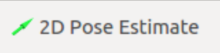

e) Use the 2D Nav Goal tool in order to send a goal pose to the robot. Make sure to select an unoccupied (dark grey) or unexpected (light grey) location. 

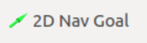

### Data for Exercise 4.1

Check the following notes in order to complete the exercise:

**Note 1**: Bear in mind that if you don't set a 2D Nav Goal, the planning process won't start. This means that until you do, you won't be able to visualize any plan in RViz.

**Note 2**: In order for the 2D tools to work, the Fixed Frame at Rviz must be set to map.

### Expected Result for Exercise 4.1

Global Costmap:

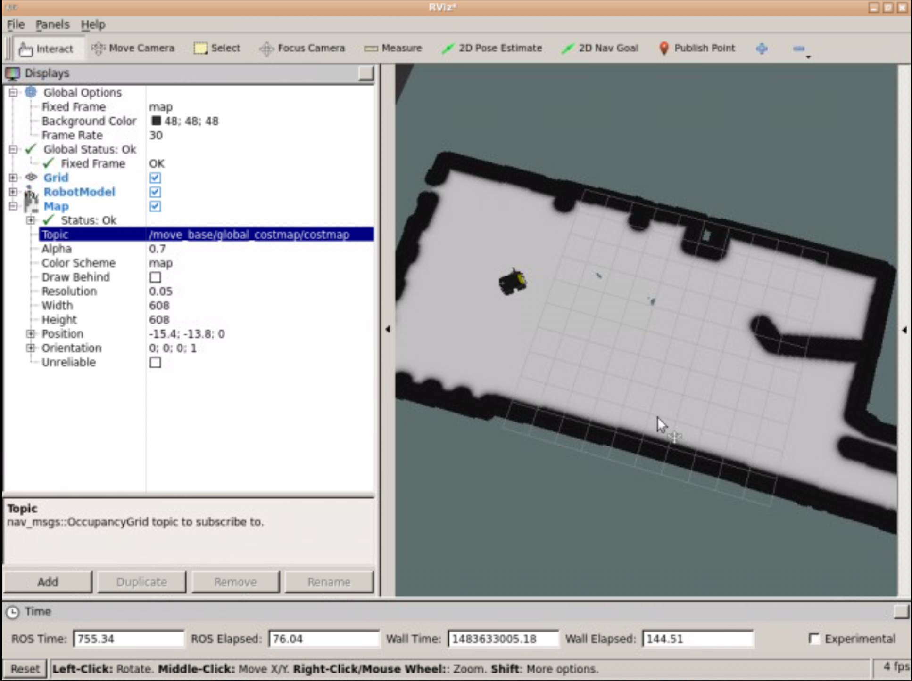

Local Costmap:

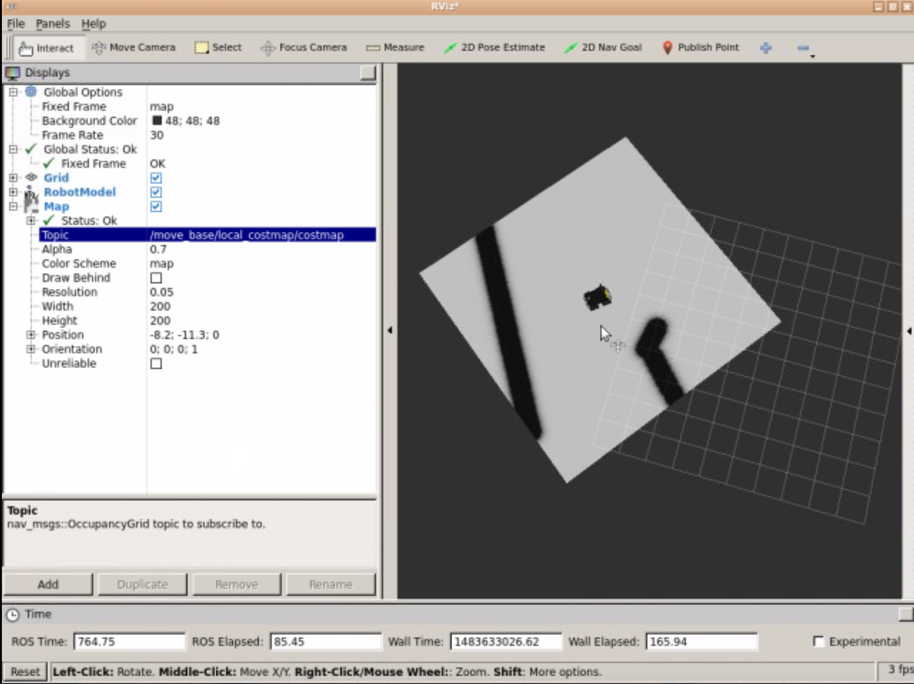

Global Plan:


Local Plan (in red) and Global Plan (in green):

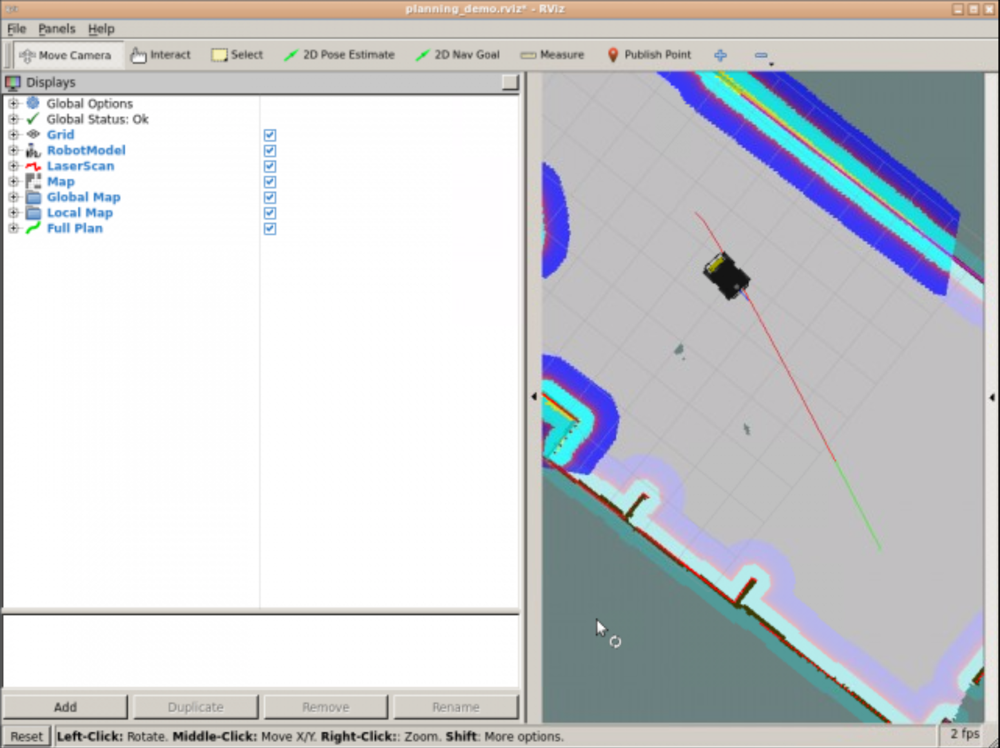

**REMEMBER**: Remember to save your RViz configuration in order to be able to load it again whenever you want. If you don't remember how to do it, check the Mapping Chapter.

That's awesome, right? But what has just happened? What was that 2D Nav Goal tool I used in order to move the robot? And what's a Costmap? How does ROS calculate the trajectories?

Keep calm!! By the end of this chapter, you'll be able to answer all of those questions. But let's go step by step, so that you can completely understand how the whole process works.

### The move_base package

The move_base package contains the **move_base node**. Doesn't that sound familiar? Well, it should, since you were introduced to it in the Basic Concepts chapter! The move_base node is one of the major elements in the ROS Navigation Stack, since it links all of the elements that take place in the Navigation process. Let's say it's like the Architect in Matrix, or the Force in Star Wars. Without this node, the ROS Navigation Stack wouldn't make any sense!

Ok! We understand that the move_base node is very important, but... what is it exactly? What does it do? Great question!

The **main function of the move_base node is to move the robot from its current position to a goal position**. Basically, this node is an implementation of a *SimpleActionServer*, which takes a goal pose with message type *geometry_msgs/PoseStamped*. Therefore, we can send position goals to this node by using a *SimpleActionClient*.

This Action Server provides the topic **move_base/goal**, which is the input of the Navigation Stack. This topic is then used to provide the goal pose.

## Exercise 4.2

a) In a WebShell, visualize the *move_base/goal* topic.

b) As you did in the previous exercise, send a goal to the robot by using the 2D Nav Goal tool in RViz.

c) Check what happens in the topic that you are listening to.

### Expected Result for Exercise 4.2


---

So, each time you set a Pose Goal using the 2D Nav Goal tool from RViz, what is really happening is that a new message is being published into the move_base/goal topic.

Anyway, this is not the only topic that the move_base Action Server provides. As every action server, it provides the following 5 topics:

- **move_base/goal (move_base_msgs/MoveBaseActionGoal)**
- **move_base/cancel (actionlib_msgs/GoalID)**
- **move_base/feedback (move_base_msgs/MoveBaseActionFeedback)**
- **move_base/status (actionlib_msgs/GoalStatusArray)**
- **move_base/result (move_base_msgs/MoveBaseActionResult)**

## Exercise 4.3

Without using Rviz, send a pose goal to the move_base node.

a) Use the command line tool in order to send this goal to the Action Server of the move_base node.

b) Visualize through the webshells all of the topics involved in the action, and check their output while the action is taking place, and when it's done.

Check the topic info by running `rostopic info /move_base/goal`:

```
Type: move_base_msgs/MoveBaseActionGoal

Publishers:
 * /move_base (http://rosds_computer:39662/)

Subscribers:
 * /move_base (http://rosds_computer:39662/)
```

Check the message definition by running `rosmsg show move_base_msgs/MoveBaseActionGoal`:

```
std_msgs/Header header
  uint32 seq
  time stamp
  string frame_id
actionlib_msgs/GoalID goal_id
  time stamp
  string id
move_base_msgs/MoveBaseGoal goal
  geometry_msgs/PoseStamped target_pose
    std_msgs/Header header
      uint32 seq
      time stamp
      string frame_id
    geometry_msgs/Pose pose
      geometry_msgs/Point position
        float64 x
        float64 y
        float64 z
      geometry_msgs/Quaternion orientation
        float64 x
        float64 y
        float64 z
        float64 w
```

Now publish a goal to the /move_base/goal topic:

```
$ rostopic pub /move_base/goal move_base_msgs/MoveBaseActionGoal "header:
  seq: 1
  stamp:
    secs: 699
    nsecs: 333000000
  frame_id: ''
goal_id:
  stamp:
    secs: 0
    nsecs:         0
  id: ''
goal:
  target_pose:
    header:
      seq: 1
      stamp:
        secs: 699
        nsecs: 333000000
      frame_id: "map"
    pose:
      position:
        x: -0.425518214703
        y: -0.552486002445
        z: 0.0
      orientation:
        x: 0.0
        y: 0.0
        z: -0.18096932038
        w: 0.983488741716"
```

### Data for Exercise 4.3

Check the following notes in order to complete the exercise:

**Note 1**: Remember that the SimpleAcionServer subscribes to the /move_base_node/goal topic in order to read the pose goal.

**Note 2**: In order to see an example of a valid message for the /move_base/goal topic, you can listen to the topic while you send a pose goal via the 2D Nav Goal tool of RViz.

**Note 3**: Keep in mind that in order to be able to send goals to the Action Server, the move_base node must be launched.

### Expected Result for Exercise 4.3

Sending goal:

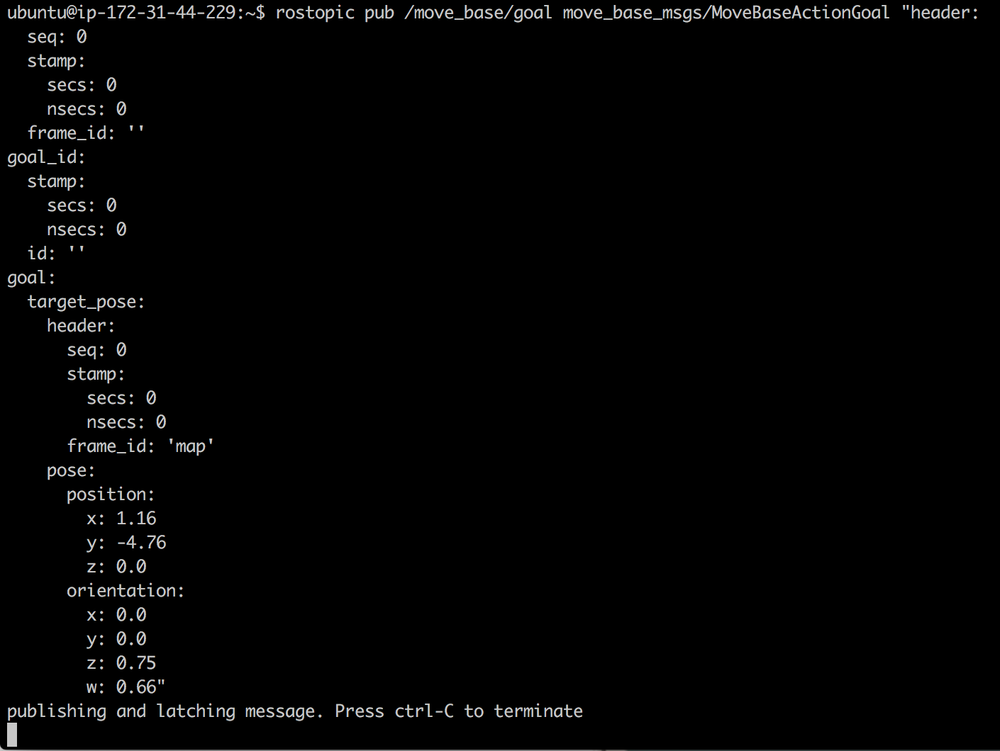

Echo feedback:

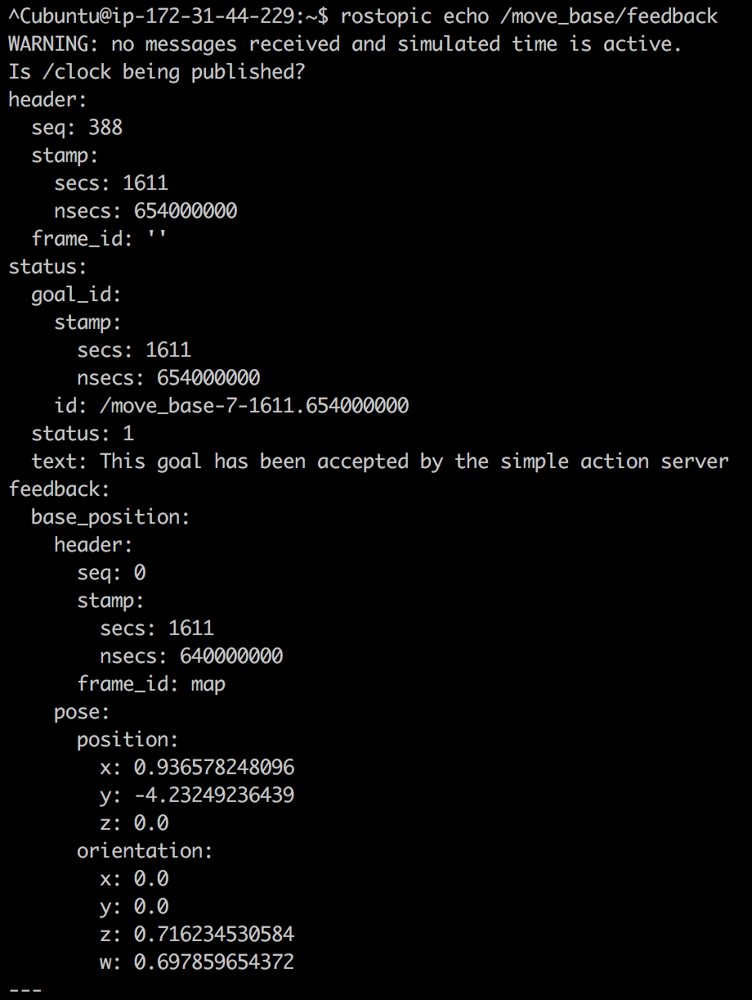

Echo status accepted:

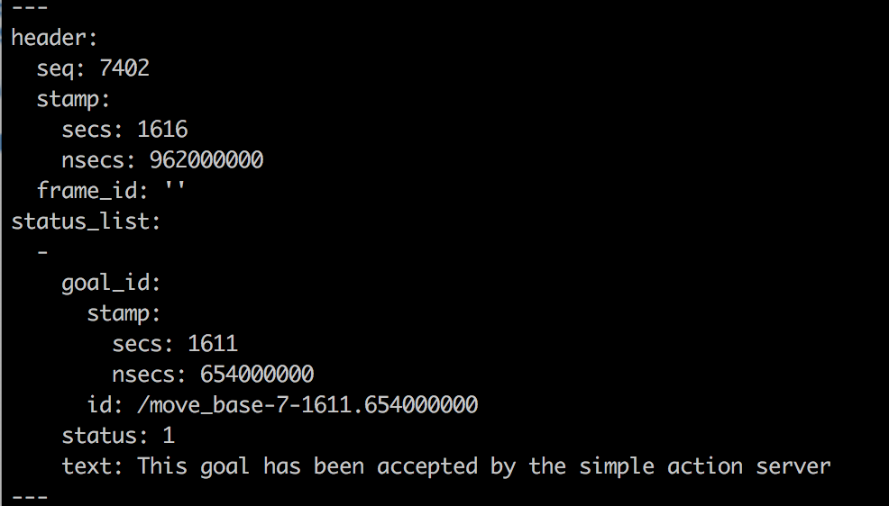

Echo status reached:

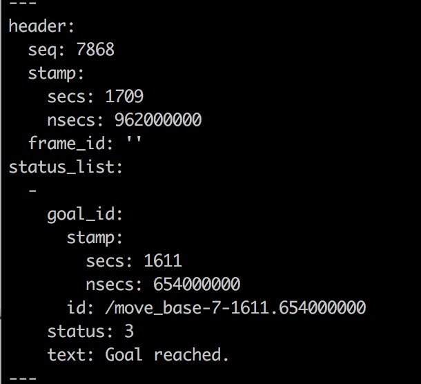

Echo result:

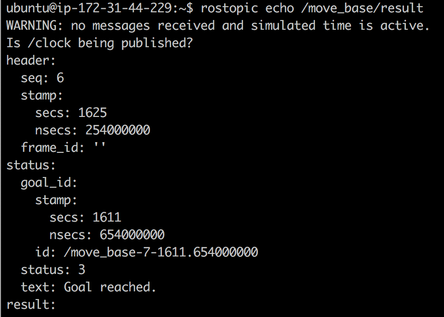

## Exercise 4.4

a) Create a new package named **send_goals**. Add rospy as a dependency.

```
$ cd ~/catkin_ws/src
$ catkin_create_pkg send_goals rospy
```

b) Inside this package, create a file named **send_goal_client.py**. Write into this file the code for an Action Client in order to send messages to the Action Server of the move_base node.

c) Using this Action Client, move the robot to three different Poses of the Map. When the robot has reached the 3 poses, start over again creating a loop, so that the robot will keep going to these 3 poses over and over.

See below for the modified solution.

```python
#! /usr/bin/env python
"""
This is a client for sending a goal to a MoveBase ActionServer called "move_base"
"""

import time
import rospy
import actionlib

# Import action messages
from move_base_msgs.msg import MoveBaseAction, MoveBaseGoal, MoveBaseResult, MoveBaseFeedback

# definition of the feedback callback. This will be called when feedback
# is received from the action server
# it just prints a message indicating a new message has been received


def feedback_callback(feedback):

    print('[Feedback] Going to Goal Pose...')


# initializes the action client node
rospy.init_node('move_base_action_client')

# create the connection to the action server
client = actionlib.SimpleActionClient('/move_base', MoveBaseAction)
# waits until the action server is up and running
client.wait_for_server()
# rospy.loginfo("Action server ready.")

# creates a goal to send to the action server
goal = MoveBaseGoal()
goal.target_pose.header.frame_id = 'map'

waypoints = [[0.0, 0.0, 0.0, 0.0, 0.0, 1.0, 0.0007963],
             [-2.0, -2.0, 0.0, 0.0, 0.0, 0.9092974, -0.4161468],
             [2.0, -2.0, 0.0, 0.0, 0.0, 0.0, 1.0]]

loop_waypoints = False

i = 0  # select first waypoint index

while True:
    goal.target_pose.pose.position.x = waypoints[i][0]
    goal.target_pose.pose.position.y = waypoints[i][1]
    goal.target_pose.pose.position.z = waypoints[i][2]
    goal.target_pose.pose.orientation.x = waypoints[i][3]
    goal.target_pose.pose.orientation.y = waypoints[i][4]
    goal.target_pose.pose.orientation.z = waypoints[i][5]
    goal.target_pose.pose.orientation.w = waypoints[i][6]
    client.send_goal(goal, feedback_cb=feedback_callback)
    client.wait_for_result()
    print('[Result] State: %d' % (client.get_state()))
    if client.get_state() == 0 or not loop_waypoints:  # PENDING
        client.cancel_goal()
        break
    i += 1
    i %= 3

# goal.target_pose.pose.position.x = waypoints[i][0]
# goal.target_pose.pose.position.y = waypoints[i][1]
# goal.target_pose.pose.position.z = waypoints[i][2]
# goal.target_pose.pose.orientation.x = waypoints[i][3]
# goal.target_pose.pose.orientation.y = waypoints[i][4]
# goal.target_pose.pose.orientation.z = waypoints[i][5]
# goal.target_pose.pose.orientation.w = waypoints[i][6]

# sends the goal to the action server, specifying which feedback function
# to call when feedback received
# client.send_goal(goal, feedback_cb=feedback_callback)

# Uncomment these lines to test goal preemption:
# time.sleep(3.0)
# client.cancel_goal()  # would cancel the goal 3 seconds after starting

# wait until the result is obtained
# you can do other stuff here instead of waiting
# and check for status from time to time
# status = client.get_state()
# check the client API link below for more info

# client.wait_for_result()

# print('[Result] State: %d' % (client.get_state()))

```

If `loop_waypoints` is set to `False`, then only one goal message is sent to the action server. The first goal waypoint sent to the action server corresponds to the initial value of index `i`. The bottom half of the script that is commented out was provided by the course. I used their code as a template and made modifications to get the robot to loop through multiple waypoints indefinitely.

### *Key points

* To find all of the seven message definitions associated with the MoveBase ActionServer, run `roscd move_base_msgs/msg` :

```
MoveBaseActionFeedback.msg  MoveBaseAction.msg        MoveBaseFeedback.msg  MoveBaseResult.msg
MoveBaseActionGoal.msg      MoveBaseActionResult.msg  MoveBaseGoal.msg
```

* An action server really only defines 3 different types of messages: Goal, Feedback, and Result. However,  MoveBaseAction.msg contains instances (?) of MoveBaseActionGoal.msg, MoveBaseActionFeedback.msg, and MoveBaseActionResult.msg:

```
$ cat MoveBaseAction.msg
# ====== DO NOT MODIFY! AUTOGENERATED FROM AN ACTION DEFINITION ======

MoveBaseActionGoal action_goal
MoveBaseActionResult action_result
MoveBaseActionFeedback action_feedback
```

Furthermore MoveBaseActionGoal.msg contains an instance of the MoveBaseGoal.msg:

```
$ cat MoveBaseActionGoal.msg
# ====== DO NOT MODIFY! AUTOGENERATED FROM AN ACTION DEFINITION ======

Header header
actionlib_msgs/GoalID goal_id
MoveBaseGoal goal
```

As you can see, MoveBaseActionGoal.msg contains the Goal message MoveBaseGoal.msg along with metadata about the Goal like the header information and goal ID. The MoveBaseGoal.msg just contains a definition of the goal message:

```
$ cat MoveBaseGoal.msg
# ====== DO NOT MODIFY! AUTOGENERATED FROM AN ACTION DEFINITION ======
geometry_msgs/PoseStamped target_pose
```

The same hierarchy also applies to MoveBaseActionFeedback.msg and MoveBaseActionResult.msg. So if you want to write an action client, you have to define a goal message which contains a target_pose message of type geometry_msgs/PoseStamped. Information about this message type can be found by:

```
$ rosmsg info geometry_msgs/PoseStamped
std_msgs/Header header
  uint32 seq
  time stamp
  string frame_id
geometry_msgs/Pose pose
  geometry_msgs/Point position
    float64 x
    float64 y
    float64 z
  geometry_msgs/Quaternion orientation
    float64 x
    float64 y
    float64 z
    float64 w
```

The goal message includes a pose message that contains the desired position and orientation. These fields in the goal message should be defined in the action client before sending the goal message to the action server. After the action client has sent the goal to the action server, the action client can request **feedback** from the action server to get a status update. In this case, the feedback message contains a geometry_msgs/PoseStamped message:

 ```
$ cat MoveBaseFeedback.msg
# ====== DO NOT MODIFY! AUTOGENERATED FROM AN ACTION DEFINITION ======
geometry_msgs/PoseStamped base_position
 ```

As the action server is executing the action,  it can send feedback to the action client with the current pose information. After the action is completed, the action client can get a **result** from the action server in the form of a result message. In this case, the result message is empty:

```
$ cat MoveBaseResult.msg
# ====== DO NOT MODIFY! AUTOGENERATED FROM AN ACTION DEFINITION ======
```

After receiving the result message, we can check the status of the goal by calling the `get_state()` method:

```
client.get_state()
```

This returns an actionlib_msgs/GoalStatus message which can take on one of 10 possible states:

```
$ rosmsg show actionlib_msgs/GoalStatus
uint8 PENDING=0
uint8 ACTIVE=1
uint8 PREEMPTED=2
uint8 SUCCEEDED=3
uint8 ABORTED=4
uint8 REJECTED=5
uint8 PREEMPTING=6
uint8 RECALLING=7
uint8 RECALLED=8
uint8 LOST=9
actionlib_msgs/GoalID goal_id
  time stamp
  string id
uint8 status
string text
```

In Exercise 4.4, we received a status of 3 which means the goal succeeded.

### Expected result for Exercise 4.4

The robot moves infinitely to the 3 poses given.

---

So, at this point, you've checked that you can send pose goals to the move_base node by sending messages to the /move_base/goal topic of its Action Server.

When this node **receives a goal pose**, it links to components such as the *global planner, local planner, recovery behaviors, and costmaps*, and **generates an output, which is a velocity command** with the message type *geometry_msgs/Twist*, and sends it to the **/cmd_vel** topic in order to move the robot.

The move_base node, just as you saw with the slam_gmapping and the amcl nodes in previous chapters, also has parameters that you can modify. For instance, one of the parameters that you can modify is the frequency at which the move_base node sends these velocity commands to the base controller. Let's check it with a quick exercise.

## Exercise 4.5

a) Create a new package named **my_move_base_launcher**. Inside this package, create 2 directories, one named **launch** and the other one named **params**. Inside the *launch* directory, create 2 new files named **my_move_base_launch_1.launch** and **my_move_base_launch_2.launch**. Inside the *params* directory, create a new file named **my_move_base_params.yaml**.

b) Have a look at the **move_base_demo.launch** and **move_base.launch** files of the *husky_navigation* package. Also, have a look at the **planner.yaml** file of the same package.

**move_base_demo.launch** contains:

```xml
<launch>

  <!-- Run the map server -->
  <arg name="map_file" default="$(find husky_navigation)/maps/my_map.yaml"/>
  <node name="map_server" pkg="map_server" type="map_server" args="$(arg map_file)" />

  <!--- Run AMCL -->
  <include file="$(find husky_navigation)/launch/amcl.launch" />

  <!--- Run Move Base -->
  <include file="$(find husky_navigation)/launch/move_base.launch" />

</launch>
```

**move_base.launch** contains:

```xml
<launch>

  <arg name="no_static_map" default="false"/>

  <arg name="base_global_planner" default="navfn/NavfnROS"/>
  <arg name="base_local_planner" default="dwa_local_planner/DWAPlannerROS"/>
  <!-- <arg name="base_local_planner" default="base_local_planner/TrajectoryPlannerROS"/> -->

  <node pkg="move_base" type="move_base" respawn="false" name="move_base" output="screen">

    <param name="base_global_planner" value="$(arg base_global_planner)"/>
    <param name="base_local_planner" value="$(arg base_local_planner)"/>
    <rosparam file="$(find husky_navigation)/config/planner.yaml" command="load"/>

    <!-- observation sources located in costmap_common.yaml -->
    <rosparam file="$(find husky_navigation)/config/costmap_common.yaml" command="load" ns="global_costmap" />
    <rosparam file="$(find husky_navigation)/config/costmap_common.yaml" command="load" ns="local_costmap"/>

    <!-- local costmap, needs size -->
    <rosparam file="$(find husky_navigation)/config/costmap_local.yaml" command="load" ns="local_costmap" />
    <param name="local_costmap/width" value="10.0"/>
    <param name="local_costmap/height" value="10.0"/>

    <!-- static global costmap, static map provides size -->
    <rosparam file="$(find husky_navigation)/config/costmap_global_static.yaml" command="load" ns="global_costmap" unless="$(arg no_static_map)"/>

    <!-- global costmap with laser, for odom_navigation_demo -->
    <rosparam file="$(find husky_navigation)/config/costmap_global_laser.yaml" command="load" ns="global_costmap" if="$(arg no_static_map)"/>
    <param name="global_costmap/width" value="100.0" if="$(arg no_static_map)"/>
    <param name="global_costmap/height" value="100.0" if="$(arg no_static_map)"/>
  </node>

</launch>
```

**planner.yaml** contains:

```
controller_frequency: 5.0
recovery_behaviour_enabled: true

NavfnROS:
  allow_unknown: true # Specifies whether or not to allow navfn to create plans that traverse unknown space.
  default_tolerance: 0.1 # A tolerance on the goal point for the planner.

TrajectoryPlannerROS:
  # Robot Configuration Parameters
  acc_lim_x: 2.5
  acc_lim_theta:  3.2

  max_vel_x: 1.0
  min_vel_x: 0.0

  max_vel_theta: 1.0
  min_vel_theta: -1.0
  min_in_place_vel_theta: 0.2

  holonomic_robot: false
  escape_vel: -0.1

  # Goal Tolerance Parameters
  yaw_goal_tolerance: 0.1
  xy_goal_tolerance: 0.2
  latch_xy_goal_tolerance: false

  # Forward Simulation Parameters
  sim_time: 2.0
  sim_granularity: 0.02
  angular_sim_granularity: 0.02
  vx_samples: 6
  vtheta_samples: 20
  controller_frequency: 20.0

  # Trajectory scoring parameters
  meter_scoring: true # Whether the gdist_scale and pdist_scale parameters should assume that goal_distance and path_distance are expressed in units of meters or cells. Cells are assumed by default (false).
  occdist_scale:  0.1 #The weighting for how much the controller should attempt to avoid obstacles. default 0.01
  pdist_scale: 0.75  #     The weighting for how much the controller should stay close to the path it was given . default 0.6
  gdist_scale: 1.0 #     The weighting for how much the controller should attempt to reach its local goal,also controls speed  default 0.8

  heading_lookahead: 0.325  #How far to look ahead in meters when scoring different in-place-rotation trajectories
  heading_scoring: false  #Whether to score based on the robot's heading to the path or its distance from the path. default false
  heading_scoring_timestep: 0.8   #How far to look ahead in time in seconds along the simulated trajectorywhen using heading scoring (double, default: 0.8)
  dwa: true #Whether to use the Dynamic Window Approach (DWA)_ or whether to use Trajectory Rollout
  simple_attractor: false
  publish_cost_grid_pc: true

  # Oscillation Prevention Parameters
  oscillation_reset_dist: 0.25 #How far the robot must travel in meters before oscillation flags are reset(double, default: 0.05)
  escape_reset_dist: 0.1
  escape_reset_theta: 0.1

DWAPlannerROS:
  # Robot configuration parameters
  acc_lim_x: 2.5
  acc_lim_y: 0
  acc_lim_th: 3.2

  max_vel_x: 0.5
  min_vel_x: 0.0
  max_vel_y: 0
  min_vel_y: 0

  max_trans_vel: 0.5
  min_trans_vel: 0.1
  max_rot_vel: 1.0
  min_rot_vel: 0.2

  # Goal Tolerance Parameters
  yaw_goal_tolerance: 0.1
  xy_goal_tolerance: 0.2
  latch_xy_goal_tolerance: false

  # # Forward Simulation Parameters
  # sim_time: 2.0
  # sim_granularity: 0.02
  # vx_samples: 6
  # vy_samples: 0
  # vtheta_samples: 20
  # penalize_negative_x: true

  # # Trajectory scoring parameters
  # path_distance_bias: 32.0 # The weighting for how much the controller should stay close to the path it was given
  # goal_distance_bias: 24.0 # The weighting for how much the controller should attempt to reach its localgoal, also controls speed
  # occdist_scale: 0.01 # The weighting for how much the controller should attempt to avoid obstacles
  # forward_point_distance: 0.325 # The distance from the center point of the robot to place an additionalscoring point, in meters
  # stop_time_buffer: 0.2  # The amount of time that the robot must stThe absolute value of the veolicty at which to start scaling the robot's footprint, in m/sop before a collision in order for a trajectory to beconsidered valid in seconds
  # scaling_speed: 0.25 # The absolute value of the veolicty at which to start scaling the robot's footprint, in m/s
  # max_scaling_factor: 0.2 # The maximum factor to scale the robot's footprint by

  # # Oscillation Prevention Parameters
  # oscillation_reset_dist: 0.25 #How far the robot must travel in meters before oscillation flags are reset (double, default: 0.05)
```

c) Copy the contents of these files to the files that you created in the first step.

d) Modify the *my_move_base_launch_1.launch* file so that it loads your second launch file.

Note that **my_move_base_launch_1.launch** already launches **move_base.launch**, so I commented this line out:

```xml
<include file="$(find husky_navigation)/launch/move_base.launch" />
```

and replaced it with this line:

```xml
<include file="$(find my_move_base_launcher)/launch/my_move_base_launch_2.launch" />
```

e) Modify the *my_move_base_launch_2.launch* file so that it loads your move_base parameters file.

Note that **my_move_base_launch_2.launch** already loads the original **planner.yaml** file, so I commented this line out:

```xml
<rosparam file="$(find husky_navigation)/config/planner.yaml" command="load"/>
```

and replaced it with this line:

```xml
<rosparam file="$(find my_move_base_launcher)/params/my_move_base_params.yaml" command="load"/>
```

f) Modify the *my_move_base_params.yaml* file, and change the **controller_frequency** parameter.

g) Launch the *my_move_base_launch_1.launch* file, and check what happens now.

The controller frequency is set to: controller_frequency: 5.0. At 5.0 Hz, the robot moves smoothly and continuously. The maximum /cmd_vel linear speed is 0.5 m/s.  When I decrease the frequency to 1.0 Hz, the robot does not move smoothly nor continuously. It moves for a fraction of a second, then pauses, then continues moving again in a repeated cycle until it reaches the goal. **I do not understand why lowering the frequency would cause this type of behavior.** The maximum /cmd_vel linear speed here is also 0.5 m/s.

When I increase the controller frequency to the default 20.0 Hz, the robot moves smoothly and continuously but much slower than at 5 Hz. I checked the /cmd_vel topic and the max speed was 0.5 m/s at 5 Hz but dropped to 0.166 m/s at 20 Hz. **I do not understand why increasing the frequency would cause the maximum commanded velocity to drop.**

## Exercise 4.6

a) Open Rviz and add a Display in order to be able to visualize the Global Plan.

Under **Displays** > **Map**, select the **Topic** as **/move_base/global_costmap/costmap**.

The global planner will generate a plan to reach the desired goal while avoiding obstacles based on the global costmap. To see the global cost map in Rviz, under **Displays** > **Map**, select the **Topic** as **/move_base/global_costmap/costmap**.

To visualize the Global Plan in Rviz, you need add **Path** to the **Displays** window by selecting **Add** > **Path**. Then under **Displays** > **Path**, select the **Topic** as **/move_base/NavfnROS/plan**.

b) Subscribe to the topic where the Global Planner publishes its planned path, and have a look at it.

See part (a) from above.

c) Using the 2D Nav Goal tool, send a new goal to the move_base node.

### Expected Result for Exercise 4.6

Global Plan in RViz:

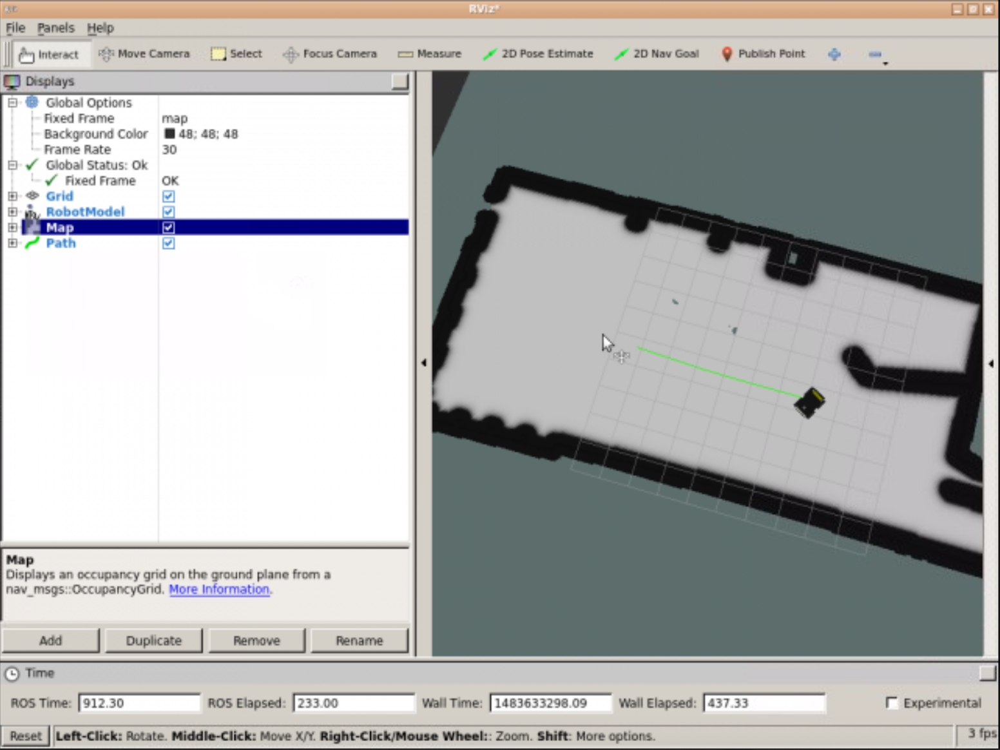

Global Plan topic:

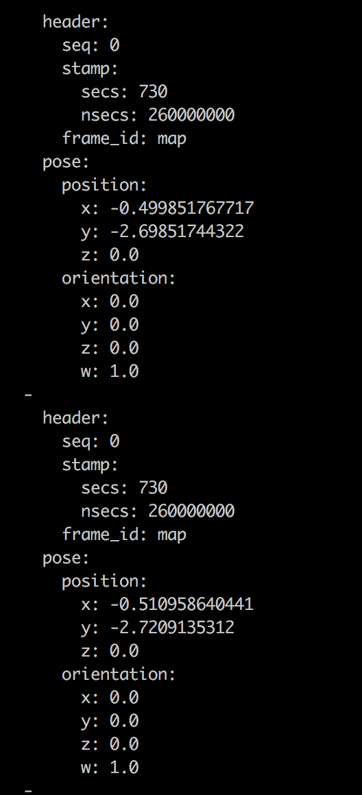

Note that the Global Plan topic screenshot above was generated by listening to the **/move_base/NavfnROS/plan** topic which publishes a plan in the **map** frame. Another topic that sounds similar is the **/move_base/DWAPlannerROS/global_plan** topic, but this publishes a plan in the **odom** frame. **I think these plans could be the same but expressed in different coordinate frames but I would need to verify this.** My guess is that the global planner is generates a global plan in the map frame and then this plan is transformed to be in the odom frame for the local planner.

---

You've probably noticed that when you send a goal in order to visualize the path plan made by the global planner, the robot automatically starts executing this plan. This happens because by sending this goal pose, you're starting the whole navigation process.

In some cases, you might be interested in just visualizing the global plan, but not in executing that plan. For this case, the move_base node provides a service named **/make_plan**. This service allows you to calculate a global plan without causing the robot to execute the path. Let's check how it works with the next exercise.

## Exercise 4.7

Create a Service Client that will call one of the services introduced above in order to get the plan to a given pose, without causing the robot to move.

a) Create a new package named **make_plan**. Add rospy as a dependency.

b) Inside this package, create a file named **make_plan_caller.py**. Write the code for your Service Client into this file.

### Data for Exercise 4.7

Check the following notes in order to complete the exercise:

**Note 1**: The type of message used by the /make_plan service is nav_msgs/GetPlan.

**Note 2**: When filing this message in order to call the service, you don't have to fill all of the fields of the message. Check the following message example:

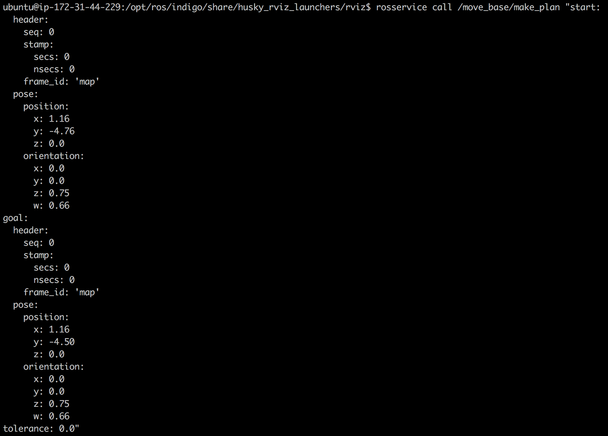

### Solution for Exercise 4.7

First check information about the **/move_base/make_plan** service:

```
$ rosservice info /move_base/make_plan
Node: /move_base
URI: rosrpc://rosds_computer:54715
Type: nav_msgs/GetPlan
Args: start goal tolerance
```

Then show the structure of the **/nav_msgs/GetPlan** service message type:

```
$ rossrv show nav_msgs/GetPlan
geometry_msgs/PoseStamped start
  std_msgs/Header header
    uint32 seq
    time stamp
    string frame_id
  geometry_msgs/Pose pose
    geometry_msgs/Point position
      float64 x
      float64 y
      float64 z
    geometry_msgs/Quaternion orientation
      float64 x
      float64 y
      float64 z
      float64 w
geometry_msgs/PoseStamped goal
  std_msgs/Header header
    uint32 seq
    time stamp
    string frame_id
  geometry_msgs/Pose pose
    geometry_msgs/Point position
      float64 x
      float64 y
      float64 z
    geometry_msgs/Quaternion orientation
      float64 x
      float64 y
      float64 z
      float64 w
float32 tolerance
---
nav_msgs/Path plan
  std_msgs/Header header
    uint32 seq
    time stamp
    string frame_id
  geometry_msgs/PoseStamped[] poses
    std_msgs/Header header
      uint32 seq
      time stamp
      string frame_id
    geometry_msgs/Pose pose
      geometry_msgs/Point position
        float64 x
        float64 y
        float64 z
      geometry_msgs/Quaternion orientation
        float64 x
        float64 y
        float64 z
        float64 w
```

The first part of the service message is the **request** followed by the **response**. The request consists of a start pose and goal pose. The response consists of an array of a sequence of poses that comprise the planned trajectory.

The **make_plan_caller.py** service client contains:

```python
#!/usr/bin/env python
"""
This is a service client that calls the /move_base/make_plan service.
"""

import rospy
from nav_msgs.srv import GetPlan, GetPlanRequest

# Initialize node for service client
rospy.init_node('make_plan_service_client', anonymous=True)

# Wait for service server to respond
rospy.wait_for_service('/move_base/make_plan')

make_plan = rospy.ServiceProxy('/move_base/make_plan', GetPlan)
req = GetPlanRequest()
req.start.header.frame_id = 'map'
req.start.pose.position.x = 0.0
req.start.pose.position.y = 0.0
req.start.pose.position.z = 0.0
req.start.pose.orientation.x = 0.0
req.start.pose.orientation.y = 0.0
req.start.pose.orientation.z = 0.0
req.start.pose.orientation.w = 1.0
req.goal.header.frame_id = 'map'
req.goal.pose.position.x = 1.0
req.goal.pose.position.y = 1.0
req.goal.pose.position.z = 0.0
req.goal.pose.orientation.x = 0.0
req.goal.pose.orientation.y = 0.0
req.goal.pose.orientation.z = 0.0
req.goal.pose.orientation.w = 1.0
req.tolerance = 0.1
resp = make_plan(req)

print resp

```

Note that you must specify the **frame** of the start pose and goal pose as "map" before sending the request message or you will get an error. To run the service client, open a terminal and run `rosrun make_plan make_plan_caller.py`.

### Expected Result for Exercise 4.7

Returned Plan:

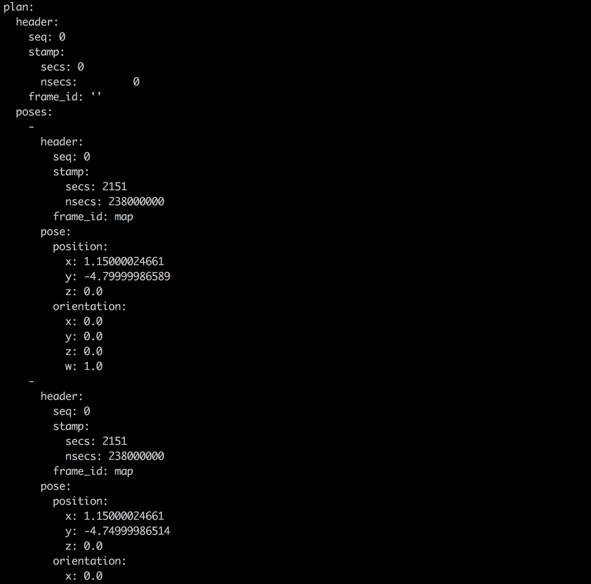

---

So, you now know that the first step of this navigation process is to calculate a safe plan so that your robot can arrive to the user-specified goal pose. But... how is this path calculated?


There exist different global planners. Depending on your setup (the robot you use, the environment it navigates, etc.), you would use one or another. Let's have a look at the most important ones.


### Navfn

The Navfn planner is probably the most commonly used global planner for ROS Navigation. It uses Dijkstra's algorithm in order to calculate the shortest path between the initial pose and the goal pose. Below, you can see an animation of how this algorithm works.


### Carrot Planner

The carrot planner takes the goal pose and checks if this goal is in an obstacle. Then, if it is in an obstacle, it walks back along the vector between the goal and the robot until a goal point that is not in an obstacle is found. It, then, passes this goal point on as a plan to a local planner or controller. Therefore, this planner does not do any global path planning. It is helpful if you require your robot to move close to the given goal, even if the goal is unreachable. In complicated indoor environments, this planner is not very practical. 

This algorithm can be useful if, for instance, you want your robot to move as close as possible to an obstacle (a table, for instance).

### Global Planner

The global planner is a more flexible replacement for the navfn planner. It allows you to change the algorithm used by navfn (Dijkstra's algorithm) to calculate paths for other algorithms. These options include support for A∗, toggling quadratic approximation, and toggling grid path.

### Change the Global Planner

The global planner used by the move_base node it's usually specified in the move_base parameters file. In order to do this, you will add one of the following lines to the parameters file:

```python
base_global_planner: "navfn/NavfnROS" # Sets the Navfn Planner

base_global_planner: "carrot_planner/CarrotPlanner" # Sets the Carrot Planner

base_global_planner: "global_planner/GlobalPlanner" # Sets the Global Planner
```

**NOTE:** It can also, though, be specified in the launch file, like it is our case.

## Exercise 4.8

a) Open Rviz and add a display in order to be able to visualize the global plan.

b) Send a goal using the 2D Nav Goal tool. This goal must be "inside" an obstacle. Check what happens.

I got this error when choosing navfn/NavfnROS as the global planner:

```
[ WARN] [1556317165.381964265, 292.837000000]: Map update loop missed its desired rate of 4.0000Hz... the loop actually took 2.2820 seconds
[ WARN] [1556317165.731875003, 292.983000000]: Clearing costmap to unstuck robot (1.840000m).
[ WARN] [1556317176.228963192, 298.037000000]: Map update loop missed its desired rate of 4.0000Hz... the loop actually took 2.2000 seconds
[ WARN] [1556317176.505130591, 298.184000000]: Rotate recovery behavior started.
[ WARN] [1556317190.725861392, 304.258000000]: Map update loop missed its desired rate of 4.0000Hz... the loop actually took 1.2210 seconds
[ WARN] [1556317191.384051691, 304.526000000]: Map update loop missed its desired rate of 4.0000Hz... the loop actually took 0.2680 seconds
[ WARN] [1556317198.462509384, 307.882000000]: Map update loop missed its desired rate of 4.0000Hz... the loop actually took 3.3740 seconds
[ERROR] [1556317198.803701155, 308.036000000]: Aborting because a valid plan could not be found. Even after executing all recovery behaviors
```


c) Modify the **my_move_base_launch_2.launch** file so that it now uses the carrot planner.

There are two possible ways to set the value of the base_global_planner parameter in the launch file:

1. In the launch file (not inside any tags), define an argument called "base_global_planner" and set its value to be "carrot_planner/CarrotPlanner":

```xml
<arg name="base_global_planner" default="carrot_planner/CarrotPlanner"/>
```

When launching the move_base package, set the value of the "base_global_planner" with the argument defined above inside of the \<node> tag:

```xml
<param name="base_global_planner" value="$(arg base_global_planner)"/>
```

2. Set the value of "base_global_planner" in the params.yaml file:

```python
base_global_planner: "carrot_planner/CarrotPlanner" # Sets the Carrot Planner
```

Then load the params.yaml file inside of the \<node> tag when you launch the move_base package:

```xml
<rosparam file="$(find my_move_base_launcher)/params/my_move_base_params.yaml" command="load"/>
```

> When setting the value of the base_global_planner, make sure to only define it using only one of the methods above and commenting out the other one to avoid naming conflicts.

d) Repeat step b, and check what happens now.

The carrot_planner/CarrotPlanner planned a path to the boundary of the obstacle as expected.

### Data for Exercise 4.8

Check the following notes in order to complete the exercise:

**Note 1**: To make sure you've properly changed the global planner, you can use the following command:

**rosparam get /move_base/base_global_planner**.

### Expected Result for Exercise 4.8

Sending goal:

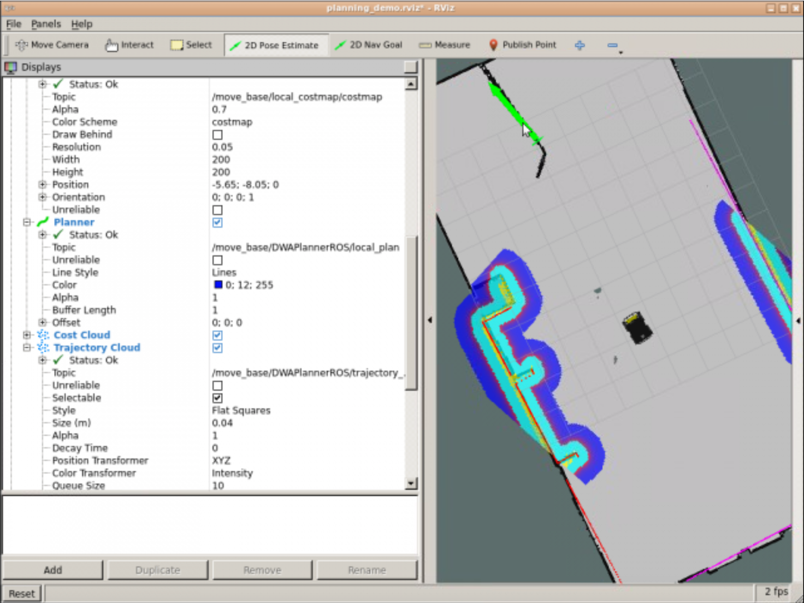

Navfn:

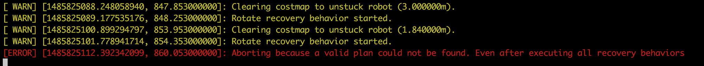

Sending goal at obstacle:


Carrot Planner:

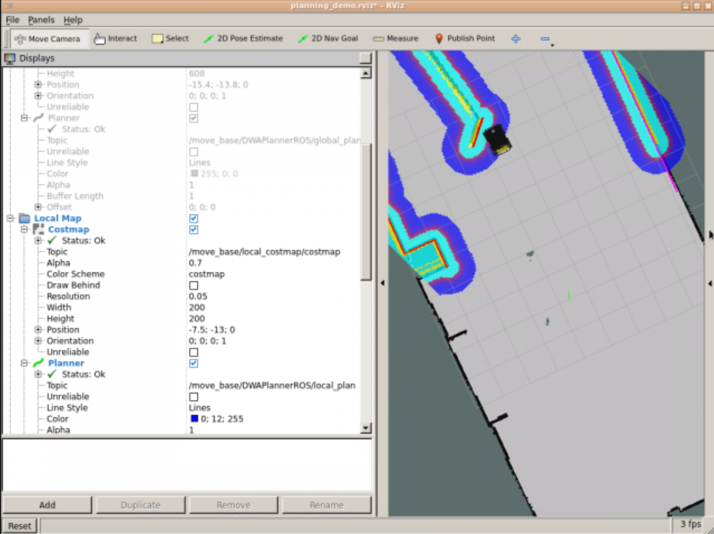

---

The global planner also has its own parameters in order to customize its behaviour. The parameters for the global planner are also located in a YAML file. Depending on which global planner you use, the parameters to set will be different. In this course, we will have a look at the parameters for the navfn planner because it's the one that is most commonly used. If you are interested in seeing the parameters you can set for the other planners, you can have a look at them here:

carrot planner: <http://wiki.ros.org/carrot_planner>

global planner: <http://wiki.ros.org/global_planner>

To use the GlobalPlanner, set the value of base_global_planner in the parameters YAML file as:

```python
base_global_planner: "global_planner/GlobalPlanner"
```

The parameters of GlobalPlanner can be set in the YAML file for example by:

```python
GlobalPlanner:
  use_dijkstra: false
```

### Navfn Parameters

### Navfn Parameters

- **/allow_unknown (default: true)**: Specifies whether or not to allow navfn to create plans that traverse unknown space. NOTE: if you are using a layered costmap_2d costmap with a voxel or obstacle layer, you must also set the track_unknown_space param for that layer to be true, or it will convert all of your unknown space to free space (which navfn will then happily go right through).
- **/planner_window_x (default: 0.0)**: Specifies the x size of an optional window to restrict the planner to. This can be useful for restricting NavFn to work in a small window of a large costmap.
- **/planner_window_y (default: 0.0)**: Specifies the y size of an optional window to restrict the planner to. This can be useful for restricting NavFn to work in a small window of a large costmap.
- **/default_tolerance (default: 0.0)**: A tolerance on the goal point for the planner. NavFn will attempt to create a plan that is as close to the specified goal as possible, but no farther away than the default_tolerance.

- **cost_factor**
- **neutral_cost**
- **lethal_cost**

Here you can see an example of a global planner parameters file:

```python
NavfnROS:
  visualize_potential: false    
  allow_unknown: false          
                                
  planner_window_x: 0.0         
  planner_window_y: 0.0         

  default_tolerance: 0.0
```

## Exercise 4.9

Change the **use_dijkstra** parameter to false, and repeat Exercise 4.8. Check if something changes now. 

Setting **use_dijkstra** to false means that the **\*A** algorithm is used as the global planner. From inspection, it is difficult to tell the difference between the two algorithms. The wiki page http://wiki.ros.org/global_planner shows some comparisons between the two algorithms.

---

So... summarizing:

Until now, you've seen that a global planner exists that is in charge of calculating a safe path in order to move the robot from an initial position to a goal position. You've also seen that there are different types of global planners, and that you can choose the global planner that you want to use. Finally, you've also seen that each planner has its own parameters, which modify the way the planner behaves.

But now, let me ask you a question. When you plan a trajectory, this trajectory has to be planned according to a map, right? A path without a map makes no sense. Ok, so... can you guess what map the global planner uses in order to calculate its path?

You may be tempted to think that the map that is being used is the map that you created in the Mapping Chapter (Chapter 2) of this course... but, let me tell you, that's not entirely true.

There exists another type of map: **the costmap**. Does it sound familiar? It should since you were introduced to it back in the first exercise of this chapter.

A costmap is a map that represents places that are safe for the robot to be in a grid of cells. Usually, the values in the costmap are binary, representing either free space or places where the robot would be in collision.

Each cell in a costmap has an integer value in the range {0,255}. There are some special values frequently used in this range, which work as follows:

- **255 (NO_INFORMATION)**: Reserved for cells where not enough information is known.
- **254 (LETHAL_OBSTACLE**: Indicates that a collision-causing obstacle was sensed in this cell
- **253 (INSCRIBED_INFLATED_OBSTACLE)**: Indicates no obstacle, but moving the center of the robot to this location will result in a collision
- **0 (FREE_SPACE)**: Cells where there are no obstacles and, therefore, moving the center of the robot to this position will not result in a collision

There exist 2 types of costmaps: **global costmap** and **local costmap**. The main difference between them is, basically, the way they are built:

- The **global costmap** is created from a static map.
- The **local costmap** is created from the robot's sensor readings.

For now, we'll focus on the global costmap since it is the one used by the global planner. So, **the global planner uses the global costmap in order to calculate the path to follow**.

Let's do an exercise so that you can have a better idea of how a global costmap looks.

## Exercise 4.10

Launch Rviz and add the necessary display in order to visualize the global costmap. 

### Data for Exercise 4.10

Check the following notes in order to complete the exercise:

**Note 1**: You can change the colours used for the global costmap at the Color Scheme parameter in the RViz configuration:

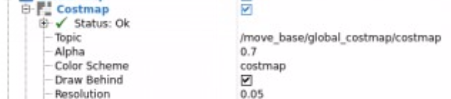

### Expected Result for Exercise 4.10

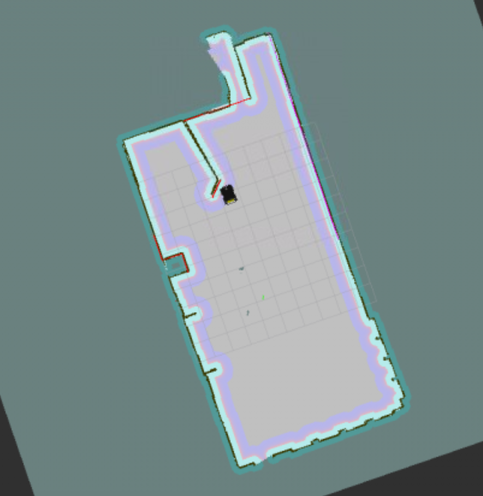

---

### Global Costmap

The global costmap is created from a user-generated static map (as the one we created in the Mapping Chapter). In this case, the costmap is initialized to match the width, height, and obstacle information provided by the static map. This configuration is normally used in conjunction with a localization system, such as amcl. This is the method you'll use to initialize a **global costmap**.

The global costmap also has its own parameters, which are defined in a YAML file. Next, you can see an example of a global costmap parameters file.

```python
global_frame: map
static_map: true
rolling_window: false

plugins:
  - {name: static,                  type: "costmap_2d::StaticLayer"}
  - {name: inflation,               type: "costmap_2d::InflationLayer"}
  - {name: obstacles,               type: "costmap_2d::VoxelLayer"}
```

Costmap parameters are defined in 3 different files:

- A YAML file that sets the parameters for the global costmap (which is the one you've seen above). Let's name this file *global_costmap_params.yaml*.
- A YAML file that sets the parameters for the local costmap. Let's name this file *local_costmap_params.yaml*.
- A YAML file that sets the parameters for both the global and local costmaps. Let's name this file *common_costmap_params.yaml*.

Fow now, we'll focus on the global costmap parameters since it's the costmap that is used by the global planner.

### Global Costmap Parameters

The parameters you need to know are the following:

- **global_frame (default: "/map")**: The global frame for the costmap to operate in.
- **static_map (default: true)**: Whether or not to use a static map to initialize the costmap.
- **rolling_window (default: false)**: Whether or not to use a rolling window version of the costmap. If the static_map parameter is set to true, this parameter must be set to false.
- **plugins**: Sequence of plugin specifications, one per layer. Each specification is a dictionary with a **name** and **type** fields. The name is used to define the parameter namespace for the plugin. This name will then be defined in the **common_costmap_parameters.yaml** file, which you will see in the the next Unit. The type field actually defines the plugin (source code) that is going to be used.

So, by setting the static_map parameter to true, and the rolling_window parameters to false, we will initialize the costmap by getting the data from a static map. This is the way you want to initialize a global costmap.

## Exercise 4.11

a) Add a file named **my_global_costmap_params.yaml** to the *params* directory of the package you created in Exercise 4.5.

b) Copy the contents of the **costmap_global_static.yaml** file of the *husky_navigation* package into this file.

c) Modify the **my_move_base_launch_2.launch** file you created in Exercise 4.5 so that it loads the global costmap parameters files you just created.

Find this line and comment it out:

```xml
<rosparam file="$(find husky_navigation)/config/costmap_global_static.yaml" command="load" ns="global_costmap" unless="$(arg no_static_map)"/>
```

Add this line:

```xml
<rosparam file="$(find my_move_base_launcher)/params/my_global_costmap_params.yaml" command="load" ns="global_costmap" unless="$(arg no_static_map)"/>
```

d) Change the **rolling_window** parameter to true and launch the move_base node again.

e) Check what changes you see in the visualization of the global costmap.

This is what my_global_costmap_params.yaml contains:

```python
global_frame: map
static_map: false
rolling_window: true
track_unknown_space: track_unknown_space

plugins:
  - {name: static,                  type: "costmap_2d::StaticLayer"}
  - {name: obstacles_laser,         type: "costmap_2d::VoxelLayer"}
  - {name: inflation,               type: "costmap_2d::InflationLayer"}
```

When rolling_window is set to true, make sure that static_map is set to false.

### Expected Result for Exercise 4.11

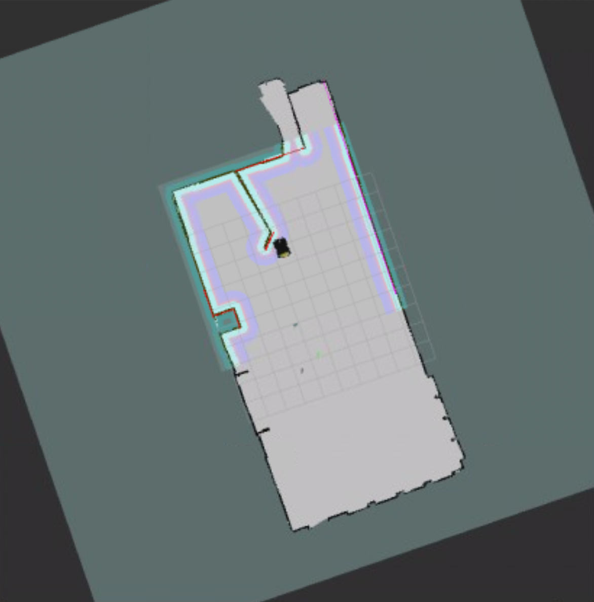

---

The last parameter you need to know how to set is the plugins area. In the plugins area, we will add layers to the costmap configuration. Ok, but... what are layers?

In order to simplify (and clarify) the configuration of costmaps, ROS uses layers. Layers are like "blocks" of parameters that are related. For instance, the **static map, the sensed obstacles, and the inflation are separated into different layers**. These layers are defined in the **common_costmap_parameters.yaml**file, and then added to the **local_costmap_params.yaml** and **global_costmap_params.yaml** files.

To add a layer to a configuration file of a costmap, you will specify it in the plugins area. Have a look at the following line:

```python
plugins: 
    - {name: static_map,       type: "costmap_2d::StaticLayer"}
```

Here, you're adding to your costmap configuration a layer named **static_map**, which will use the **costmap_2d::StaticLayer** plugin. You can add as many layers as you want:

```python
plugins: 
    - {name: static_map,       type: "costmap_2d::StaticLayer"}
    - {name: obstacles,        type: "costmap_2d::VoxelLayer"}
    - {name: inflation,        type: "costmap_2d::InflationLayer"}
```

For instance, you can see an example on the local costmap parameters file shown above. In the case of the global costmap, you will usually use these 2 layers:

- **costmap_2d::StaticLayer**: Used to initialize the costmap from a static map.
- **costmap_2d::InflationLayer**: Used to inflate obstacles.

You may have noticed that the layers are just being added to the parameters file. That's true. Both in the global and local costmap parameters file, the layers are just added. The specific parameters of these layers are defined in the **common costmap parameters** file. We will have a look at this file later on in the chapter.

# Unit 5: Path Planning Part 2 (Obstacle Avoidance)

## Summary

Estimated time to completion: **3 hours**

What will you learn with this unit?

- How does Obstacle Avoidance work
- What is the Local Planner?
- What is the Local Costmap?
- Path Planning Recap
- How to use the Dynamic Reconfigure and other Rviz tools

---

Until this point, you've seen how ROS plans a trajectory in order to move a robot from a starting position to a goal position. In this chapter, you will learn how ROS executes this trajectory, and avoids obstacles while doing so. You will also learn other important concepts regarding Path Planning, which we missed in the previous chapter. Finally, we will do a summary so that you can better understand the whole process. 

Are you up to the challenge? Let's get started then!

### The Local Planner

Once the global planner has calculated the path to follow, this path is sent to the local planner. The local planner, then, will execute each segment of the global plan (let's imagine the local plan as a smaller part of the global plan). So, **given a plan to follow (provided by the global planner) and a map, the local planner will provide velocity commands in order to move the robot**.

Unlike the global planner, the **local planner monitors the odometry and the laser data**, and chooses a collision-free local plan (let's imagine the local plan as a smaller part of the global plan) for the robot. So, the local planner **can recompute the robot's path on the fly** in order to keep the robot from striking objects, yet still allowing it to reach its destination.

Once the local plan is calculated, it is published into a topic named **/local_plan**. The local planner also publishes the portion of the global plan that it is attemting to follow into the topic **/global_plan**. Let's do an exercise so that you can see this better.

## Exercise 5.1

a) Open Rviz and add Displays in order to be able to visualize the **/global_plan** and the **/local_plan** topics of the local planner.

b) Send a Goal Pose to the robot and visualize both topics.

**/global_plan** topic:

```
$ rostopic info /move_base/DWAPlannerROS/global_plan
Type: nav_msgs/Path
```

```
$ rosmsg show nav_msgs/Path
std_msgs/Header header
  uint32 seq
  time stamp
  string frame_id
geometry_msgs/PoseStamped[] poses
  std_msgs/Header header
    uint32 seq
    time stamp
    string frame_id
  geometry_msgs/Pose pose
    geometry_msgs/Point position
      float64 x
      float64 y
      float64 z
    geometry_msgs/Quaternion orientation
      float64 x
      float64 y
      float64 z
      float64 w
```

**/local_plan** topic:

```
$ rostopic info /move_base/DWAPlannerROS/local_plan
Type: nav_msgs/Path
```

Both global and local plans are message types containing a sequence of waypoints for the robot to follow. The global plan is basically the shortest obstacle-free path from the current position to the goal based on the global static map. The local plan is path that the robot is actually commanded to follow and it accounts for obstacles not in the static map and the robot's kinematic constraints. For example, the local planner may generate a plan that gives the robot a smooth and continuous path to follow based on its kinematic constraints. It is interesting to note that the **/move_base/NavfnROS/plan** topic also has the message type **nav_msgs/Path**. In practice, /global_plan and NavfnROS/plan usually look the same. Sometimes, /global_plan looks like a shorter version (a subset?) of NavfnROS/plan when the goal is far enough away from the current position.

What is the real difference between **/global_plan** and **/NavfnROS/plan**?

### Expected Result for Exercise 5.1


---


As for the global planner, different types of local planners also exist. Depending on your setup (the robot you use, the environment it navigates, etc.) and the type of performance you want, you will use one or another. Let's have a look at the most important ones.

### base_local_planner

The base local planner provides implementations of the *Trajectory Rollout* and the *Dynamic Window Approach (DWA)* algorithms in order to calculate and execute a global plan for the robot.

Summarizing, the basic idea of how this algorithms works is as follows:

- Discretely sample from the robot's control space
- For each sampled velocity, perform forward simulations from the robot's current state to predict what would happen if the sampled velocity was applied.
- Evaluate each trajectory resulting from the forward simulation.
- Discard illegal trajectories.
- Pick the highest-scoring trajectory and send the associated velocities to the mobile base.
- Rinse and Repeat.

DWA differs from Trajectory Rollout in how the robot's space is sampled. Trajectory Rollout samples are from the set of achievable velocities over the entire forward simulation period given the acceleration limits of the robot, while DWA samples are from the set of achievable velocities for just one simulation step given the acceleration limits of the robot.

DWA is a more efficient algorithm because it samples a smaller space, but may be outperformed by Trajectory Rollout for robots with low acceleration limits because DWA does not forward simulate constant accelerations. In practice, DWA and Trajectory Rollout perform similarly, so **it's recommended to use DWA because of its efficiency gains**.

The DWA algorithm of the base local planner has been improved in a new local planner separated from this one. That's the DWA local planner we'll see next.

### dwa_local_planner

The DWA local planner provides an implementation of the *Dynamic Window Approach* algorithm. It is basically a re-write of the base local planner's DWA (Dynamic Window Approach) option, but the code is a lot cleaner and easier to understand, particularly in the way that the trajectories are simulated. 

So, for applications that use the DWA approach for local planning, the dwa_local_planner is probably the best choice. This is the **most commonly used option**.

### eband_local_planner

The eband local planner implements the *Elastic Band* method in order to calculate the local plan to follow.

### teb_local_planner

The teb local planner implements the *Timed Elastic Band* method in order to calculate the local plan to follow.

### Change the local_planner

As for the global planner, you can also select which local planner you want to use. This is also done in the move_base node parameters file, by adding one of the following lines:

```python
base_local_planner: "base_local_planner/TrajectoryPlannerROS" # Sets the Trajectory Rollout algorithm from base local                                                                 planner

base_local_planner: "dwa_local_planner/DWAPlannerROS" # Sets the dwa local planner

base_local_planner: "eband_local_planner/EBandPlannerROS" # Sets the eband local planner

base_local_planner: "teb_local_planner/TebLocalPlannerROS" # Sets the teb local planner
```

## Exercise 5.2

Change the local planner in the **my_move_base_launch_2.launch** file to use the teb_local_planner and check how it performs.

> Make sure the value of base_local_planner is only set in one place: either in the parameters YAML file or in the launch file.

The timed elastic band local planner takes a lot longer to calculate compared to the dynamic window approach. For example, I got the error shown below:

```
[ WARN] [1556475398.684018112, 1798.669000000]: Control loop missed its desired rate of 5.0000Hz... theloop actually took 0.2130 seconds
```

I think this means it took longer to calculate a new local plan than the controller frequency of 5.0 Hz. If this happens, I need to check the maximum computation time for the local planner and make sure that I set the controller frequency slower than this.

### Expected Result for Exercise 5.2

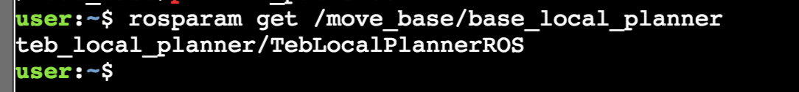

---

**NOTE:** Make sure to switch back to the DWAPlanner after you finish with this Exercise.

As you would expect, the local planner also has its own parameters. These parameters will be different depending on the local planner you use. In this course, we'll be focusing on the DWA local planner parameters, since it's the most common choice. Anyways, if you want to check the specific parameters for the other local planners, you can have a look at them here:

base_local_planner: <http://wiki.ros.org/base_local_planner>

eband_local_planner: <http://wiki.ros.org/eband_local_planner>

teb_local_planner: <http://wiki.ros.org/teb_local_planner>

### dwa local planner Parameters

The parameters for the local planner are set in another YAML file. The most important parameters for the DWA local planner are the following:

#### Robot Configuration Parameters

- **/acc_lim_x (default: 2.5)**: The x acceleration limit of the robot in meters/sec^2
- **/acc_lim_th (default: 3.2)**: The rotational acceleration limit of the robot in radians/sec^2
- **/max_trans_vel (default: 0.55)**: The absolute value of the maximum translational velocity for the robot in m/s
- **/min_trans_vel (default: 0.1)**: The absolute value of the minimum translational velocity for the robot in m/s
- **/max_vel_x (default: 0.55)**: The maximum x velocity for the robot in m/s.
- **/min_vel_x (default: 0.0)**: The minimum x velocity for the robot in m/s, negative for backwards motion.
- **/max_rot_vel (default: 1.0)**: The absolute value of the maximum rotational velocity for the robot in rad/s
- **/min_rot_vel (default: 0.4)**: The absolute value of the minimum rotational velocity for the robot in rad/s

#### Goal Tolerance Parameters

- **/yaw_goal_tolerance (double, default: 0.05)**: The tolerance, in radians, for the controller in yaw/rotation when achieving its goal
- **/xy_goal_tolerance (double, default: 0.10)**: The tolerance, in meters, for the controller in the x and y distance when achieving a goal
- **/latch_xy_goal_tolerance (bool, default: false)**: If goal tolerance is latched, if the robot ever reaches the goal xy location, it will simply rotate in place, even if it ends up outside the goal tolerance while it is doing so.


## Exercise 5.3

a) Open the **my_move_base_params.yaml** file you created in the previous Chapter to edit it.

b) Modify the **xy_goal_tolerance** parameter of the DWAPlanner and set it to a higher value.

c) Check if you notice any differences in the performance.

The robot stops short of the goal by the distance that I set for xy_goal_tolerance.

```
$ rosparam get /move_base/DWAPlannerROS/xy_goal_tolerance
1.0
```

### Expected Result for Exercise 5.3

High XY tolerance:

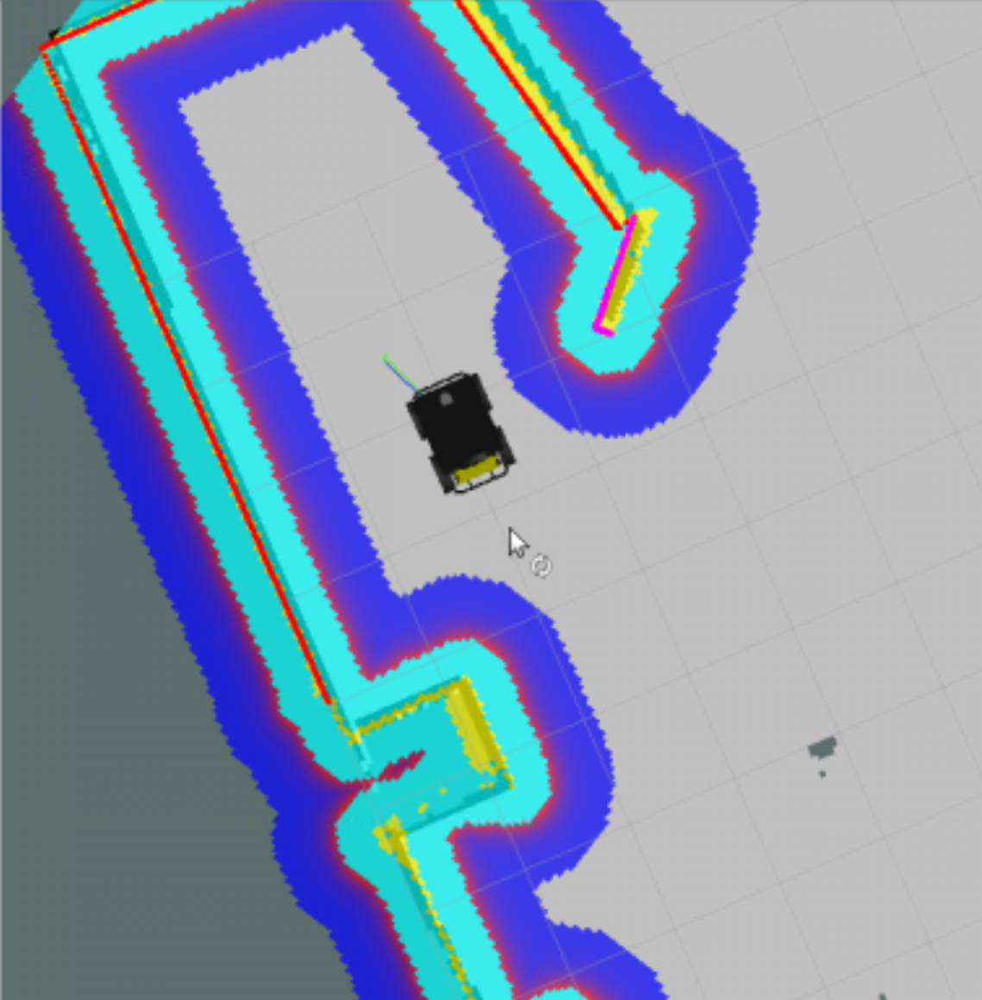

Low XY tolerance:

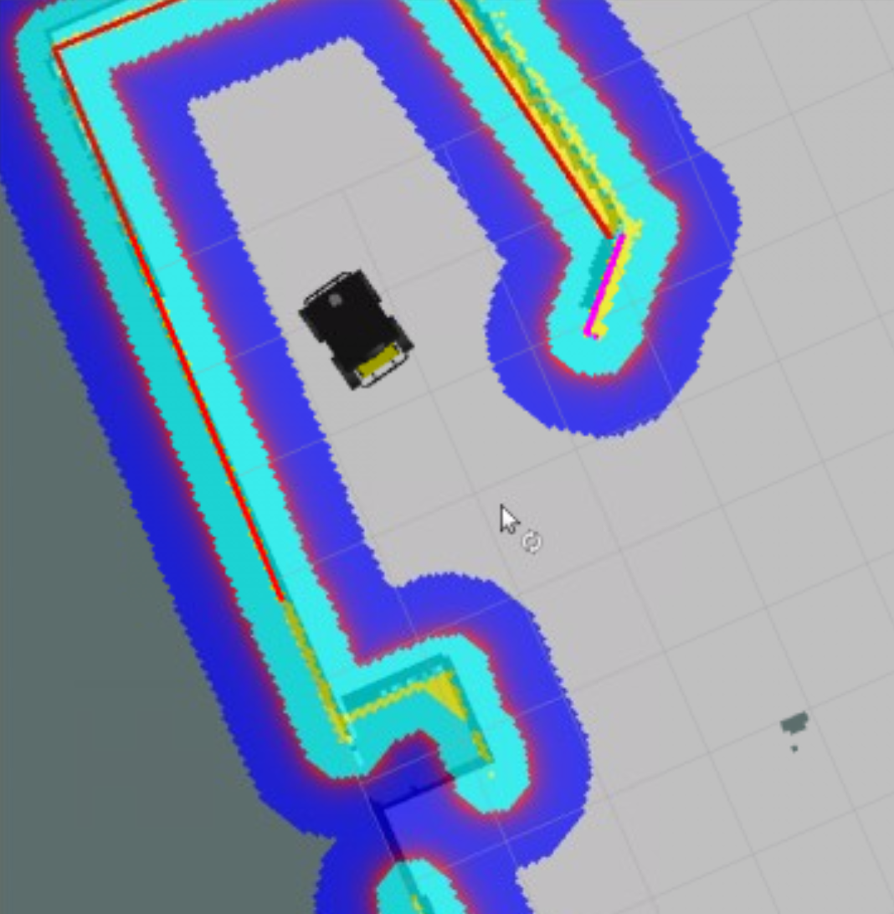

---

As you've seen in the exercise, the higher you set the goal tolerances in your parameters file, the less accurate the robot will be in order to set a goal as reached.

### Forward Simulation Parameters

- **/sim_time (default: 1.7)**: The amount of time to forward-simulate trajectories in seconds
- **/sim_granularity (default: 0.025)**: The step size, in meters, to take between points on a given trajectory
- **/vx_samples (default: 3)**: The number of samples to use when exploring the x velocity space
- **/vy_samples (default: 10)**: The number of samples to use when exploring the y velocity space
- **/vtheta_samples (default: 20)**: The number of samples to use when exploring the theta velocity space


## Exercise 5.4

a) Modify the **sim_time** parameter in the local planner parameters file and set it to 4.0.

b) Check if you notice any differences in the performance or visualization of the local planner.

I did not observe a noticeable difference between the default 1.7 second sim_time and 4.0 second sim_time.

### Expected Result for Exercise 5.4

Regular sim_time:

 

High sim_time:


---

#### Trajectory Scoring Parameters

- **/path_distance_bias (default: 32.0)**: The weighting for how much the controller should stay close to the path it was given
- **/goal_distance_bias (default: 24.0)**: The weighting for how much the controller should attempt to reach its local goal; also controls speed
- **/occdist_scale (default: 0.01)**: The weighting for how much the controller should attempt to avoid obstacles

Here you have an example of the dwa_local_planner_params.yaml:

```python
DWAPlannerROS:

# Robot Configuration Parameters - Kobuki
  max_vel_x: 0.5  # 0.55
  min_vel_x: 0.0

  max_vel_y: 0.0  # diff drive robot
  min_vel_y: 0.0  # diff drive robot

  max_trans_vel: 0.5 # choose slightly less than the base's capability
  min_trans_vel: 0.1  # this is the min trans velocity when there is negligible rotational velocity
  trans_stopped_vel: 0.1

  # Warning!
  #   do not set min_trans_vel to 0.0 otherwise dwa will always think translational velocities
  #   are non-negligible and small in place rotational velocities will be created.

  max_rot_vel: 5.0  # choose slightly less than the base's capability
  min_rot_vel: 0.4  # this is the min angular velocity when there is negligible translational velocity
  rot_stopped_vel: 0.4

  acc_lim_x: 1.0 # maximum is theoretically 2.0, but we
  acc_lim_theta: 2.0
  acc_lim_y: 0.0      # diff drive robot

# Goal Tolerance Parameters
  yaw_goal_tolerance: 0.3  # 0.05
  xy_goal_tolerance: 0.15  # 0.10
  # latch_xy_goal_tolerance: false

# Forward Simulation Parameters
  sim_time: 1.0       # 1.7
  vx_samples: 6       # 3
  vy_samples: 1       # diff drive robot, there is only one sample
  vtheta_samples: 20  # 20

# Trajectory Scoring Parameters
  path_distance_bias: 64.0      # 32.0   - weighting for how much it should stick to the global path plan
  goal_distance_bias: 24.0      # 24.0   - wighting for how much it should attempt to reach its goal
  occdist_scale: 0.5            # 0.01   - weighting for how much the controller should avoid obstacles
  forward_point_distance: 0.325 # 0.325  - how far along to place an additional scoring point
    stop_time_buffer: 0.2         # 0.2    - amount of time a robot must stop in before colliding for a valid traj.
  scaling_speed: 0.25           # 0.25   - absolute velocity at which to start scaling the robot's footprint
  max_scaling_factor: 0.2       # 0.2    - how much to scale the robot's footprint when at speed.

# Oscillation Prevention Parameters
  oscillation_reset_dist: 0.05  # 0.05   - how far to travel before resetting oscillation flags

# Debugging
  publish_traj_pc : true
  publish_cost_grid_pc: true
  global_frame_id: odom


# Differential-drive robot configuration - necessary?
#  holonomic_robot: false
```

## Exercise 5.5

Change the **path_distance_bias** parameter in the local planner parameters file.

Check if you notice any differences in the performance.

The robot's local trajectory follows the global plan much closer with path_distance_bias = 64.0 compared to 10.0 as expected. If the robot has to navigate in a small space, increasing path_distance_bias would reduce the chance of colliding with obstacles.

---

In the global planner section, we already introduced you to costmaps, focusing on the global costmap. So, now it's time to talk a little bit about the local costmap.

### Local Costmap

The first thing you need to know is that the **local planner uses the local costmap in order to calculate local plans**.

Unlike the global costmap, the local costmap is created directly from the robot's sensor readings. Given a width and a height for the costmap (which are defined by the user), it keeps the robot in the center of the costmap as it moves throughout the environment, dropping obstacle information from the map as the robot moves.

Let's do an exercise so that you can get a better idea of how the local costmap looks, and how to differentiate a local costmap from a global costmap.

## Exercise 5.6

a) Open Rviz and add the proper displays in order to visualize the global and the local costmaps.

b) Execute the following command in order to spawn an obstacle in the room.

Check if you already have the **object.urdf** file in your workspace. If you don't have it yet, you'll need to execute the following command in order to move it to your workspace.

Execute in WebShell #2:

```
cp /home/simulations/public_sim_ws/src/all/turtlebot/turtlebot_navigation_gazebo/urdf/object.urdf /home/user/catkin_ws/src
```

Now, spawn the object.

Execute in WebShell #2:

```
rosrun gazebo_ros spawn_model -file /home/user/catkin_ws/src/object.urdf -urdf -x 0 -y 0 -z 1 -model my_object
```

c) Launch the keyboard Teleop and move close to the spawned object.

Execute in WebShell #3:

```
roslaunch husky_launch keyboard_teleop.launch
```

d) Check the differences between the global and local Costmaps.

### Expected Result for Exercise 5.6

Husky facing the spawned obstacle:


Global Costmap (Obstacle doesn't appear):


Local Costmap (Obstacle does appear):

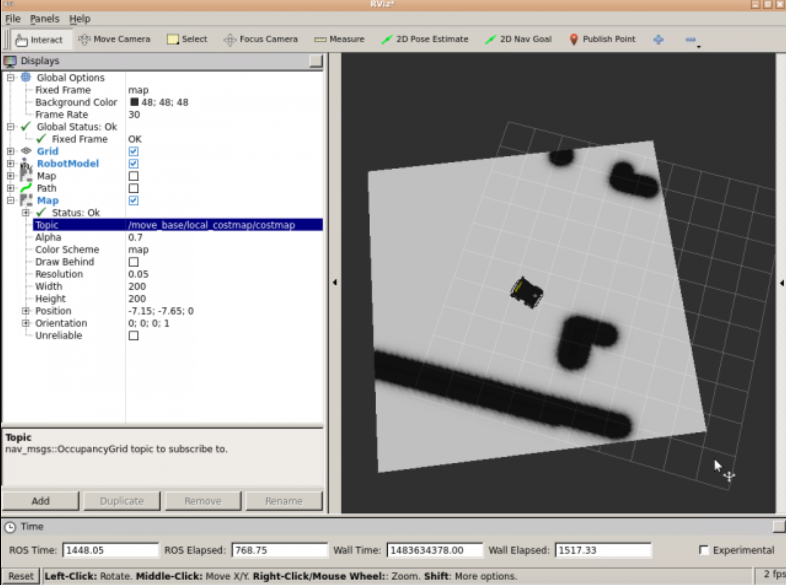

---

So, as you've seen in the previous exercise, the **local costmap does detect new objects that appear in the simulation, while the global costmap doesn't**.

This happens, as you may have already deduced, because the global costmap is created from a static map file. This means that the costmap won't change, even if the environment does. The local costmap, instead, is created from the robot's sensor readings, so it will always keep updating with new readings from the sensors.

Since the global costmap and the local costmap don't have the same behavior, the parameters file must also be different. Let's have a look at the most important parameters that we need to set for the local costmap.

### Local Costmap Parameters

The parameters you need to know are the following:

- **global_frame**: The global frame for the costmap to operate in. In the local costmap, this parameter has to be set to "/odom".
- **static_map** : Whether or not to use a static map to initialize the costmap. In the local costmap, this parameter has to be set to "false."
- **rolling_window**: Whether or not to use a rolling window version of the costmap. If the static_map parameter is set to true, this parameter must be set to false. In the local costmap, this parameter has to be set to "true."
- **width**: The width of the costmap.
- **heigth**: The height of the costmap.
- **update_frequency**: The frequency in Hz for the map to be updated.
- **plugins**: Sequence of plugin specifications, one per layer. Each specification is a dictionary with a name and type fields. The name is used to define the parameter namespace for the plugin.

So, by setting the **static_map** paramter to false, and the **rolling_window** parameter to true, we are indicating that we don't want the costmap to be initialized from a static map (as we did with the global costmap), but to be built from the robot's sensor readings. 
Also, since we won't have any static map, the **global_frame** parameter needs to be set to **odom**. 
Finally, we also need to set a **width** and a **height** for the costmap, because in this case, it can't get these values from a static map.

Let's do a simple exercise so that you can modify some of these parameters.

## Exercise 5.7

a) Add a file named **my_local_costmap_params.yaml** to the *params* directory of the package you created in Exercise 4.5.

b) Copy the contents of the **costmap_local.yaml** file of the *husky_navigation* package into this file.

**costmap_local.yaml** contains:

```python
global_frame: odom
rolling_window: true

plugins:
  - {name: obstacles_laser,           type: "costmap_2d::ObstacleLayer"}
  - {name: inflation,                 type: "costmap_2d::InflationLayer"}
```

c) Modify the **my_move_base_launch_2.launch** file you created in exercise 4.5 so that it loads the local costmap parameters file you just created.

d) Launch Rviz and visualize the local costmap again. Visualize both the map and costmap modes.

e) Modify the **width** and **height** parameters and put them to 5. Visualize the costmap again.

**NOTE:** Keep in mind that, for your case, the **width** and **heigth** parameters are being loaded directly from the launch file. So, you will have to remove from the launch file and add them to the parameters file.

### Expected Result for Exercise 5.7

10x10 costmap (map view):

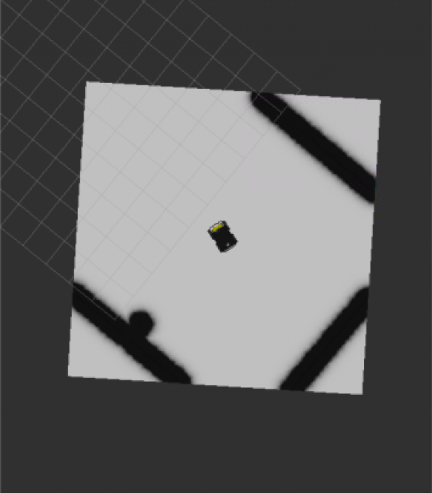

10x10 costmap (costmap view):


5x5 costmap (map view):

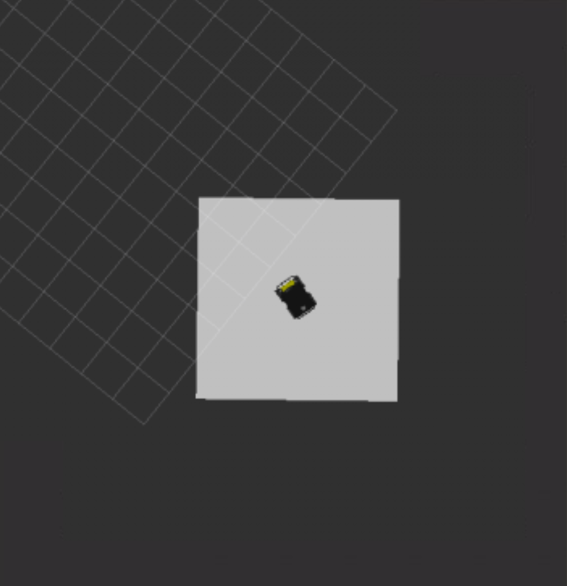

5x5 costmap (costmap view):


---

As you've seen in the previous exercise, it's very important to set a correct width and height for your costmap. Depending on the environment you want to navigate, you will have set one value or another in order to properly visualize the obstacles.

Just as we saw for the global costmap, layers can also be added to the local costmap. In the case of the local costmap, you will usually add these 2 layers:

- **costmap_2d::ObstacleLayer**: Used for obstacle avoidance.
- **costmap_2d::InflationLayer**: Used to inflate obstacles.

So, you will end up with something like this:

```python
plugins:
    - {name: obstacle_layer,      type: "costmap_2d::ObstacleLayer"}
    - {name: inflation_layer,     type: "costmap_2d::InflationLayer"}
```

**VERY IMPORTANT:** Note that the **obstacle layer** uses different plugins for the **local costmap** and the **global costmap**. For the local costmap, it uses the **costmap_2d::ObstacleLayer**, and for the global costmap it uses the **costmap_2d::VoxelLayer**. This is very important because it is a common error in Navigation to use the wrong plugin for the obstacle layers.

As you've already seen through the exercises, the local costmap keeps updating itself . These update cycles are made at a rate specified by the **update_frequency**parameter. Each cycle works as follows:

- Sensor data comes in.
- Marking and clearing operations are performed.
- The appropriate cost values are assigned to each cell.
- Obstacle inflation is performed on each cell with an obstacle. This consists of propagating cost values outwards from each occupied cell out to a specified inflation radius.

## Exercise 5.8

a) In the local costmap parameters file, change the **update_frequency** parameter of the map to be slower.

b) Repeat Exercise 5.6 again, and see what happens now.

I changed the update frequency to 1.0 Hz by adding this line to the my_local_costmap_params.yaml file:

```
update_frequency: 1.0
```

The update frequency of the local costmap can be verified by:

```
$ rosparam get /move_base/local_costmap/update_frequency
1.0
```

After reducing the update frequency from the default 5.0 Hz to 1.0 Hz, the local costmap does not update as frequently as expected.

### Expected Result for Exercise 5.8

The object in the costmap is spawned with a little delay.

---

Now, you may be wondering... what are the marking and clearing operations you mentioned above?

As you already know, the costmap automatically subscribes to the sensor topics and updates itself according to the data it receives from them. Each sensor is used to either **mark** (insert obstacle information into the costmap), **clear** (remove obstacle information from the costmap), or both.

A **marking** operation is just an index into an array to change the cost of a cell.
A **clearing** operation, however, consists of raytracing through a grid from the origin of the sensor outwards for each observation reported.

The marking and clearing operations can be defined in the **obstacle layer**.

At this point, we can almost say that you already know how to configure both global and local costmaps. But if you remember, there's still a paramters file we haven't talked about. That's the **common costmap parameters file**. These parameters will affect both the global and the local costmap.

Basically, the parameters you'll have to set in this file are the following:

- **footprint**: Footprint is the contour of the mobile base. In ROS, it is represented by a two-dimensional array of the form [x0, y0], [x1, y1], [x2, y2], ...]. This footprint will be used to compute the radius of inscribed circles and circumscribed circles, which are used to inflate obstacles in a way that fits this robot. Usually, for safety, we want to have the footprint be slightly larger than the robot’s real contour. 
- **robot_radius**: In case the robot is circular, we will specify this parameter instead of the footprint. 
- **layers parameters**: Here we will define the parameters for each layer.

Each layer has its own parameters.

### Obstacle Layer

The obstacle layer is in charge of the **marking and clearing operations**.

As you already know, the costmap automatically subscribes to the sensor topics and updates itself according to the data it receives from them. Each sensor is used to either mark (insert obstacle information into the costmap), clear (remove obstacle information from the costmap), or both.

A marking operation is just an index into an array to change the cost of a cell.
A clearing operation, however, consists of raytracing through a grid from the origin of the sensor outwards for each observation reported.

The marking and clearing operations can be defined in the obstacle layer.

- **max_obstacle_height (default: 2.0)**: The maximum height of any obstacle to be inserted into the costmap, in meters. This parameter should be set to be slightly higher than the height of your robot.
- **obstacle range (default: 2.5)**: The default maximum distance from the robot at which an obstacle will be inserted into the cost map, in meters. This can be overridden on a per-sensor basis.
- **raytrace_range (default: 3.0)**: The default range in meters at which to raytrace out obstacles from the map using sensor data. This can be overridden on a per-sensor basis.
- **observation_sources (default: "")**: A list of observation source names separated by spaces. This defines each of the *source_name* namespaces defined below.

Each source_name in observation_sources defines a namespace in which parameters can be set:

- **/source_name/topic (default: source_name)**: The topic on which sensor data comes in for this source. Defaults to the name of the source.
- **/source_name/data_type (default: "PointCloud")**: The data type associated with the topic, right now only "PointCloud," "PointCloud2," and "LaserScan" are supported.
- **/source_name/clearing (default: false)**: Whether or not this observation should be used to clear out freespace.
- **/source_name/marking (default: true)**: Whether or not this observation should be used to mark obstacles.
- **/source_name/inf_is_valid (default: false)**: Allows for Inf values in "LaserScan" observation messages. The Inf values are converted to the laser's maximum range.

**VERY IMPORTANT:** A very important thing to keep in mind is that the **obstacle layer** uses different plugins for the **local costmap** and the **global costmap**. For the local costmap, it uses the **costmap_2d::ObstacleLayer**, and for the global costmap it uses the **costmap_2d::VoxelLayer**. This is very important because it is a common error in Navigation to use the wrong plugin for the obstacle layers.

## Exercise 5.9

a) Add a file named **my_common_costmap_params.yaml** to the *params* directory of the package you created in Exercise 4.5.

Make sure to edit the launch file **my_move_base_launch_2.launch**. Comment out the following two lines:

```xml
<rosparam file="$(find husky_navigation)/config/costmap_common.yaml" command="load" ns="global_costmap" />
    <rosparam file="$(find husky_navigation)/config/costmap_common.yaml" command="load" ns="local_costmap"/>
```

Add the following two lines:

```xml
<rosparam file="$(find my_move_base_launcher)/params/my_common_costmap_params.yaml" command="load" ns="global_costmap" />
    <rosparam file="$(find my_move_base_launcher)/params/my_common_costmap_params.yaml" command="load" ns="local_costmap"/>
```

b) Copy the contents of the **costmap_common.yaml** file of the *husky_navigation* package into this new file.

**costmap_common.yaml** contains:

```
footprint: [[-0.5, -0.33], [-0.5, 0.33], [0.5, 0.33], [0.5, -0.33]]
footprint_padding: 0.01

robot_base_frame: base_link
update_frequency: 4.0
publish_frequency: 3.0
transform_tolerance: 0.5

resolution: 0.05

obstacle_range: 5.5
raytrace_range: 6.0

#layer definitions
static:
    map_topic: /map
    subscribe_to_updates: true

obstacles_laser:
    observation_sources: laser
    laser: {data_type: LaserScan, clearing: true, marking: true, topic: scan, inf_is_valid: true}

inflation:
    inflation_radius: 1.0
```

c) Now, modify the **obstacle_range** parameter and set it to 1.

d) Move the robot close to an obstacle and see what happens.

### Expected Result for Exercise 5.9


---

#### Inflation Layer

The inflation layer is in charge of performing inflation in each cell with an obstacle.

- **inflation_radius (default: 0.55)**: The radius in meters to which the map inflates obstacle cost values.
- **cost_scaling_factor (default: 10.0)**: A scaling factor to apply to cost values during inflation.

## Exercise 5.10

a) Now, modify the **inflation_radius** parameter of the costmap to be slower.

b) Move close to an object and check the difference.

### Expected Result for Exercise 5.10

Low inflation:


High inflation:

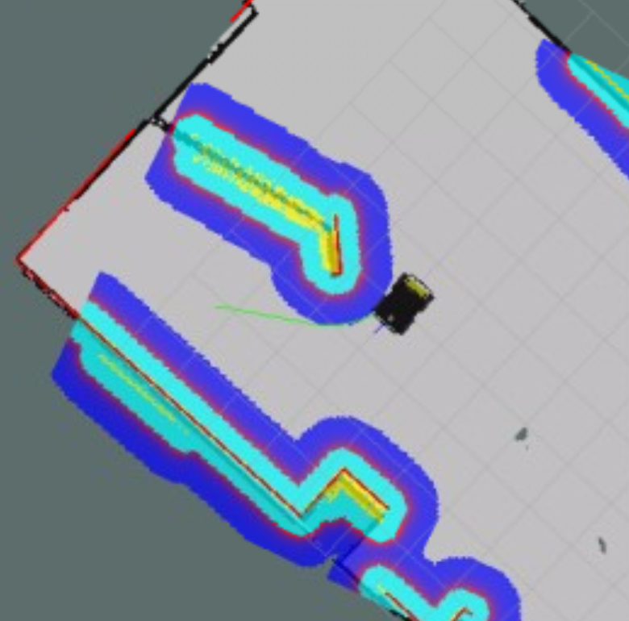

---

#### Static Layer

The static layer is in charge of providing the static map to the costmaps that require it (global costmap).

- **map_topic (string, default: "map")**: The topic that the costmap subscribes to for the static map.

## Recovery Behaviors

It could happen that while trying to perform a trajectory, the robot gets stuck for some reason. Fortunately, if this happens, the ROS Navigation Stack provides methods that can help your robot to get unstuck and continue navigating. These are the **recovery behaviors**.

The ROS Navigation Stack provides 2 recovery behaviors: **clear costmap** and **rotate recovery**.

In order to enable the recovery behaviors, we need to set the following parameter in the move_base parameters file:

- **recovery_behavior_enabled (default: true)**: Enables or disables the recovery behaviors.

### Rotate Recovery

Bascially, the rotate recovery behavior is a simple recovery behavior that attempts to clear out space by rotating the robot 360 degrees. This way, the robot may be able to find an obstacle-free path to continue navigating.

It has some parameters that you can customize in order to change or improve its behavior:

### Rotate Recovery Parameters

- **/sim_granularity (double, default: 0.017)**: The distance, in radians, between checks for obstacles when checking if an in-place rotation is safe. Defaults to 1 degree.
- **/frequency (double, default: 20.0)**: The frequency, in HZ, at which to send velocity commands to the mobile base.

### Other Parameters

IMPORTANT: These parameters are already set when using the base_local_planner local planner; they only need to be set explicitly for the recovery behavior if a different local planner is used.**

- **/yaw_goal_tolerance (double, default: 0.05)**: The tolerance, in radians, for the controller in yaw/rotation when achieving its goal
- **/acc_lim_th (double, default: 3.2)**: The rotational acceleration limit of the robot, in radians/sec^2
- **/max_rotational_vel (double, default: 1.0)**: The maximum rotational velocity allowed for the base, in radians/sec
- **/min_in_place_rotational_vel (double, default: 0.4)**: The minimum rotational velocity allowed for the base while performing in-place rotations, in radians/sec

These parameters are set in the move_base parameters file.

## Exercise 5.11

Force the robot to move to an obstacle and check if the Rotate Recovery behavior launches. 

---

### Clear Costmap

The clear costmap recovery is a simple recovery behavior that clears out space by clearing obstacles outside of a specified region from the robot's map. Basically, the local costmap reverts to the same state as the global costmap.

The move_base node also provides a service in order to clear out obstacles from a costmap. This service is called **/move_base/clear_costmaps**.

Bear in mind that by clearing obstacles from a costmap, you will make these obstacles invisible to the robot. So, be careful when calling this service since it could cause the robot to start hitting obstacles.

## Exercise 5.12

a) If there's not one yet, add an object to the scene that doesn't appear in the global costmap. For instance, the object in [Exercise 5.6](https://i-020023c2451ceb591.robotigniteacademy.com/jupyter/notebooks/Path_Planning_2.ipynb#ex-5-6).

Recall that to add the obstacle:

```
rosrun gazebo_ros spawn_model -file /home/user/catkin_ws/src/object.urdf -urdf -x 0 -y 0 -z 1 -model my_object
```

b) Move the robot so that it detects this new obstacle in the local costmap.

Use teleop:

```
roslaunch husky_launch keyboard_teleop.launch
```

c) Turn the robot so that it doesn't see anymore the obstacle (the laser beams don't detect it).

d) Perform a call to the **/clear_costmaps** service through the WebShell, and check what happens.

```
rosservice call /move_base/clear_costmaps "{}"
```

### Expected Result for Exercise 5.12

Object detected by the laser and placed into the local Ccostmap:


Husky turns and laser doesn't detect the object anymore, but it still appears in the local costmap.


After calling the **/move_base/clear_costmaps** service, the object is cleared from the local costmap:

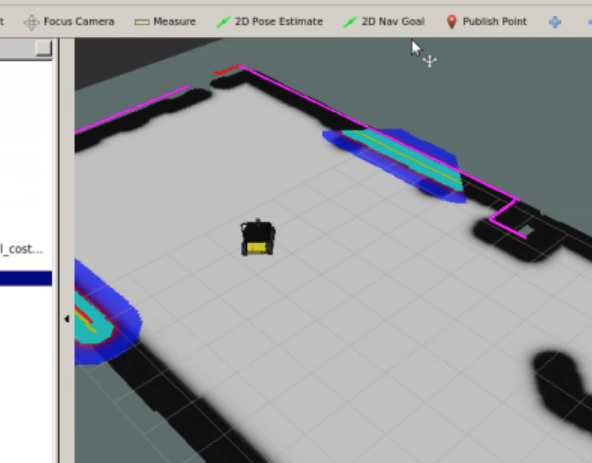

---

## Oscillation Supression

Oscillation occurs when, in any of the x, y, or theta dimensions, positive and negative values are chosen consecutively.

To prevent oscillations, when the robot moves in any direction, the opposite direction is marked invalid for the next cycle, until the robot has moved beyond a certain distance from the position where the flag was set.

In order to manage this issue, 2 parameters exist that you can set in the move_base parameters file.

- **oscillation_timeout (double, default: 0.0)**: How long, in seconds, to allow for oscillation before executing recovery behaviors. A value of 0.0 corresponds to an infinite timeout.
- **oscillation_distance (double, default: 0.5)**: How far, in meters, the robot must move to not be considered oscillating. Moving this far resets the timer counting up to the ~oscillation_timeout

## Recap

Congratulations! At this point, you've already seen almost all of the important parts that this chapter covers. And since this is the last chapter of the course, this means that you are very close to knowing how to deal with ROS Navigation in its entirety!

Anyways, you may be overwhelmed with all of the information that you've received about Path Planning. That's why I think this is a good moment to do a summary of all that you've seen in this chapter up until now. Let's begin!

### The move_base node

The move_base node is, basically, the node that coordinates all of the Path Planning System. It takes a goal pose as input, and outputs the necessary velocity commands in order to move the robot from an initial pose to the specified goal pose. In order to achieve this, the move_base node manages a whole internal process where it take place for different parts:

- global planner
- local planner
- costmaps
- recovery behaviors

### The global planner

When a new goal is received by the move_base node, it is immediately sent to the global planner. The global planner, then, will calculate a safe path for the robot to use to arrive to the specified goal. The global planner uses the global costmap data in order to calculate this path.

There are different types of global planners. Depending on your setup, you will use one or another.

### The local planner

Once the global planner has calculated a path for the robot, this is sent to the local planner. The local planner, then, will execute this path, breaking it into smaller (local) parts. So, given a plan to follow and a map, the local planner will provide velocity commands in order to move the robot. The local planner operates over a local costmap.

There are different types of local planners. Depending on the kind of performance you require, you will use one or another.

### Costmaps

Costmaps are, basically, maps that represent which points of the map are safe for the robot to be in, and which ones are not. There are 2 types of costmaps:

- global costmap
- local costmap

Basically, the difference between them is that the global costmap is built using the data from a previously built static map, while the local costmap is built from the robot's sensor readings.

### Recovery Behaviors

The recovery behaviors provide methods for the robot in case it gets stuck. The Navigation Stack provides 2 different recovery behaviors:

- rotate recovery
- clear costmap

### Configuration

Since there are lots of different nodes working together, the number of parameters available to configure the different nodes is also very high. I think it would be a great idea if we summarize the different parameter files that we will need to set for Path Planning. The parameter files you'll need are the following:

- **move_base_params.yaml**
- **global_planner_params.yaml**
- **local_planner_params.yamls**
- **common_costmap_params.yaml**
- **global_costmap_params.yaml**
- **local_costmap_params.yaml**

Besides the parameter files shown above, we will also need to have a launch file in order to launch the whole system and load the different parameters.

### Overall

Summarizing, this is how the whole path planning method goes:

After getting the current position of the robot, we can send a goal position to the **move_base** node. This node will then send this goal position to a **global planner** which will plan a path from the current robot position to the goal position. This plan is in respect to the **global costmap**, which is feeding from the **map server**.

The **global planner** will then send this path to the **local planner**, which executes each segment of the global plan. The **local planner** gets the odometry and the laser data values and finds a collision-free local plan for the robot. The **local planner** is associated with the **local costmap**, which can monitor the obstacle(s) around the robot. The **local planner** generates the velocity commands and sends them to the base controller. The robot base controller will then convert these commands into real robot movement.

If the robot is stuck somewhere, the recovery behavior nodes, such as the **clear costmap recovery** or **rotate recovery**, will be called.

Now everything makes more sense, right?

## Dynamic Reconfigure

Until now, we've seen how to change parameters by modifying them in the parameters files. But, guess what... this is not the only way that you can change parameters! You can also change dynamic parameters by using the rqt_reconfigure tool. Follow the next steps:

## Exercise 5.14

a) Run the next command in order to open the rqt_reconfigure tool.

```
rosrun rqt_reconfigure rqt_reconfigure
```

- Open the move_base group.

- Select the DWAPlannerROS node.

- Play a little bit with the following 3 parameters:
  - **path_distance_bias**
  - **goal_distance_bias**
  - **occdist_scale**

- The above parameters are the ones involved in calculating the cost function, which is used to score each trajectory. More in detail, they define the following:
  - **path_distance_bias**: The weighting for how much the controller should stay close to the path it was given.
  - **goal_distance_bias**: The weighting for how much the controller should attempt to reach its local goal, also controls speed.
  - **occdist_scale**: The weighting for how much the controller should attempt to avoid obstacles.

- Open Rviz and visualize how the global and local plans change depending on the values set.

### Expected Result for Exercise 5.14


## Other Useful Visualizations in Rviz

Until now, we've seen some ways of visualizing different parts of the move_base node process through Rviz. But, there are a couple more that may be interesting to know:

### Robot Footprint

It shows the footprint of the robot.

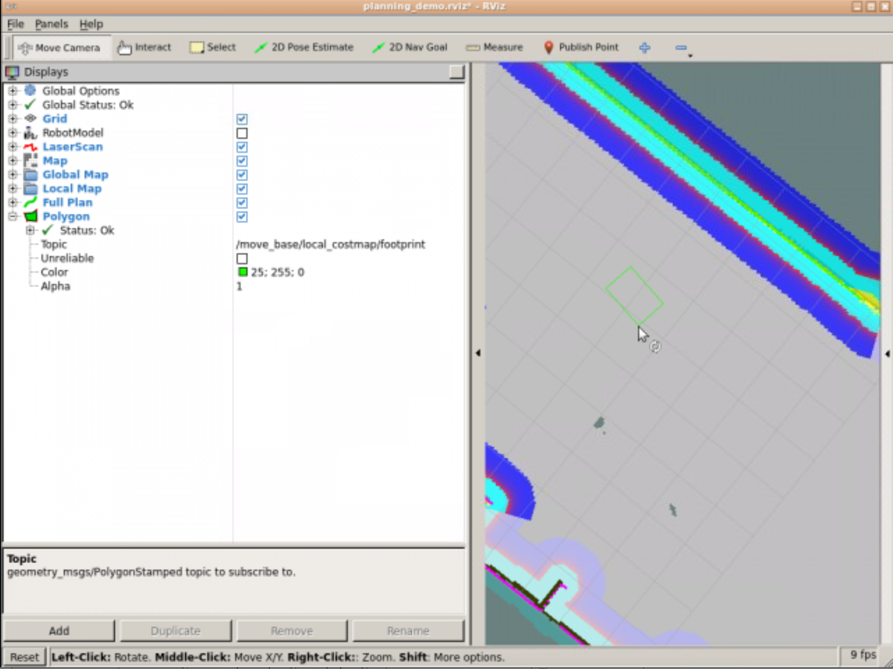

### Current Goal

To show the goal pose that the navigation stack is attempting to achieve, add a Pose Display and set its topic to /move_base_simple/goal. You will now be able to see the goal pose as a red arrow. It can be used to learn the final position of the robot.

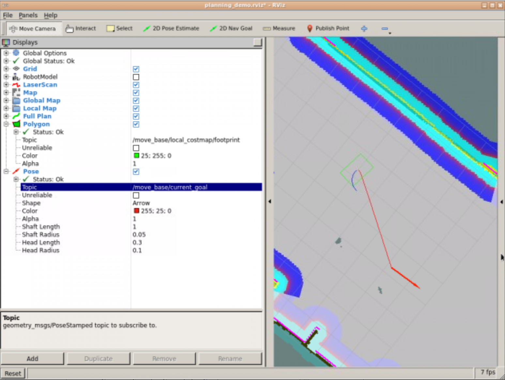

## Exercise 5.15

Open Rviz and try to visualize the elements described above. 

### Expected Result for Exercise 5.15

Images similar to those shown above in RViz.

---

## CONCLUSIONS


Summarizing, the ROS Path Planning system is basically managed by the move_base node.

