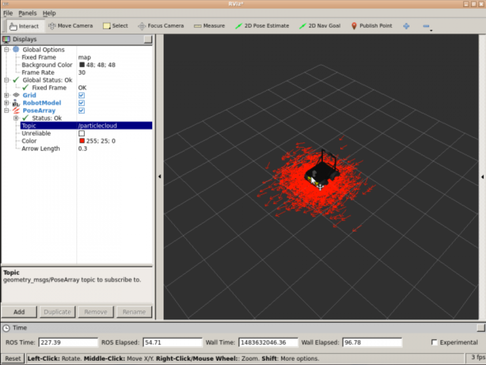
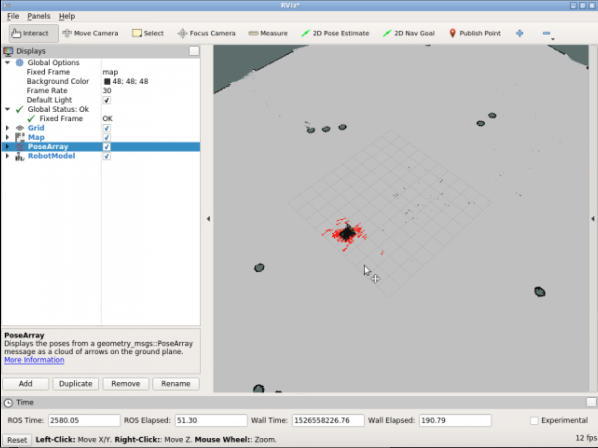
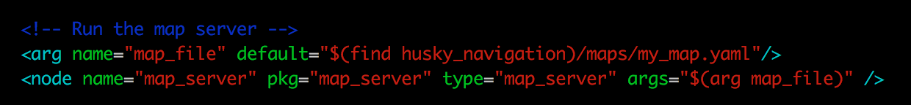
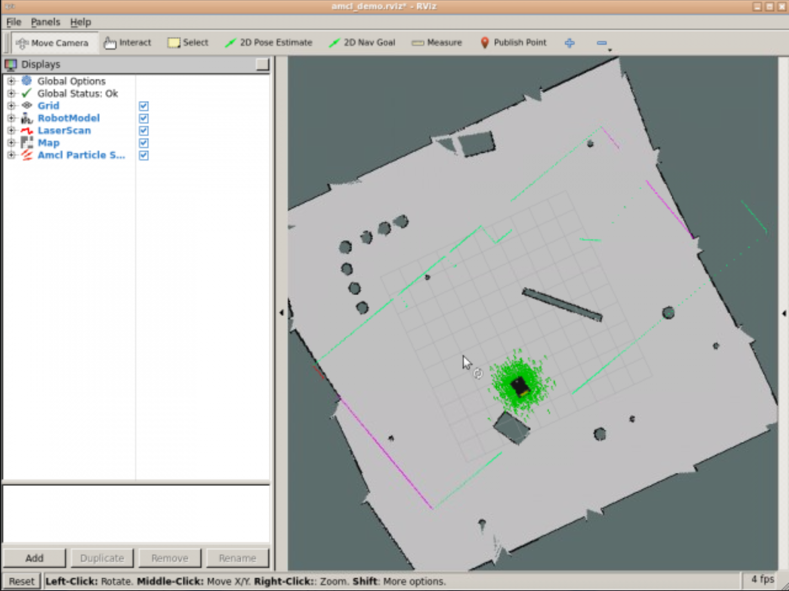
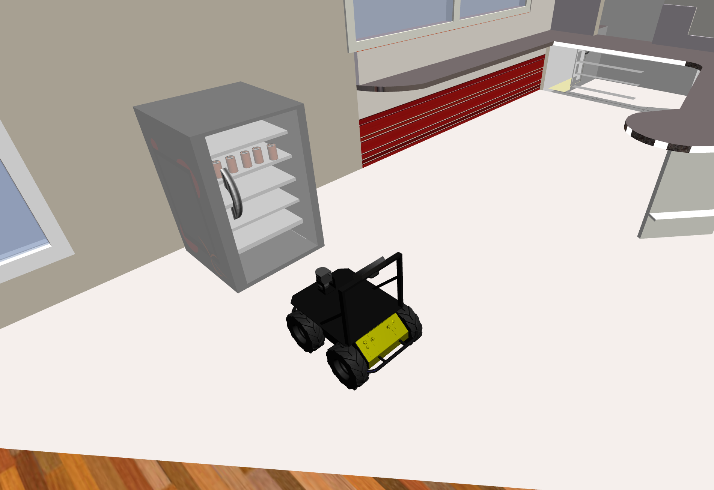
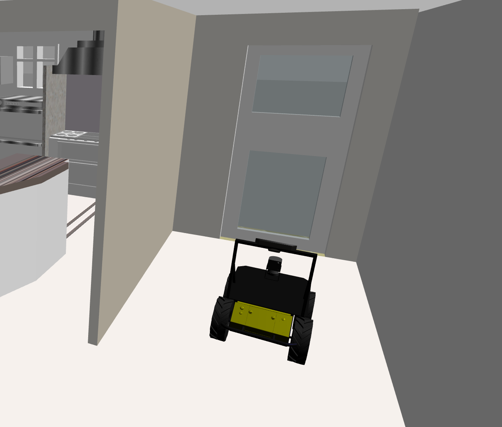
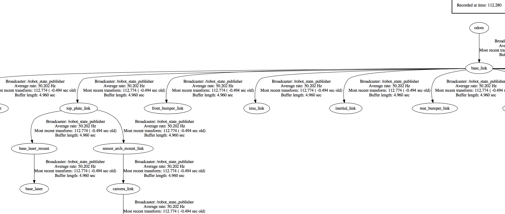
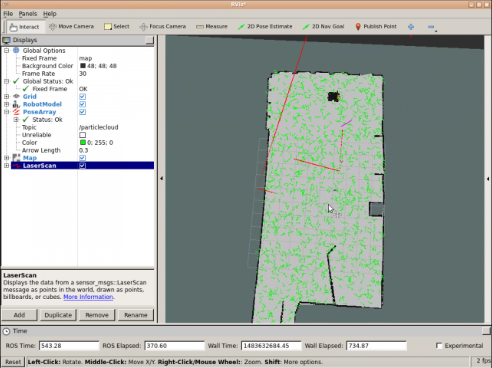

# Unit 3: Robot Localization

## SUMMARY

Estimated time to completion: **2 hours**

What will you learn with this unit?

- What does Localization mean in ROS Navigation?
- How does Localization work?
- How do we perform Localization in ROS?

---

In both the Basic Concepts Unit and in the Mapping Unit, we introduced and mentioned several times the importance of the Robot's localization in ROS Navigation. When the robot moves around a map, **it needs to know which is its POSITION within the map, and which is its ORIENTATION**. Determining its location and rotation (better known as the Pose of the robot) by using its sensor readings is known as **Robot Localization**.

In this Chapter, you will learn how to deal with the localization issue in ROS. But as we did in the previous chapter, let's first have a look at how RViz can help us with the localization process.

## Visualize Localization in Rviz

As you've already seen, you can launch RViz and add displays in order to watch the localization of the robot. For this chapter, you'll basically need to use 3 elements of RViz:

- **LaserScan** Display (Shown in the previous chapter)
- **Map** Display (Shown in the previous chapter)
- **PoseArray** Display

### Exercise 3.1

a) Execute the following command in order to launch the amcl node. We need to have this node running in order to visualize the Pose Arrays.

**Execute in WebShell #1**

```
roslaunch husky_navigation amcl_demo.launch
```

Hit the icon with a screen in the top-right corner of the IDE window


in order to open the Graphic Interface.

b) Launch Rviz and add the necessary displays in order to visualize the localization data (not the map and the laser).

```
rosrun rviz rviz
```

#### Visualize Pose Array (Particle Clouds)

- Click the Add button under displays and choose the **PoseArray** display.
- In the display properties, introduce the name of the topic where the particle cloud are being published (usually **/particlecloud**).
- To see the robot's position, you can choose to also add the RobotModel or TF displays.

#### Data for Exercise 3.1

Check the following notes in order to complete the exercise: 

**Note 1**: You can change the arrow's length and color by modifying the "Color" and "Arrow Length" properties.


#### Expected Result for Exercise 3.1



---

Now that you already know how to configure RViz in order to visualize the localization of the robot, let's get to work!

**REMEMBER**: Remember to save your RViz configuration in order to be able to load it again whenever you want. If you don't remember how to do it, check the previous chapter (Mapping Chapter).

### Exercise 3.2

**IMPORTANT: Before starting with this exercise, make sure that your Rviz is properly configurated in order to visualize the localization process. Also, add the necessary elements in order to visualize the map and the laser.**

In the next exercise, we'll see an example of how ROS deals with the Robot localization issue.

a) Add the LaserScan and Map displays in order to visualize the position of the robot in the room through RViz.

b) Using the 2D Pose Estimate tool, set an initial position and orientation in RViz for the Husky robot. It doesn't has to be exact, just take a look at the Husky's position and orientation in the simulation and try to set it in a similar way in RViz.

c) Make the robot move around the room by using the keyboard teleop program.

**Execute in WebShell #3**

```
roslaunch husky_navigation_launch keyboard_teleop.launch
```

#### Data for Exercise 3.2

Check the following notes in order to complete the exercise:

**Note 1**: Localization in ROS is visualized through elements called particles (we'll see more on this later on in the unit).

**Note 2**: The spread of the cloud represents the localization system's uncertainity about the robot's pose.

**Note 3**: As the robot moves around the environment, this cloud should shrink in size due to additional scan data allowing amcl to refine its estimation of the robot's position and orientation.

#### Expected Result for Exercise 3.2

Before moving the robot:


After moving the robot:



---

Ok, but... what just happened? What were those strange arrows we were visualizing in RViz? Let's first introduce some concepts in order to better understand what you've just done.

## Monte Carlo Localization (MCL)

Because the robot may not always move as expected, it generates many random guesses as to where it is going to move next. These guesses are known as particles. Each particle contains a full description of a possible future pose. When the robot observes the environment it's in (via sensor readings), it discards particles that don't match with these readings, and generates more particles close to those that look more probable. This way, in the end, most of the particles will converge in the most probable pose that the robot is in. So **the more you move, the more data you'll get from your sensors, hence the localization will be more precise**. These particles are those **arrows** that you saw in RViz in the previous exercise. Amazing, right?

This is known as the Monte Carlo Localization (MCL) algorithm, or also particle filter localization.

### The AMCL package

The AMCL (Adaptive Monte Carlo Localization) package provides the **amcl node**, which uses the MCL system in order to track the localization of a robot moving in a 2D space. This node **subscribes to the data of the laser, the laser-based map, and the transformations of the robot, and publishes its estimated position in the map**. On startup, the amcl node initializes its particle filter according to the parameters provided.

**NOTE**: As you may have noticed, in order to name this ROS package (and node), the word **Adaptive** has been added to the Monte Carlo Localization algorithm. This is because, in this node, we will be able to configure (adapt) some of the parameters that are used in this algorithm. You'll learn more about these parameters later on in this chapter.

So, basically, what you've done in the previous exercise was the following: 

- First, you launched an **amcl node** using the preconfigured **amcl_demo.launch** file.
- Second, you set up an initial pose by using the 2D Pose Estimate tool (which published that pose to the **/initialpose**topic).
- Then, you started moving the robot around the room, and the **amcl node** began reading the data published into the **laser topic (/scan)**, the **map topic(/map)**, and the **transform topic (/tf)**, and published the estimated pose where the robot was in to the **/amcl_pose** and the **/particlecloud** topics.
- Finally, via RViz, you accesed the data being published by this node into the **/particlecloud** topic, so you were able to visualize it, thanks to the cloud of "arrows," which were indicating the most probable position the robot was in, and its orientation.

Now, everything makes more sense, right?

**FLASHBACK**

Now you may be thinking... but where does this node get the map from? And that's a great question!

In the previous unit, you learned about the **map_server** node, which allows you to provide the data of a map from the map's file. Do you remember? If not, I suggest you go back and take a quick look in order to refresh your memory.

Back again? So basically, what we're doing here is to call that functionality in order to provide the map data to the amcl node. And we're doing it through the **amcl_demo.launch** file that you launched back in Exercise 3.1. If you take a look at this file, you'll see at the top of it, there is a section like this:



Here, the file is launching a **map_server** node, which will take the provided map file (arg **map_file**) and turn it into map data. Then, it will publish this data to the **/map** topic, which will be used by the **amcl** node to perform localization.

---

### Exercise 3.3

**IMPORTANT: Before starting with this exercise, make sure that you've stopped the previously launched amcl node by pressing Ctrl + C on the console where you executed the command.**

a) Have a look at the **amcl_demo.launch** file in the **husky_navigation** package. You'll see that what it's actually doing is calling another launch file named **amcl.launch**.

**<u>amcl.launch</u>**:

```xml
<launch>

  <arg name="use_map_topic" default="true"/>
  <arg name="scan_topic" default="scan" />

  <node pkg="amcl" type="amcl" name="amcl">
    <param name="use_map_topic" value="$(arg use_map_topic)"/>
    <!-- Publish scans from best pose at a max of 10 Hz -->
    <param name="odom_model_type" value="diff"/>
    <param name="odom_alpha5" value="0.1"/>
    <param name="gui_publish_rate" value="10.0"/>
    <param name="laser_max_beams" value="60"/>
    <param name="laser_max_range" value="12.0"/>
    <param name="min_particles" value="500"/>
    <param name="max_particles" value="2000"/>
    <param name="kld_err" value="0.05"/>
    <param name="kld_z" value="0.99"/>
    <param name="odom_alpha1" value="0.2"/>
    <param name="odom_alpha2" value="0.2"/>
    <!-- translation std dev, m -->
    <param name="odom_alpha3" value="0.2"/>
    <param name="odom_alpha4" value="0.2"/>
    <param name="laser_z_hit" value="0.5"/>
    <param name="laser_z_short" value="0.05"/>
    <param name="laser_z_max" value="0.05"/>
    <param name="laser_z_rand" value="0.5"/>
    <param name="laser_sigma_hit" value="0.2"/>
    <param name="laser_lambda_short" value="0.1"/>
    <param name="laser_model_type" value="likelihood_field"/>
    <!-- <param name="laser_model_type" value="beam"/> -->
    <param name="laser_likelihood_max_dist" value="2.0"/>
    <param name="update_min_d" value="0.25"/>
    <param name="update_min_a" value="0.2"/>
    <param name="odom_frame_id" value="odom"/>
    <param name="resample_interval" value="1"/>
    <!-- Increase tolerance because the computer can get quite busy -->
    <param name="transform_tolerance" value="1.0"/>
    <param name="recovery_alpha_slow" value="0.0"/>
    <param name="recovery_alpha_fast" value="0.0"/>
    <remap from="scan" to="$(arg scan_topic)"/>
  </node>

</launch>
```

b) Create a new package named **my_amcl_launcher**. Inside this package, create a new directory named launch. And inside of this directory, create a new file named **change_map.launch**. Copy the contents of the **amcl.launch** file into this new file.

c) In the launch file that you've just created, add a section where you launch the map_server node (as you've just seen above), and provide a different map file.

To replace the current map **my_map.yaml** with another map **playpen_map.yaml**, add this line:

```xml
<arg name="map_file" default="$(find husky_navigation)/maps/playpen_map.yaml"/>
```

and comment out this line:

```xml
<arg name="map_file" default="$(find husky_navigation)/maps/my_map.yaml"/>
```

d) Open RViz and see what happens now.

#### Data for Exercise 3.3

Check the following notes in order to complete the exercise: 

**Note 1**: The map files are located in a directory called maps of the husky_navigation package.

#### Expected Result for Exercise 3.3



---

### Exercise 3.4

**IMPORTANT: Before starting with this exercise, make sure that you've set the correct map file into the amcl launch file again, and then launch the node.**

In Exercise 3.2, you visualized localization through Rviz and the */particlecloud* topic. But, now you've learned that this is not the only topic that the amcl node writes on. Get information about the estimated pose of the robot without using the */particlecloud* topic.

#### Data for Exercise 3.4

Check the following notes in order to complete the exercise: 

**Note 1**: Keep in mind that in order to be able to visualize these topics, the amcl node must be launched.

**Note 2**: Move the robot through the room and check if the pose changes correctly.

#### Expected Result for Exercise 3.4

Output of the /amcl_pose topic:


### Exercise 3.5

Create a service server that, when called, returns the pose (position and orientation) of the robot at that exact moment.

a) Create a new package named **get_pose**. Add rospy as a dependency.

b) Inside this package, create a file named **get_pose_service.py**. Inside this file, write the code of your **Service Server**.

To get the current pose of the robot, we can subscribe to the **/amcl_pose** topic.

To find the message type of **/amcl_pose**:

```
$ rostopic info /amcl_pose
Type: geometry_msgs/PoseWithCovarianceStamped

Publishers:
 * /amcl (http://rosds_computer:46660/)

Subscribers: None
```

To find the structure of **geometry_msgs/PoseWithCovarianceStamped**:

```
$ rosmsg info geometry_msgs/PoseWithCovarianceStamped
std_msgs/Header header
  uint32 seq
  time stamp
  string frame_id
geometry_msgs/PoseWithCovariance pose
  geometry_msgs/Pose pose
    geometry_msgs/Point position
      float64 x
      float64 y
      float64 z
    geometry_msgs/Quaternion orientation
      float64 x
      float64 y
      float64 z
      float64 w
  float64[36] covariance
```

As you can see, the **geometry_msgs/PoseWithCovarianceStamped** message type contains a **geometry_msgs/PoseWithCovariance** message along with header information.  The service server should contain a subscriber that subscribes to the **/amcl_pose** topic, which has message type **geometry_msgs/PoseWithCovarianceStamped**, and then the service server will store this pose information in a **geometry_msgs/PoseWithCovariance** message and print it to the terminal. The service does not need any input nor does it return any output. Thus the service can be of type **Empty**, which means the service request and service response are both empty (None). See below for the implementation.

**Solution:**

```python
#!/usr/bin/env python

import rospy
# Import the service message python classes generated from Empty.srv.
from std_srvs.srv import Empty, EmptyResponse
from geometry_msgs.msg import PoseWithCovarianceStamped, Pose

# To run:
# Terminal 1 (load map, run amcl, run move_base): roslaunch my_amcl_launcher change_map.launch
# Terminal 2 (start service server):  rosrun get_pose get_pose_service.py
# or: roslaunch get_pose get_pose_service.launch
# Terminal 3 (call service server): rosservice call /get_pose_service
# Terminal 4 (drive around): roslaunch husky_navigation_launch keyboard_teleop.launch

pose_msg = Pose()


def sub_callback(msg):
    global pose_msg
    pose_msg = msg.pose.pose


def service_callback(req):
    print "Robot pose: "
    print pose_msg
    return EmptyResponse()


rospy.init_node('get_pose_server')
sub = rospy.Subscriber('/amcl_pose', PoseWithCovarianceStamped, sub_callback)
my_service = rospy.Service('/get_pose_service', Empty, service_callback)

rospy.spin()
```

c) Create a launch file in order to launch your Service.

**<u>get\_pose\_service.launch</u>**

```xml
<launch>
    <node pkg="get_pose" type="get_pose_service.py" name="get_pose_server" output="screen">
    </node>
</launch>
```

Launch service server:

```
roslaunch get_pose get_pose_service.launch
```

d) Using a WebShell, call your service.

```
rosservice call /get_pose_service
```

Move around:

```
roslaunch husky_navigation_launch keyboard_teleop.launch
```

e) Using your Service, get the pose data from these 2 spots in the environment:





## Hardware Requirements

As we saw in the previous chapter (Mapping), **configuration is also very important to properly localizing the robot in the environment**.

In order to get a proper Robot localization, we need to fullfil 3 basic requirements:

- Provide Good **Laser Data**
- Provide Good **Odometry Data**
- Provide Good Laser-Based **Map Data**

### Exercise 3.6

Make sure that your robot is publishing this data, and identify both the topic and the message type that each topic is using in order to publish the data.

Have a look at one or more of the messages that were published in this topic in order to check their structure.

#### Data for Exercise 3.6

Check the following notes in order to complete the exercise: 

**Note 1**: Keep in mind that in order to be able to visualize these topics, the amcl node must be launched.

#### Expected Result for Exercise 3.6


---

## Transforms

As we also saw in the previous chapter (Mapping), we need to be publishing a correct **transform** between the laser frame and the base of the robot's frame. This is pretty obvious, since as you've already learned, the robot **uses the laser readings in order to constantly re-calculate it's localization**.

More specifically, the amcl node has these 2 requirements regarding the transformations of the robot:

- amcl transforms incoming laser scans to the odometry frame (~odom_frame_id). So, there must be a path through the tf tree from the frame in which the laser scans are published to the odometry frame.
- amcl looks up the transform between the laser's frame and the base frame (~base_frame_id), and latches it forever. So **amcl cannot handle a laser that moves with respect to the base.**

**NOTE**: If you want more information regarding this issue, go back to the Mapping Chapter and review this section.

### Exercise 3.7

Generate the transforms tree and check if the above requirements are fulfilled.

To generate a pdf of the transforms tree:

```
rosrun tf view_frames
```

#### Data for Exercise 3.7

Check the following notes in order to complete the exercise: 

**Note 1:** Remember that you can download a file through the IDE by right-clicking on them and selecting the "Download" option.

**Note 2**: Also remember that in order to be able to access the file from the IDE, it needs to be in the catkin_ws/src directory.

#### Expected Result for Exercise 3.7



---

## Creating a launch file for the AMCL node

As you saw in the Mapping Chapter, you also need to have a launch file in order to start the amcl node. This node is also highly customizable and we can configure many parameters in order to improve its performance. These parameters can be set either in the launch file itself or in a separate parameters file (YAML file). You can have a look at a complete list of all of the parameters that this node has here: <http://wiki.ros.org/amcl> 

Let's have a look at some of the most important ones:

### General Parameters

- **odom_model_type (default: "diff")**: It puts the odometry model to use. It can be "diff," "omni," "diff-corrected," or "omni-corrected."
- **odom_frame_id (default: "odom")**: Indicates the frame associated with odometry.
- **base_frame_id (default: "base_link")**: Indicates the frame associated with the robot base.
- **global_frame_id (default: "map")**: Indicates the name of the coordinate frame published by the localization system.
- **use_map_topic (default: false)**: Indicates if the node gets the map data from the topic or from a service call.

### Filter Parameters

These parameters will allow you to configure the way that the particle filter performs.

- **min_particles (default: 100)**: Sets the minimum allowed number of particles for the filter.
- **max_particles (default: 5000)**: Sets the maximum allowed number of particles for the filter.
- **kld_err (default: 0.01)**: Sets the maximum error allowed between the true distribution and the estimated distribution.
- **update_min_d (default: 0.2)**: Sets the linear distance (in meters) that the robot has to move in order to perform a filter update.
- **update_min_a (default: π/6.0)**: Sets the angular distance (in radians) that the robot has to move in order to perform a filter update.
- **resample_interval (default: 2)**: Sets the number of filter updates required before resampling.
- **transform_tolerance (default: 0.1)**: Time (in seconds) with which to post-date the transform that is published, to indicate that this transform is valid into the future.
- **gui_publish_rate (default: -1.0)**: Maximum rate (in Hz) at which scans and paths are published for visualization. If this value is -1.0, this function is disabled.

### Exercise 3.8

**IMPORTANT: Before starting with this exercise, make sure that you've stopped the previously launched amcl node by pressing Ctrl + C on the console where you executed the command.**

a) In the package that you created in Exercise 3.3, create a new launch file named **my_amcl_launch.launch**. Copy the contents of the **amcl_demo.launch** file to this file.

**<u>my\_amcl\_launch.launch</u>**

```xml
<launch>

  <!-- Run the map server -->
  <arg name="map_file" default="$(find husky_navigation)/maps/my_map.yaml"/>
  <!-- <arg name="map_file" default="$(find husky_navigation)/maps/playpen_map.yaml"/> -->
  <node name="map_server" pkg="map_server" type="map_server" args="$(arg map_file)" />

  <!--- Run AMCL -->
  <!-- <include file="$(find husky_navigation)/launch/amcl.launch" /> -->
  <arg name="use_map_topic" default="true"/>
  <arg name="scan_topic" default="scan" />

  <node pkg="amcl" type="amcl" name="amcl">

    <param name="use_map_topic" value="$(arg use_map_topic)"/>
    <!-- Publish scans from best pose at a max of 10 Hz -->
    <param name="odom_model_type" value="diff"/>
    <param name="odom_alpha5" value="0.1"/>
    <param name="gui_publish_rate" value="10.0"/>
    <param name="laser_max_beams" value="60"/>
    <!-- <param name="laser_max_range" value="12.0"/> -->
    <param name="laser_max_range" value="1.0"/>
    <!-- <param name="min_particles" value="500"/>
    <param name="max_particles" value="2000"/> -->
    <param name="min_particles" value="1"/>
    <param name="max_particles" value="5"/>
    <param name="kld_err" value="0.05"/>
    <param name="kld_z" value="0.99"/>
    <param name="odom_alpha1" value="0.2"/>
    <param name="odom_alpha2" value="0.2"/>
    <!-- translation std dev, m -->
    <param name="odom_alpha3" value="0.2"/>
    <param name="odom_alpha4" value="0.2"/>
    <param name="laser_z_hit" value="0.5"/>
    <param name="laser_z_short" value="0.05"/>
    <param name="laser_z_max" value="0.05"/>
    <param name="laser_z_rand" value="0.5"/>
    <param name="laser_sigma_hit" value="0.2"/>
    <param name="laser_lambda_short" value="0.1"/>
    <param name="laser_model_type" value="likelihood_field"/>
    <!-- <param name="laser_model_type" value="beam"/> -->
    <param name="laser_likelihood_max_dist" value="2.0"/>
    <param name="update_min_d" value="0.25"/>
    <param name="update_min_a" value="0.2"/>
    <param name="odom_frame_id" value="odom"/>
    <param name="resample_interval" value="1"/>
    <!-- Increase tolerance because the computer can get quite busy -->
    <param name="transform_tolerance" value="1.0"/>
    <param name="recovery_alpha_slow" value="0.0"/>
    <param name="recovery_alpha_fast" value="0.0"/>
    <remap from="scan" to="$(arg scan_topic)"/>
  </node>

  <!--- Run Move Base -->
  <include file="$(find husky_navigation)/launch/move_base.launch" />

</launch>
```

b) Modify the **min_particles** and **max_particles** parameters. Set them to 1 and 5, respectively.

c) Launch the node again using this new launch file, and see what happens.

#### Expected Result for Exercise 3.8


---

Can you guess what happened? Well, the number of particles (green arrows) that are used to localize the robot has drastically decreased. This means that the number of guesses (regarding the pose of the robot) that the localization algorithm will be able to do is going to be very slow. This will cause the localization of the robot to be much more imprecise.

### Laser Parameters

These parameters will allow you to configure the way the amcl node interacts with the laser.

- **laser_min_range (default: -1.0)**: Minimum scan range to be considered; -1.0 will cause the laser's reported minimum range to be used.
- **laser_max_range (default: -1.0)**: Maximum scan range to be considered; -1.0 will cause the laser's reported maximum range to be used.
- **laser_max_beams (default: 30)**: How many evenly-spaced beams in each scan to be used when updating the filter.
- **laser_z_hit (default: 0.95)**: Mixture weight for the z_hit part of the model.
- **laser_z_short (default: 0.1)**: Mixture weight for the z_short part of the model.
- **laser_z_max (default: 0.05)**: Mixture weight for the z_max part of the model.
- **laser_z_rand (default: 0.05)**: Mixture weight for the z_rand part of the model.

### Exercise 3.9

**IMPORTANT: Before starting with this exercise, make sure that you've stopped the previously launched amcl node by pressing Ctrl + C on the console where you executed the command.**

a) Modify the **laser_max_range**parameter, and set it to 1.

b) Launch the node again, and see what happens.

#### Expected Result for Exercise 3.9

The localization of the robot will now be much more difficult. This means that the particles will remain dispersed, even after you move the robot around the environment.

---

Do you know why this is happening? Any clue? It's actually quite obvious.

You have modified the **laser_max_range** parameter to 1, so the range of the laser is now very low. And, as you already learned in this chapter, the robot uses the data from the laser readings in order to localize itself. So, now the laser readings won't contain much useful information, and this will cause the localization of the robot to be much more difficult.

Now that you have already seen (and played with) some of the parameters that you can configure in the amcl node, it's time for you to create your own launch file. But, as you learned in the previous chapter, you can also load these parameters from an external YAML file. So, now, let's create our own launch and parameter files!

### Exercise 3.10

Create a launch file and a parameters file for the amcl node.

a) Inside the **my_amcl_launcher** package, create a new directory named **params**. Inside this directory, create a file named **my_amcl_params.yaml**

b) Write the parameters that you want to set for your amcl node into this file.

**<u>my\_amcl\_params.yaml</u>**

```
use_map_topic: true
odom_model_type: diff
odom_alpha5: 0.1
gui_publish_rate: 10.0
laser_max_beams: 60
laser_max_range: 12.0
min_particles: 500
max_particles: 2000
kld_err: 0.05
kld_z: 0.99
odom_alpha1: 0.2
odom_alpha2: 0.2
odom_alpha3: 0.2
odom_alpha4: 0.2
laser_z_hit: 0.5
laser_z_short: 0.05
laser_z_max: 0.05
laser_z_rand: 0.5
laser_sigma_hit: 0.2
laser_lambda_short: 0.1
laser_model_type: likelihood_field
laser_likelihood_max_dist: 2.0
update_min_d: 0.25
update_min_a: 0.2
odom_frame_id: odom
resample_interval: 1
transform_tolerance: 1.0
recovery_alpha_slow: 0.0
recovery_alpha_fast: 0.0
```

c) Modify the launch file you created in Exercise 3.8. Remove all of the parameters that are being loaded on the launch file, and load the parameters file that you've just created instead.

**<u>my_amcl_launch_param.launch</u>**

```xml
<launch>

  <!-- Run the map server -->
  <arg name="map_file" default="$(find husky_navigation)/maps/my_map.yaml"/>
  <node name="map_server" pkg="map_server" type="map_server" args="$(arg map_file)" />

  <!--- Run AMCL -->
  <arg name="scan_topic" default="scan" />

  <node pkg="amcl" type="amcl" name="amcl">

    <rosparam file="$(find my_amcl_launcher)/params/my_amcl_params.yaml" command="load" />

    <remap from="scan" to="$(arg scan_topic)"/>
  </node>

  <!--- Run Move Base -->
  <include file="$(find husky_navigation)/launch/move_base.launch" />

</launch>
```

Note the removal of:

```xml
<include file="$(find husky_navigation)/launch/amcl.launch" />
```

because the parameters are being loaded from the YAML file instead.

d) Execute your launch file and test that everything works fine.

#### Data for Exercise 3.10

Check the following notes in order to complete the exercise:

**Note 1**: As discussed previously, the amcl node needs to get data from the **/map** topic in order to work properly, so you'll need to publish map information into the proper topic.

---

## AMCL through Services

Until now, we've seen how to deal with localization through topics. We were getting data from the laser, odometry, and map topics, and publishing it into 2 new topics that provided us with the robot's localization information. But, there are (or there can be) some services involved as well, if you like. Let's have a quick look at them:

### Services Provided by the amcl node

**global_localization (std_srvs/Empty)**: Initiate global localization, wherein all particles are dispersed randomly throughout the free space in the map.

### Services Called by the amcl node

**static_map (nav_msgs/GetMap)**: amcl calls this service to retrieve the map that is used for laser-based localization.

Summarizing, the amcl node provides a service called **global_localization** in order to restart the positions of the particles, and is able to make use of a service called **static_map** in order to get the map data it needs.

### Exercise 3.11

a) Launch RViz in order to visualize the **/particlecloud** topic.

b) Create a new package named **initialize_particles**. Add rospy as a dependency.

c) Inside this package, create a new file named **init_particles_caller.py**. Inside this Python file, write the code for a service client. This client will perform a call to the **/global_localization** service in order to disperse the particles.

To get info about the **/global_localization** service:

```
$ rosservice info /global_localization
Node: /amcl
URI: rosrpc://rosds_computer:48094
Type: std_srvs/Empty
Args:
```

The /global_localization service has an **Empty** service type, which means the request and response messages are both empty (None).

**<u>init\_particles\_caller.py</u>**

```python
#!/usr/bin/env python
"""
/global_localization service global_localization_client
"""

# import sys
import rospy
from std_srvs.srv import Empty, EmptyRequest


def global_localization_client():
    """
    Requests /global_localization service
    """
    rospy.wait_for_service('/global_localization')
    rospy.loginfo("/global_localization service found.")
    try:
        global_localization = rospy.ServiceProxy('/global_localization', Empty)
        req = EmptyRequest()
        resp = global_localization(req)

        return resp
    except rospy.ServiceException, error:
        print "Service call failed: %s" % error


if __name__ == "__main__":
    rospy.init_node('init_particles_service_client', anonymous=True)
    global_localization_client()

```
<u>**init\_particles\_caller.py**</u> (from solutions)

```python
#! /usr/bin/env python

import rospy
from std_srvs.srv import Empty, EmptyRequest
import sys 

rospy.init_node('service_client')
rospy.wait_for_service('/global_localization')
disperse_particles_service = rospy.ServiceProxy('/global_localization', Empty)
msg = EmptyRequest()
result = disperse_particles_service(msg)
print result
```

#### Data for Exercise 3.11

Check the following Notes in order to complete the Exercise:

**Note 1**: Keep in mind that in order to be able to call this service, you need to have the amcl node running.

#### Expected Result for Exercise 3.11


---

So I have a service that allows me to disperse the filter particles randomly all around the environment. Alright, but... why do I need this for? It is really useful for me?

That's actually a very good question. And the anser is YES! Of course! Until now, when launching the amcl node, you were using RViz (the 2D Pose Estimate tool) in order to provide an approximate pose of the robot. This way, you were providing a HUGE help to the amcl node in order to localize the robot. That's why the particles were all initialized close to the robot's position.

But let me ask you... What happens if you have no idea about where the robot actually is? Or what happens if you can't use RViz, so you can't provide an approximate pose of the robot?

If this is the case, then you will have to initialize the particles all around the environment, and start moving the robot around it. This way, the sensors will start to gather information about the environment and provide it to the robot. And as you already know, as the robot keeps geting more and more information about the environment, the particles of the filter will kep getting more and more accurate.

Let's do an exercise so you can understand better how this works.

### Exercise 3.12

a) Inside the package that you created in the exercise above, create a new file named **square_move.py**.

b) Inside this file, write the code to move the robot. The robot must perform a square movement. When it finishes, it has to print the covariance of the filter particles into the screen.

c) Test that your code works (the robot moves in a square).

d) When you've tested that it works, add the necessary code so that your program does the following:

1. First of all, it calls the necessary service in order to disperse the particles all around the environment.
2. When the particles are randomly dispersed, it performs the square movement.
3. When it has finished doing the movement, it checks the particles' covariance.
4. If this covariance is less than 0.65, this means that the robot has localized itself correctly. Then, the program will end. If this covariance is greater than 0.65, it will repeat the whole the process (disperse the particles, perform the movement, check the covariance...).

**<u>square_move.py</u>** (from solution)

```python
#!/usr/bin/env python
import rospy
from geometry_msgs.msg import Twist, PoseWithCovarianceStamped
from std_srvs.srv import Empty, EmptyRequest
import time
import math

class MoveHusky():
    
    def __init__(self):
        
        # Init Publisher
        self.husky_vel_publisher = rospy.Publisher('/cmd_vel', Twist, queue_size=1)
        self.cmd = Twist()
        # Init Subscriber
        self.amcl_pose_sub = rospy.Subscriber('/amcl_pose', PoseWithCovarianceStamped, self.sub_callback)
        self.sub_msg = PoseWithCovarianceStamped()
        # Initialize Service Client
        rospy.wait_for_service('/global_localization')
        self.disperse_particles_service = rospy.ServiceProxy('/global_localization', Empty)
        self.srv_request = EmptyRequest()
        # Other stuff
        self.ctrl_c = False
        rospy.on_shutdown(self.shutdownhook)
        self.rate = rospy.Rate(10)
        
    def shutdownhook(self):
        
        # works better than the rospy.is_shut_down()
        self.stop_husky()
        self.ctrl_c = True

    def stop_husky(self):
        
        rospy.loginfo("Shutdown time! Stop the robot")
        self.cmd.linear.x = 0.0
        self.cmd.angular.z = 0.0
        i = 0
        
        while i < 20:
            self.husky_vel_publisher.publish(self.cmd)
            self.rate.sleep()
            i += 1

    def move_forward(self, linear_speed=0.5, angular_speed=0.0):
        
        self.cmd.linear.x = linear_speed
        self.cmd.angular.z = angular_speed
        i = 0
        
        while i < 50:
            self.husky_vel_publisher.publish(self.cmd)
            self.rate.sleep()
            i += 1
        
    def turn(self, linear_speed=0.0, angular_speed=0.8):
        
        self.cmd.linear.x = linear_speed
        self.cmd.angular.z = angular_speed
        i = 0
        
        while i < 25:
            self.husky_vel_publisher.publish(self.cmd)
            self.rate.sleep()
            i += 1
    
    def move_square(self):
        
        i = 0
        
        while not self.ctrl_c and i < 4:
            # Move Forwards
            rospy.loginfo("######## Going Forwards...")
            self.move_forward()
            self.stop_husky()
            # Turn
            rospy.loginfo("######## Turning...")
            self.turn()
            self.stop_husky()
            i += 1
            
        self.stop_husky()
        rospy.loginfo("######## Finished Moving in a Square")
        
    def call_service(self):
        
        rospy.loginfo("######## Calling Service...")
        result = self.disperse_particles_service(self.srv_request)
        
    def sub_callback(self, msg):
        
        self.sub_msg = msg

    def calculate_covariance(self):
        
        rospy.loginfo("######## Calculating Covariance...")
        cov_x = self.sub_msg.pose.covariance[0]
        cov_y = self.sub_msg.pose.covariance[7]
        cov_z = self.sub_msg.pose.covariance[35]
        rospy.loginfo("## Cov X: " + str(cov_x) + " ## Cov Y: " + str(cov_y) + " ## Cov Z: " + str(cov_z))
        cov = (cov_x+cov_y+cov_z)/3
        
        return cov
        
            
if __name__ == '__main__':
    rospy.init_node('move_husky_node', anonymous=True)
    MoveHusky_object = MoveHusky()
    
    cov = 1
    
    while cov > 0.65:
        MoveHusky_object.call_service()
        MoveHusky_object.move_square()
        cov = MoveHusky_object.calculate_covariance()
        rospy.loginfo("######## Total Covariance: " + str(cov))
        if cov > 0.65:
            rospy.loginfo("######## Total Covariance is greater than 0.65. Repeating the process...")
        else:
            rospy.loginfo("######## Total Covariance is lower than 0.65. Robot correctly localized!")
            rospy.loginfo("######## Exiting...")
```

#### Data for Exercise 3.12

Check the following notes in order to complete the exercise: 

**Note 1:** Keep in mind that in order to be able to call this service, you need to have the amcl node running.
**Note 2:** The particles covariance is published into the /amcl_pose topic.
**Note 3:** The particles covariance is published into a matrix. This matrix looks like this:


The only values that you need to pay attention to is the first one (which is the covariance in x), the 8th one (which is the covariance in y), and the last one (which is the covariance in z).

> The open loop controller running in square_move.py will not work correctly if teleop mode is running in another terminal. The robot will be moving extremely slowly. Specifically, I had `roslaunch husky_navigation_launch keyboard_teleop.launch` running in another terminal. Make sure this is not currently running in another terminal!

#### Expected Result for Exercise 3.12



---

## Summary

In order to navigate around a map autonomously, a robot needs to be able to localize itself into the map. And this is precisely the functionality that the amcl node (of the amcl package) provides us. In order to achieve this, the amcl node uses the MCL (Monte Carlo Localization) algorithm.

You can't navigate without a map, as you learned in the previous chapter. But, surely, you can't navigate if your robot isn't able to localize itself in it either. So, the localization process is another key part of ROS Navigation.

Bascially, the amcl node takes data from the laser and the odometry of the robot, and also from the map of the environment, and outputs an estimated pose of the robot. The more the robot moves around the environment, the more data the localization system will get, so the more precise the estimated pose it returns will be.